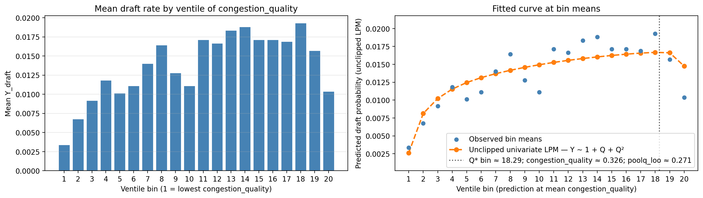

# Tier 1 Narrative Outline

## 1. The Core Idea: Competing Local Forces

The central idea is that local environments are not purely good or bad. They contain competing forces.

On one side, stronger local peers can improve development, signaling, standards, visibility, and recognition. On the other side, those same stronger peers can create congestion: fewer opportunities, harder role competition, less individual distinctiveness, and more competition for scarce recognition.

The inverted-U is the descriptive footprint we would expect if these competing local forces operate at the same time.

At low levels of local peer quality, the beneficial side may dominate. At high levels of local peer quality, the congestion side may dominate.

## 2. The Descriptive Phenomenon: The Inverted-U

The empirical pattern is a nonlinear relationship between local peer environment and eventual advancement.

At low levels of local peer quality, a stronger local environment appears beneficial. Individuals surrounded by stronger peers may develop faster, perform in more competitive settings, receive more credible signals, or become more visible to evaluators.

At very high levels of local peer quality, the relationship bends downward. The same environment that improves development or signaling may also create crowding: fewer opportunities, harder role competition, less individual distinctiveness, and more difficulty standing out.

The descriptive pattern is therefore:

\[
\Pr(Y=1)
\text{ rises with local environment at first, then falls at high local environment.}
\]

Cartoon version:

```text
Advancement
Probability
    ^
    |              *
    |           *     *
    |        *           *
    |     *
    |  *
    +--------------------------> Local environment / peer quality
       low        middle      high
```

This is descriptive, not yet causal. The first task is to explain what minimal structure could produce this shape.

## 3. Forces Potentially At Play

Many forces could contribute to the observed curve. We do not need to formalize all of them at once, but we should name them so the narrative has conceptual room.

| Force family | Possible influences |
| :--- | :--- |
| Positive local forces | Development from stronger peers; higher training or competitive standards; better team context; stronger signals from performing in a high-quality environment; greater evaluator attention; prestige or credibility of the local pool. |
| Negative local forces | Local crowding; reduced minutes or role opportunities; harder comparison set; reduced individual distinction; evaluator compression; competition for scarce recognition; difficulty separating one person from many strong peers. |
| Individual-level forces | Own performance; latent ability; role fit; effort; persistence; strategic sorting into environments. |
| System-level forces | Finite number of advancement slots; evaluator bandwidth; institutional rules; timing; cohort strength; domain-specific selection norms. |

The long-run theory may eventually develop variables for many of these. Tier 1 should not.

## 4. Local And Global Forces Across Domains

The key structural distinction is that some forces operate locally while others operate globally.

| Domain | Local forces | Global forces |
| :--- | :--- | :--- |
| Basketball | Teammates; roster structure; minutes; role; usage; coaching; local visibility. | NBA draft slots; draft-year competition; league-level selection. |
| Army | Senior rater pools; command opportunities; assignments; local comparison groups; evaluation contexts. | Promotion boards; total promotion allocations; institution-wide distinction scarcity. |
| Academia | Department composition; coauthor networks; mentoring; lab resources; teaching/service loads; local prestige. | Journal space; grants; citations; job markets; tenure standards; field-level recognition. |

The domains differ in their exact mechanisms, but they share a common architecture:

\[
\text{local environments shape opportunity and signals, while global systems allocate scarce distinction.}
\]

This is why the model should begin abstractly. The same local/global structure may appear across domains even when the measured variables differ.

Personal ability matters in all three domains, but it enters this narrative differently from the local/global structure. Ability helps people perform, and it often helps people move into higher-talent local pools. Stronger basketball players reach stronger teams, stronger officers enter stronger assignment or rating pools, and stronger academics sort into stronger departments, labs, networks, or publication environments.

For Tier 1, ability is therefore not ignored. It is treated as a background sorting force and later empirical control, while the first minimal formula focuses on the local environment faced by the individual and the global scarcity of distinction.

## 5. Why Tier 1 Exists

Tier 1 is the minimum model needed to represent the core phenomenon without disappearing into every possible mechanism. The goal is not to build the full theory immediately. The goal is to ask:

> What is the smallest model that can represent nonlinear advancement under local environments and global scarcity?

| Tier 1 should | Tier 1 should not yet include |
| :--- | :--- |
| Preserve the local/global distinction. | Full network structure. |
| Preserve advancement scarcity. | Endogenous sorting. |
| Allow local environments to have both beneficial and costly effects. | Strategic behavior. |
| Produce a possible inverted-U. | Detailed evaluator psychology. |
| Remain simple enough to fit, explain, and compare across domains. | Every possible opportunity and recognition mechanism. |

The excluded mechanisms may matter later. They are not the first model.

## 6. Distinction As The First Amalgamated Scarce Commodity

The central scarce commodity is distinction.

Distinction is not only raw performance. It is a compound outcome of:

- performance,
- opportunity to display performance,
- recognition by evaluators or institutions.

In different domains, distinction appears as:

| Domain | Scarce distinction |
| :--- | :--- |
| Basketball | NBA draft selection, elite role recognition |
| Army | top blocks, command opportunities, promotion |
| Academia | tenure, grants, elite publications, citations, prestige |

This makes distinction a useful first-best amalgamated concept. It lets the model avoid prematurely separating performance, opportunity, and recognition into many variables before the minimal structure is clear.

The empirical outcome is:

\[
Y = 1
\]

when the individual receives the focal distinction, and:

\[
Y = 0
\]

otherwise.

## 7. Global Scarcity: Lambda

Let:

\[
\Lambda_t
\]

represent the global amount of distinction available in period \(t\).

In basketball, \(\Lambda_t\) is approximately the number of NBA draft slots in a year.

More generally, \(\Lambda_t\) represents system-level selection capacity:

- how many people can be promoted,
- how many can be drafted,
- how many can receive a scarce elite evaluation,
- how much recognition the system can allocate.

Lambda is therefore not a local variable. It is the global constraint under which local environments are converted into advancement outcomes.

This distinction matters because local scarcity and global scarcity are not the same thing. Local scarcity lives inside the local term \(L_{ijt}\): minutes, role competition, senior-rater competition, mentorship attention, authorship opportunities, department resources, or local visibility. Global scarcity lives in \(\Lambda_t\): the total amount of distinction the system can allocate.

So:

\[
L_{ijt} = \text{local environment, including local opportunity scarcity}
\]

while:

\[
\Lambda_t = \text{global distinction capacity}
\]

## 8. The Tier 1 Minimal Formula

Let:

\[
L_{ijt}
\]

represent the local term: the amalgamated local environment faced by individual \(i\) in local pool \(j\) at time \(t\).

The local term rolls up both positive and negative local forces:

- development,
- peer quality,
- opportunity,
- crowding,
- visibility,
- role competition,
- local recognition.

Then the Tier 1 minimal model is:

\[
\Pr(Y_i = 1) = f(L_{ijt}, \Lambda_t)
\]

In words:

> The probability of receiving distinction depends on the local environment faced by the individual and the global scarcity of available distinction.

The first empirical move is to proxy \(L_{ijt}\) with local peer quality:

\[
L_{ijt} \approx Q_{ijt}
\]

This is intentionally a rolled-up first proxy. \(Q_{ijt}\) is not being treated as only "development" or only "congestion." It is the first observable local-environment measure that can carry both sides at once:

- the beneficial side of stronger peers: development, standards, signaling, and recognition;
- the costly side of stronger peers: crowding, role competition, reduced opportunity, and harder distinction.

and ask whether:

\[
\Pr(Y_i = 1)
\]

follows the observed inverted-U as \(Q_{ijt}\) increases.

If it does, then Tier 1 has done its first job: it has represented the core nonlinear phenomenon using a minimal local/global structure.

## 9. Minimal Assumptions For Tier 1

The Tier 1 model needs a small number of assumptions. These are not claims that the world is simple. They are the assumptions that make the first fitted model disciplined enough to explain, test, and extend.

1. **Advancement is globally scarce.** There is a limited amount of distinction available in each period. In basketball, this is represented by the finite number of NBA draft selections.
2. **Local environments matter.** An individual's chance of receiving global distinction depends partly on the local pool in which the individual develops, competes, and is evaluated.
3. **The local term can contain competing forces.** The same local pool can create benefits, such as development and credible signaling, and costs, such as congestion, reduced opportunity, and harder individual distinction.
4. **The first local proxy can be reduced-form.** Tier 1 does not need to separately estimate every local mechanism at first. It can begin with local peer quality \(Q\) as a rolled-up empirical proxy for the net local environment \(L\).
5. **The individual is excluded from their own local-quality measure.** The first \(Q\) proxy is leave-self-out peer quality, so a player's own performance is not mechanically included in the local peer-quality variable.
6. **The first test is descriptive and model-based, not fully causal.** The goal is to see whether the reduced-form local term reproduces the inverted-U and yields an interpretable turning point \(Q^*\).
7. **Later controls and decompositions are extensions, not core Tier 1 assumptions.** Own ability, minutes, crowding, visibility, and recognition can be added after the minimal pattern is established.

Taken together, these assumptions let the model say something precise without overbuilding: local environments are consequential, global distinction is scarce, and the local term may have an internal benefit-versus-drag structure.

## 10. The Internal Tension Inside The Local Term

The next step is to name the competing elements inside the local term without turning them into a large model too soon.

Let the first empirical local measure be local peer quality \(Q\). Then the net local term can be described as:

\[
L_{\text{net}}(Q) = B(Q) - D(Q)
\]

where:

- \(B(Q)\) is the benefit side of stronger local peers: development, higher standards, stronger signaling, visibility, and recognition;
- \(D(Q)\) is the downside or drag side of stronger local peers: congestion, reduced opportunity, crowding, role competition, and harder individual distinction.

The inverted-U appears when these two forces dominate at different parts of the local-quality range.

At low to moderate \(Q\), the benefit side may dominate:

\[
B'(Q) > D'(Q)
\]

At high \(Q\), the downside side may dominate:

\[
D'(Q) > B'(Q)
\]

The turning point is the balance point:

\[
B'(Q^*) = D'(Q^*)
\]

In words, \(Q^*\) is the local peer-quality level where the marginal benefit of a stronger local pool is exactly offset by the marginal downside of crowding and reduced distinction.

This is the controlled version of the "phase shift" idea. It does not require claiming a literal phase transition. It says that the dominant marginal force changes: before the peak, development/signaling benefits dominate; after the peak, congestion/distinction costs dominate.

In later decomposed models, \(B\) may be proxied by peer quality, team strength, and visibility, while \(D\) may be proxied by crowding, minutes/opportunity, within-team rank, and recognition dilution. For Tier 1, this remains a reference direction rather than the first model.

## 11. How Tier 1 Connects To Data

The next question you asked is how this abstract structure gets fit to data. The first answer should be simple: map each model object to an observable proxy, fit the reduced-form curve, and extract the turning point.

Initial mapping:

| Model object | Meaning | First empirical proxy |
| :--- | :--- | :--- |
| \(Y_i\) | whether individual receives the focal distinction | basketball: drafted or not drafted |
| \(L_{ijt}\) | amalgamated local environment | first proxied by \(Q_{ijt}\), leave-self-out local peer quality |
| \(\Lambda_t\) | global distinction capacity | basketball: NBA draft slots in year \(t\) |
| \(B(Q)-D(Q)\) | net benefit minus downside of local peer quality | inferred from the shape of \(\Pr(Y_i=1)\) over \(Q\), not separately estimated at first |
| \(A_{ijt}\) | own ability / performance | later control or sorting variable; basketball: own performance metric |

The first basketball diagnostic is the binned draft-rate curve from `535_sports_tier_1.ipynb`.

<p align="center">
  
</p>

**Figure note.** The left panel bins player-seasons by local peer quality and plots the observed mean draft rate in each bin. The right panel overlays a simple univariate quadratic linear-probability fit, \(Y \sim 1 + Q + Q^2\), evaluated at the bin means. The vertical \(Q^*\) marker is the fitted turning point: the estimated local peer-quality level where the benefit side of the local environment and the congestion/distinction-cost side are approximately balanced. This is not yet the final causal model; it is the first visual check that the reduced-form Tier 1 object can reproduce the inverted-U pattern and produce a concrete point to discuss.

The first empirical move is descriptive:

1. Bin players by \(Q_{ijt}\).
2. Plot average \(\Pr(Y_i=1)\) in each bin.
3. Ask whether the curve rises and then falls.

The first fitted model should remain transparent:

\[
\Pr(Y_i=1) \approx \alpha + \beta_1 Q_{ijt} + \beta_2 Q_{ijt}^2
\]

Then add own performance as a control:

\[
\Pr(Y_i=1) \approx \alpha + \beta_1 Q_{ijt} + \beta_2 Q_{ijt}^2 + \theta A_{ijt}
\]

This is the initial least-squares / linear probability version. It is not the final statistical model, but it is easy to inspect and connects directly to the binned descriptive curve.

Because \(Y_i\) is binary, the more formal version should use a logit or probit model estimated by maximum likelihood:

\[
\Pr(Y_i=1) = g^{-1}(\alpha + \beta_1 Q_{ijt} + \beta_2 Q_{ijt}^2 + \theta A_{ijt})
\]

where \(g^{-1}\) is the logit or probit link.

The object we want to extract is the estimated turning point:

\[
Q^* = -\frac{\beta_1}{2\beta_2}
\]

In words, \(Q^*\) is the estimated local peer-quality level where advancement probability is highest. If this point exists and is stable across simple specifications, then Tier 1 has a concrete empirical object: the local environment level where benefits and downsides balance.

Later, after this minimal fit is clear, we can open \(L\) into additional pieces:

- crowding,
- minutes or opportunity,
- visibility,
- recognition,
- domain-specific local scarcity.

But the first fitting task is not to estimate every component. The first task is to show that the minimal local/global structure can reproduce and quantify the observed nonlinear pattern.

## 12. What Would Count As A Tier 1 Success?

Tier 1 succeeds if the minimal local/global structure is enough to reproduce and quantify the core pattern without adding every possible mechanism.

### Criterion 1 - Descriptive

- the binned curve of \(\Pr(Y_i=1)\) over \(Q_{ijt}\) rises at low-to-moderate local peer quality;
- the curve falls or flattens at high local peer quality;
- the pattern is not driven only by one extreme bin or obvious data artifact.

### Criterion 2 - Model-based

- the fitted quadratic has the expected shape, with \(\beta_1 > 0\) and \(\beta_2 < 0\);
- the estimated turning point \(Q^*\) lies inside the observed data range;
- the fitted curve is not just a visual artifact of clipping, sparse bins, or unstable tails.

### Criterion 3 - Robustness to ability

Adding \(A_{ijt}\) as a control asks whether the local-environment pattern survives after accounting for the individual's own performance or ability. In plain terms, it asks:

> Among people with similar own ability or performance, does the local pool still show an inverted-U relationship with advancement?

This matters because high-ability people often sort into higher-talent local pools. Without \(A\), the model could confuse the effect of the local environment with the fact that stronger individuals are more likely to enter stronger environments.

### Criterion 4 - Interpretability

- the estimated peak can be read as the point where \(B(Q)\) and \(D(Q)\) balance;
- the result can be explained as competing local benefits and downsides under global distinction scarcity;
- the same architecture can travel to Army and academia, even if the empirical proxy for \(L\) changes.

If these conditions hold, then Tier 1 has done its job. It has not explained every mechanism, but it has shown that a minimal model based on local environment and global scarcity can generate the observed nonlinear advancement pattern.

## 13. Variable Domains And Normalization

The model also needs each object to have a clear mathematical type. This is the point of specifying variable domains.

| Object | Domain | Interpretation |
| :--- | :--- | :--- |
| \(Y_i\) | \(\{0,1\}\) | Whether individual \(i\) receives the focal distinction. |
| \(\Pr(Y_i=1)\) | \([0,1]\) | Probability that individual \(i\) receives the focal distinction. |
| \(L_{ijt}\) | Continuous index, usually standardized for estimation | Amalgamated local environment faced by individual \(i\) in local pool \(j\) at time \(t\). |
| \(Q_{ijt}\) | Continuous, usually standardized or normalized | First empirical proxy for \(L_{ijt}\): leave-self-out local peer quality. |
| \(A_{ijt}\) | Continuous, usually standardized | Own ability or performance proxy; used as a control or sorting variable. |
| \(\Lambda_t\) | Positive count or capacity | Global amount of distinction available in period \(t\). |

The practical rule is simple: binary outcomes stay binary, probabilities must stay between 0 and 1, and continuous predictors such as \(Q\), \(L\), and \(A\) should usually be standardized before fitting so that coefficient scales are interpretable and numerically stable.

## 14. Reference Note: Linear Index, Logit, And Probit

In the logit/probit version, the model first creates a raw score:

\[
z_i = \alpha + \beta_1 Q_{ijt} + \beta_2 Q_{ijt}^2 + \theta A_{ijt}
\]

This raw score is called the **linear index**. It is "linear" because it is a weighted sum of model terms, even though one of those terms may be \(Q_{ijt}^2\). The coefficients enter linearly.

The index can be any real number:

\[
z_i \in (-\infty,\infty)
\]

But probabilities must be between 0 and 1. A link function maps the raw index into a valid probability:

\[
\Pr(Y_i=1) = g^{-1}(z_i)
\]

For logit:

\[
g^{-1}(z_i)=\frac{1}{1+e^{-z_i}}
\]

For probit:

\[
g^{-1}(z_i)=\Phi(z_i)
\]

where \(\Phi\) is the standard normal cumulative distribution function.

In plain language:

- the linear index is the model's raw advancement score;
- logit or probit converts that score into a probability;
- this is why logit/probit predictions stay in \([0,1]\).

The linear probability model is simpler because it uses the raw score directly as the probability. That makes it easy to inspect, but it can sometimes predict invalid values below 0 or above 1.

## 15. Reference Note: Candidate Decompositions Of \(B\) And \(D\)

For now:

\[
L_{\text{net}}(Q)=B(Q)-D(Q)
\]

is conceptual. Later models can try to represent \(B\) and \(D\) with observable proxies, but these should be treated as candidate decompositions rather than commitments.

### Candidate \(B(Q)\): Benefit Side

\(B(Q)\) is the upside of stronger local peers.

Candidate data proxies:

- **Peer quality:** leave-self-out teammate quality, `poolq_loo` or `congestion_quality`.
- **Team context:** team strength, win percentage, schedule strength, conference quality.
- **Signaling credibility:** performing well on a high-quality team may be more credible than performing well in a weak environment.
- **Visibility / attention:** team prominence, tournament exposure, ranking, conference, media visibility.
- **Developmental environment:** teammate quality, coaching quality if available, program strength.

In basketball, the first proxy for \(B\) is essentially \(Q\), because stronger peers may improve development and signal credibility.

### Candidate \(D(Q)\): Downside / Drag Side

\(D(Q)\) is the congestion or opportunity-cost side.

Candidate data proxies:

- **Crowding:** `congestion_crowding`, such as total leave-self-out teammate performance mass.
- **Opportunity:** `minutes`, starts, usage rate, role, shot attempts, touches.
- **Relative rank:** player's rank within team by performance, usage, minutes, or role.
- **Competition for role:** number of teammates above a performance threshold.
- **Recognition dilution:** many strong players on the same team competing for evaluator attention.
- **Weighted crowding:** `congestion_crowding_weighted`, where strong peers matter more if they also occupy minutes or opportunity.

A later decomposed version might look like:

\[
B(Q) \approx b_1 Q + b_2 \text{team quality/visibility}
\]

\[
D(Q) \approx d_1 C + d_2(1-O) + d_3 \text{relative-rank pressure}
\]

But the first Tier 1 task is not to estimate these pieces separately. The first task is to test whether the reduced-form local term can reproduce the inverted-U and produce a stable turning point.

## 16. Addendum: Fitting Plan And Method Refresher

This addendum restates the fitting plan in one place and defines the estimation terms.

### Step 1 - Descriptive Curve

Start without a fitted statistical model:

1. Construct \(Q_{ijt}\), the first proxy for the local term \(L_{ijt}\).
2. Bin observations by \(Q_{ijt}\).
3. Plot the average of \(Y_i\) in each bin.

Because \(Y_i\) is binary, the bin average is the empirical probability of distinction in that bin:

\[
\overline{Y} \approx \Pr(Y=1 \mid Q \text{ in bin})
\]

Goal: see whether the observed curve rises and then falls.

### Step 2 - OLS / Linear Probability Model

Next fit the simplest transparent curve:

\[
Y_i \approx \alpha + \beta_1 Q_{ijt} + \beta_2 Q_{ijt}^2
\]

This uses **OLS**, ordinary least squares, to estimate the curve that best fits the observed data by minimizing squared prediction errors.

Because \(Y_i\) is binary, this is also called a **linear probability model** or **LPM**. It treats the 0/1 outcome as a probability-like number.

Plain-language interpretation:

- OLS/LPM is a transparent first curve fit.
- It asks how the observed probability of distinction changes with local peer quality.
- It is easy to inspect and easy to connect to the binned descriptive curve.
- Its weakness is that it can sometimes predict probabilities below 0 or above 1.

### Step 3 - Add Ability As A Control

Then add own ability or performance:

\[
Y_i \approx \alpha + \beta_1 Q_{ijt} + \beta_2 Q_{ijt}^2 + \theta A_{ijt}
\]

Here \(A_{ijt}\) is a control because it helps separate the local-environment pattern from the individual's own ability/performance.

Plain-language interpretation:

> Among people with similar own ability or performance, does local peer quality still show an inverted-U relationship with distinction?

This matters because high-ability people often sort into higher-talent local pools.

### Step 4 - Extract The Turning Point

For the quadratic model, the estimated peak is:

\[
Q^* = -\frac{\beta_1}{2\beta_2}
\]

Plain-language interpretation:

- \(Q^*\) is the estimated local peer-quality level where predicted distinction probability is highest.
- Before \(Q^*\), the benefit side \(B(Q)\) dominates.
- After \(Q^*\), the downside/drag side \(D(Q)\) dominates.

### Step 5 - Logit / Probit By MLE

Because \(Y_i\) is binary, the more formal statistical version is a binary-outcome model:

\[
\Pr(Y_i=1) = g^{-1}(\alpha + \beta_1 Q_{ijt} + \beta_2 Q_{ijt}^2 + \theta A_{ijt})
\]

The part inside the parentheses is the **linear index**:

\[
z_i = \alpha + \beta_1 Q_{ijt} + \beta_2 Q_{ijt}^2 + \theta A_{ijt}
\]

The index can be any real number. A logit or probit link converts that raw score into a valid probability between 0 and 1.

**Logit** uses the logistic function:

\[
g^{-1}(z_i)=\frac{1}{1+e^{-z_i}}
\]

**Probit** uses the standard normal cumulative distribution function:

\[
g^{-1}(z_i)=\Phi(z_i)
\]

Both logit and probit are usually estimated using **MLE**, maximum likelihood estimation.

Plain-language interpretation:

- Logit/probit are model types for binary outcomes.
- MLE is the estimation method used to fit those models.
- MLE chooses the parameters that make the observed data most likely under the chosen model.
- Logit and probit usually give similar answers; logit is often easier to explain, while probit has a latent-normal interpretation.

### Step 6 - Later Decomposition

Only after the reduced-form Tier 1 fit is clear should we open \(L\) into pieces such as:

- benefit-side proxies for \(B(Q)\),
- downside/drag proxies for \(D(Q)\),
- opportunity,
- recognition,
- local scarcity,
- domain-specific mechanisms.

That later decomposition should explain where the curve comes from. It should not be required for the first Tier 1 test.
