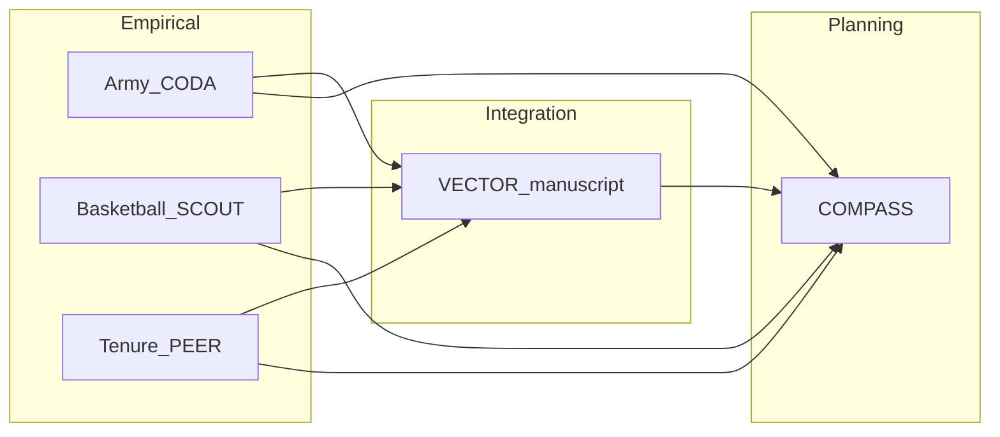
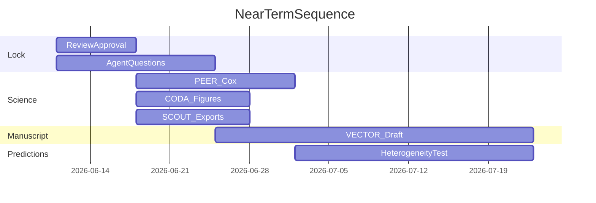

# Project status and near-term plan

**Canonical name:** `03_Where_we_are_now.md`  
**Original archive:** [`obsolete/original_filenames/PROJECT_STATUS_AND_NEAR_TERM_PLAN.md`](obsolete/original_filenames/PROJECT_STATUS_AND_NEAR_TERM_PLAN.md)

> **Maintained by:** **COMPASS** (cross-project planner). See [COMPASS_AGENT_IDENTITY.md](COMPASS_AGENT_IDENTITY.md).

**Date:** 2026-06-24 (Phase A execution complete)  
**Author:** COMPASS  
**Print stack:** [`Charles_reading_list.md`](Charles_reading_list.md) — symbol decoder: [`01_forward_plan_reading_guide.md`](01_forward_plan_reading_guide.md) **Symbol systems**  
**Companion docs (active numbered):**  
- [02_Charles_decisions_locked.md](02_Charles_decisions_locked.md) — **Tier 1 locks filed**  
- [08_Basketball_figures_on_disk.md](08_Basketball_figures_on_disk.md) — D10 bundle  
- [09_Tenure_export_on_disk.md](09_Tenure_export_on_disk.md) — inference export  
- [10_Manuscript_ink_map.md](../5-Manuscript/10_Manuscript_ink_map.md) — Word routing  
- [12_Manuscript_staging_prose.md](../5-Manuscript/12_Manuscript_staging_prose.md) — copy-from prose  
- [14_PD12_reassessment_memo.md](14_PD12_reassessment_memo.md) — PD12 ladder (reference)  
- Pre–Tier 1 correspondence → [`obsolete/`](obsolete/README.md)

---

## Executive summary

The dissertation program is a **three-setting cross-domain study** of **advancement under constrained distinction**, with Army as anchor, basketball as replication, and academia as preliminary third leg.

**Convergence (now):** The scientific bottleneck has shifted from discovery to **convergence**:

| | Task |
|---|------|
| **a.** | Empirical inverted-U patterns are **established** (Army, basketball) and **preliminary** (tenure). |
| **b.** | Close the **minimal generative model** (honest claims). |
| **c.** | Export **model-guided empirical features** (PD12 Priority 3 — quality vs congestion). |
| **d.** | Lock **2–3 testable predictions**. |
| | Draft a **Wang-style manuscript**. |

**Next:** These were deferred; review next unless they should move into the current draft:

| | Item | Plain English |
|---|------|---------------|
| **a.** | **525/UIC deep dives** | Prestige-organization / senior-rater consistency work — test whether “prestigious unit” effects hold up empirically in Army data. *(Charles: PDE issue — revisit when manuscript needs more Army mechanism meat.)* |
| **b.** | **Network-science extensions** | Talent center-of-gravity (individual + unit), talent paradox, exposure/comparison networks — strong candidates for later manuscript §8 or dissertation chapters. |
| **c.** | **3-domain parametric identifiability** (PD12 P1) | Estimate separate \(B(Q)\) and \(D(Q)\) legs with identifiable parameters across all three settings — beyond v1 minimal model. |
| **d.** | **Fourth-domain falsification** (PD12 P4) | Add a fourth empirical setting to stress-test generality. |
| **e.** | **Generative LOO-pool-quality bin-for-bin matching** | Make the basketball generative simulation reproduce the empirical `poolq_loo` curve point-for-point — north-star parallel work, not v1 blocker (Path II). |

Elevate any row only if **Charles or Alex** says so; otherwise Part VII opportunity-cost rule applies.

**Phase A (2026-06-24):** Tier 1 locks filed; SCOUT D10 bundle on disk; PEER `faculty_panel_inference_v1.csv` exported (796 persons / 52 depts); staging prose written ([`12_Manuscript_staging_prose.md`](../5-Manuscript/12_Manuscript_staging_prose.md)). **Next:** ink **`Manuscript_working_outline_v1.docx`** using [`10_Manuscript_ink_map.md`](../5-Manuscript/10_Manuscript_ink_map.md) (**manuscript §5 → §1 → §4**, then **§0** opening frame — see `#01` symbol decoder); Army AWS sync + Alex Tier 3; Layer B Cox pre-submission.

**PD12 alignment (2026-06-15):** v1 delivers Priority 3 + partial Priority 2 (talent-only fail). P1 and P4 deferred explicitly — not silent drift. See [reassessment memo](14_PD12_reassessment_memo.md).

**Target:** core manuscript draft/submission **Summer–Fall 2026** (~3–6 months).

---

## Charles clarifications (COMPASS thread, 2026-06-11)

| # | Topic | Decision |
|---|--------|----------|
| 1 | Hard deadline | **Summer–Fall 2026** for core manuscript draft/submission |
| 2 | Tenure Cox gate | **Soft gate (B):** stage 9 + honest limitations OK for VECTOR to draft Setting 3; **one basic Cell 12 Cox run in parallel** before submission (not a pre-draft blocker); Fine–Gray deferred |
| 3 | SCOUT generative priority | **A — manuscript-first (Path II):** draft with honest layering; generative LOO-pool-quality match **deferred**; Alex score = constraint-leg POC on **pool mean** axis; empirical decomposition for predictions; explicit nesting required in prose |
| 4 | Tenure Cell 12 urgency | **Charles confirmed (2026-06-11):** no hurry on planned Cell 12 in `540_tenure_pipeline.ipynb` during **draft phase**. Current **CELL 9** binned plot (`stage9_inverted_u.png`) is **legitimate preliminary descriptive evidence** for process trust and VECTOR Setting 3 prose (with limitations). **Basic Cox** remains pre-**submission** parallel work (PEER-owned); **Fine–Gray** may return before publication if estimand requires it — not gating draft |
| — | Scientific north star | Unified decomposable generative on LOO axis — **parallel**, does not gate first draft |
| — | Terminology lock | Any quantity **excluding self** must include **`LOO`** in the name (`poolq_loo` = LOO pool quality; `team_mean` / pool mean = whole roster, not LOO) |
| — | Model coherence | `20260611_1626_COMPASS_to_SCOUT_model_coherence_questions.md` **revised** for locked Path II — SCOUT must supply nesting chain + deliverables D1–D11, not path choice |
| — | Alex comms | Plan update briefs — Charles's sequencing calls; optional perspective welcome, not a decision questionnaire |

---

# Part I — Foundational context

**Pivotal insights (nuggets):** [`13_INSIGHT_NUGGETS.md`](13_INSIGHT_NUGGETS.md) — cross-project framing worth keeping while reading this doc and the forward plan.

## Foundational project summary (dissertation origins)

**Original vision (Aug 2024 proposal):** *Deciphering the Talent Mosaic* — use Army PDE/OER data and network methods (Officer Career Network, Officer Professional Network) to quantify **unit prestige**, **peer effects**, and **rater evaluation tradeoffs** across three Army chapters (Q1–Q3). Methods: eigenvector centrality, survival analysis, West Point Post Night validation.

**What persisted:** Army closed labor market; OER/senior-rater pools; competing promotion/attrition; Evans stack-ranking misclassification; Barabási/Gates science-of-science framing; talent management policy relevance.

**What morphed:** Prestige-centrality chapters → **LOO peer-pool quality inverted-U** as cross-domain stylized fact; **basketball + tenure** added; theory reframed as **finite distinction in local comparison environments**; generative Tier 1 modeling on basketball.

**Original hypotheses (evolved):** Prestigious units/peers help until they hurt (H2/H3 spirit) → now explicit **inverted-U** with mechanism decomposition path.

**Expected contributions (current framing):**  
1. Replicated empirical regularity across military, sport, academia.  
2. Minimal mechanism (congestion-adjusted advancement score + pool formation).  
3. Non-obvious predictions distinguishing competing explanations.  
4. Foundation for network-science extensions (deferred).

**Committee expectations:** Barabási — universality, minimal models, high impact; Gates — day-to-day direction, generative discipline, Wang ladder; **Dakota Murray** — tenure setting expertise (v03 brief sent); Vespignani — complex systems audience.

---

## Advisor guidance summary

**Primary advisor (operations):** Alex Gates — prioritization, manuscript sequencing, generative mechanism.  
**Strategic advisor:** Laszlo Barabási — framing, replication, network extensions (future).

### Recurring themes (Alex, from memos + agent reports)

| Theme | Source | Implication |
|-------|--------|-------------|
| Theory ≠ minimal model | `2026_0430_Paper7_feedback.md` | Rich theory; sparse formal model |
| Quadratic is diagnostic, not mechanism | `2026_0507_Alex_Gates_Post_Meeting_Simulation_Memo.md` | Keep in `sports/538_alex_tier1_model_and_fit.ipynb` empirical work; generative story is sorting + comparison |
| Assortative pools + local comparison | PD10–PD12, `Alex_model_interpreted.md` | PD11 threads A/B/C ordering |
| End-to-end measurement before perfection | PEER Apr 2026 advisor direction | Stage 9 before infinite scrape |
| Cross-domain minimal story | PD11, Alex Tier 1 spine | Don't calibrate generative on observed team means only |
| Parallel tracks: code + publication | `advisor_brief_twofold_status.md` | But **manuscript now beats 525** for near-term |

### Alex priorities (PD12 + inferred)

| Priority | PD12 name | v1 status |
|----------|-----------|-----------|
| **P3** | Model-guided empirical features (congestion vs quality) | **In scope** — SCOUT D10 export + staging **`#12` §3** (Methods) |
| **P2** | Extreme events / kill switches | **Partial** — talent-only fail; full 539 sweeps deferred |
| **P1** | Parameter identifiability (3-domain fit) | **Deferred** — post-v1 / dissertation |
| **P4** | Falsification / 4th domain | **Deferred** — post-v1 |

### Alex concerns

- Over-claiming generative replication on \(L_Q\).
- Presenting quadratic as theory.
- Fine–Gray / estimand sloppiness.
- Endless data expansion without curves.

---

## Mental model of Alex (planning aid)

| Question | Working answer |
|----------|----------------|
| What problem are we solving? | Nonlinear advancement from **local pool quality × finite distinction**, explained by **minimal generative mechanism**, replicated cross-domain. |
| What evidence convinces him? | 3-panel empirical U; generative ability-only null; congestion score POC; **model-guided features exported**; 1–2 sharp predictions tested or test-ready. |
| What would he cut? | Network extensions pre-paper; legacy `sports/537_tier1_benchmark.ipynb`; "538D decomposes 539"; causal overclaim. |
| What would he prioritize? | PD11 thread C→A; Wang ladder empirical; one heterogeneity prediction. |
| Top risks he watches | Axis/estimand confusion; distraction from writing; tenure overclaim without Cox. |

*Refine after Charles routes Planner question responses.*

---

# Part II — Current state

## Cross-project architecture



## Domain status

### Army (CODA) — Setting 1

| Dimension | Status |
|-----------|--------|
| Pipeline | `520_pipeline_cox_working.ipynb` end-to-end |
| Inverted-U | **Established** — CIF Q-bins; Cox quadratics + interaction |
| Competing risks | Cell 11 descriptive CIF; Cell 12 cause-specific Cox |
| Recent add-ons | TB-stratify CR (`cr_tb_stratify.py`, default off) |
| Open issues | Pool-size >100 audit; AWS upload; 525/UIC planned not executed |
| Confidence | **High** for descriptive U; **medium-high** for Cox curvature |

**Assumptions carrying weight:** Last-snapshot bin assignment for CIF plots; LOO pool minus mean as peer quality; CS/CSS cohort filters in run profiles.

### Basketball (SCOUT) — Setting 2

| Dimension | Status |
|-----------|--------|
| Panel | `530_sports_pipeline.ipynb` → `datasets/mbb/player_season_panel_530.csv` |
| Inverted-U | **Replicated** on `poolq_loo` |
| Empirical ladder | `538_alex_tier1_model_and_fit.ipynb` — bins, LPM, logit, \(L^*\) |
| Generative | `sports/538D_development.ipynb` CELL 10; \(S_i = A_i - w L_C\); inverted-U on **team_mean**, not \(L_Q\) match |
| Open issues | \(L_Q\) generative gap; CELL 7 robustness in `sports/538_alex_tier1_model_and_fit.ipynb`; near-threshold export parked (now in D10 — `#08`) |
| Confidence | **High** empirical; **medium** generative (conditional) |

**Assumptions carrying weight:** PPM+z performance; LOO teammate pool; ever-draft outcome.

### Academia (PEER) — Setting 3

| Dimension | Status |
|-----------|--------|
| Pipeline | `540_tenure_pipeline.ipynb` Cells 0–9 complete; Layer B (10/10.5/12) **planned** |
| Inverted-U | **Preliminary** — stage 9, 18 bins, elite bin dip; **Charles: trustworthy for draft** (unconditional bins; see `Pertinent_Thoughts_Tenure.md`) |
| Cox | Layer B **planned** (port `520` → `540`); Cell 12 **not archived** — **not urgent for draft**; basic run before submission (soft gate) |
| Fine–Gray | **Deferred** — revisit before publication if needed; not required for first VECTOR pass |
| Data limits | ~58% OA NONE; high censoring; 168 schools variable quality |
| Confidence | **Low–medium** |

**Assumptions carrying weight:** Wayback tenure events; LOO assistant pub intensity; unresolved ≠ attrition ambiguity.

---

## Modeling status

### Scientific progression ladder (PD12-aligned — defs in `#01`)

```text
Rung 1  Phenomenon (inverted-U on LOO proxy — triad)
Rung 2  Minimal mechanism (Path II generative POC — basketball)
Rung 2.5  Model-guided empirical features (quality vs congestion — export in D10)
Rung 3  Predictions (near-threshold; K)
Rung 4  Manuscript
```

### Minimal model (VECTOR / Tier 1)

**Equation-level claim:**

\[
S_i = A_i - \lambda L_{C,i}
\]

**Architecture:** Soft assignment pools (τ≈0.65) → congestion from viable peers → top-\(K\) or threshold selection → plot axis matters.

| Capability | Status |
|------------|--------|
| Empirical U on \(Q\) | ✅ Army, basketball; preliminary tenure |
| Ability-only generative null | ✅ Confirmed |
| Congestion score implemented | ✅ |
| **Model-guided features (quality vs congestion)** | ✅ in pipeline; **D10 export pending** |
| Inverted-U generative (team_mean) | ✅ |
| Inverted-U generative (\(L_Q\) LOO) | ❌ Not matched |
| \(B(Q)-D(Q)\) decomposition estimated | ❌ Deferred |
| Evans sim embedded | ❌ Theory only |

### Known weaknesses

1. Generative/empirical **axis mismatch** on basketball.  
2. Tenure **inferential layer** missing.  
3. **Prediction list** not locked.  
4. Mechanism **decomposition** not identified.  
5. Army CIF **estimand simplicity** vs prose ambition.

### Outstanding modeling questions

- Is LOO-pool-quality generative match required for v1? **No** (Charles Path A) — honest axis table + limitations; parallel north-star work optional  
- Which noise bundle (539 vs 538D) is domain-appropriate?  
- Does tenure need Fine–Gray or cause-specific Cox suffices?

---

## Predictions

**How to read this section:** These are **candidate predictions** — directions the model suggests, not finished proofs. v1 manuscript will name **#1** and **#2** as primary; the others are exploratory or deferred. Glossary: [`01_forward_plan_reading_guide.md`](01_forward_plan_reading_guide.md).

### v1 primary slots (manuscript **§7** / staging `#12` §4)

| # | Name (shorthand) | Plain English — what would count as support? | Status today | Where in repo |
|---|------------------|-----------------------------------------------|--------------|---------------|
| **#1** | Near-threshold heterogeneity | Among players who are **good but not superstars**, the elite-pool dip should be **steepest** — congestion hurts people **near the cut line**, not the very best or the clearly below-average. | **Candidate.** One basketball figure exported; not a formal cross-domain test. | `sports/538D_development.ipynb` **CELL 4D** → `heterogeneity_ventiles_top_tail.png` (listed in `#08`) |
| **#2** | Peak shift with **K** (Lambda) | When an organization has **more scarce advancement slots** (bigger boards, more draft picks, more tenure lines), the **top** of the inverted-U should **move** — global capacity matters, not only local peer quality. | **Conceptual only.** Prose hook for Army; no finished K-sweep figure. | Army narrative (CODA); defer cross-domain parameter sweep |

**Do say:** “primary prediction **directions**.”  
**Do not say:** “predictions are fully validated across all settings” (see [`07_Claim_language_guardrails.md`](07_Claim_language_guardrails.md) §F).

### Other candidate predictions (exploratory / supplement / defer)

| Name (shorthand) | Plain English | Status today | Next step |
|------------------|---------------|--------------|-----------|
| Mean × SD peer dispersion (538D CELL 4B/4C) | The downturn might depend on **how spread out** talent is within a pool (mean quality **and** dispersion), not mean alone. | Exploratory EDA done in notebook | Decide main text vs appendix |
| Own-TB stratified pool-U (Army) | The inverted-U shape might **differ by your own performance** (own “talent bucket” / TB): same pool quality, different slope for high vs mid performers. | CODA coded; **off** by default | Run if Alex wants for Army meeting |
| Assortativity required for U | You need **realistic overlapping pools** (soft assignment), not fake disjoint talent bins, for the generative story to work. | Partially shown — talent-only fails; soft assign + congestion bends curves | Already part of generative POC narrative (`537` falsifies sort-and-chop; `538` soft assign) |

**COMPASS recommendation for v1:** Ship with **#1 (near-threshold)** as the main discriminating readout + **#2 (K peak-shift)** as honest prose hook — plus one of mean×SD or own-TB stratification **only if** time allows; do not block draft on the exploratory rows.

---

## Manuscript readiness

| Section | Support level | Gap |
|---------|---------------|-----|
| Framing sentence | ✅ Dakota v03, briefing outlines | Lock final title |
| 3-panel empirical figure | ⚠️ 2.5/3 | PEER Cox beneficial pre-submit; not blocking first draft |
| Theory (local/global, distinction) | ✅ Tier1_Narrative, Vector_Master_Theory | VECTOR prose pass |
| Minimal model | ⚠️ | Axis honesty paragraph |
| Generative figures | ⚠️ | team_mean POC; \(L_Q\) caveat |
| Predictions | ❌ | List + one test |
| Limitations | ✅ Agent reports | Merge tenure OA gaps |
| Network extensions | Defer | **Manuscript §8** (Dakota v03) |

### Publication risks

1. **Over-claiming** generative replication.  
2. **Estimand conflation** (CIF vs Cox; Fine–Gray mention).  
3. **Tenure thin** at submission without Cox (soft gate allows draft-first).  
4. **Scope creep** (525, networks) delaying draft.

**Target template:** Wang et al. 2019 — cross-domain stylized fact → minimal mechanism → predictions (not literal k-memory copy).

---

# Part III — Success criteria

## 1. Minimal model complete

| Tier | Criterion |
|------|-----------|
| **Required** | Score equation specified; ability-only null documented; congestion generative POC with **explicit axis table**; soft-assignment pool formation described |
| **Beneficial** | \(L_Q\) generative match improved; \(L^*\) reported all three settings |
| **Defer** | Full Evans sim; \(B(Q)-D(Q)\) separate estimation; HPC sweeps |

## 2. Robust predictions

| Tier | Criterion |
|------|-----------|
| **Required** | 2 predictions stated; ≥1 testable with existing exports or ≤1 week SCOUT/PEER work |
| **Beneficial** | 3 predictions; heterogeneity figure in draft |
| **Defer** | Network-based predictions; \(K\) shift cross-domain |

## 3. Publishable manuscript

| Tier | Criterion |
|------|-----------|
| **Required** | Full draft all sections; 3 empirical panels; honest limitations; Alex read-ready |
| **Beneficial** | Tenure Cox table; generative supplement figure |
| **Defer** | Journal submission; network §; 525 Army extensions |

---

# Part IV — Recommended near-term sequence

**Horizon:** Next 6–10 weeks (adjust when Charles provides deadlines).

## Phase A — Lock language (Week 1)

| Step | Owner | Output |
|------|-------|--------|
| A1 | COMPASS + Charles | Initial Review + plan largely locked (2026-06-11); revise on agent answers |
| A2 | Charles → agents | Answers as `YYYYMMDD_HHMM_{AGENT}_to_COMPASS.md` (see each question file § How to respond) — **CODA:** [20260611_1633_CODA_to_COMPASS.md](20260611_1633_CODA_to_COMPASS.md) |
| A3 | VECTOR | Claim language table (supported / preliminary / not supported) |
| A4 | All agents | Shared glossary: pool quality, LOO, distinction, inverted-U |

## Phase B — Close blocking science gaps (Weeks 2–3)

| Step | Owner | Output | Priority |
|------|-------|--------|----------|
| B1 | PEER | Run Cell 12; archive HR tables | **Low for now** — Charles: no hurry during draft; schedule before **submission** only (soft gate); PEER-owned when routed |
| B2 | CODA | Manuscript figure exports + estimand sentences | **High** |
| B3 | SCOUT | Manuscript empirical exports; generative axis figure for supplement | **High** |
| B4 | SCOUT | LOO-pool-quality generative match | **Deferred** — parallel only (Charles Path A); nesting prose + axis table are blocking |

## Phase C — Manuscript draft (Weeks 3–6)

| Step | Owner | Output |
|------|-------|--------|
| C1 | VECTOR | Outline from Dakota v03 + Wang structure |
| C2 | VECTOR | **Manuscript §1–§2** empirical + theory (from staging `#12` §2) |
| C3 | VECTOR | **Manuscript §5** minimal generative model + honest status (staging `#12` §2.3 + §3.2) |
| C4 | VECTOR | **Manuscript §7** predictions (staging `#12` §4; #1 and #2 locked) |
| C5 | Charles + Alex | Advisor read; revise claims |

## Phase D — Prediction execution (parallel Weeks 4–6)

| Step | Owner | Output |
|------|-------|--------|
| D1 | SCOUT | Near-threshold heterogeneity export refresh (`sports/538D_development.ipynb` CELL 4D) OR own-TB analog |
| D2 | PEER | One robustness: alternate bins or OA filter |
| D3 | CODA | TB-stratify panels **if** Alex requests |

## Phase E — Submission prep (Weeks 7–10)

| Step | Owner | Output |
|------|-------|--------|
| E1 | VECTOR | Full manuscript polish |
| E2 | Charles | Committee circulation |
| E3 | COMPASS | Phase 2 artifacts if desired: DECISION_LOG, OPEN_QUESTIONS |



---

# Part V — Explicit deferrals (until core manuscript complete)

| Workstream | Agent | Rationale |
|------------|-------|-----------|
| 525 UIC / senior-rater consistency | CODA | Army depth; not required for 3-setting paper |
| Pool-size >100 audit | CODA | Methods note; disclaimer may suffice v1 |
| Full \(L_Q\) generative match | SCOUT | High cost; empirical U already replicated |
| 538 CELL 7+ FE/clustering | SCOUT | Robustness post-draft (`sports/538_alex_tier1_model_and_fit.ipynb`) |
| HPC parameter sweeps | SCOUT | Exploration |
| 537 legacy sim | SCOUT | Frozen benchmark (`sports/537_tier1_benchmark.ipynb`) |
| Tenure URL scrape expansion | PEER | Alex: measure on hand first |
| NRC/USNews prestige merge | PEER | v2 |
| Network science **manuscript §8** extensions | VECTOR | Dakota marks exploratory |
| OCN eigenvector prestige chapters | CODA/VECTOR | Original dissertation Ch1–3; future dissertation scope |
| `Publication_Plan.md` §2 mechanism paragraphs | VECTOR/Charles | Fill after draft skeleton |
| Phase 2 planning files | COMPASS | After this plan approved |

---

# Part VI — Agent coordination

## Ownership (near-term)

| Artifact | Owner |
|----------|-------|
| Dakota v03 RTF refresh | VECTOR + Charles |
| Alex Tier 1 spine | SCOUT maintains; VECTOR cites |
| Army manuscript figures | CODA |
| Basketball manuscript figures | SCOUT |
| Tenure manuscript figures | PEER |
| Cross-domain prose | VECTOR |
| This plan + decision log | COMPASS |

## Dependency graph (critical path)

```text
PEER Cell 12 ──► VECTOR Setting 3 §
CODA estimand sentences ──► VECTOR Methods  *(filed 2026-06-11: [20260611_1633_CODA_to_COMPASS.md](20260611_1633_CODA_to_COMPASS.md))*
SCOUT axis table ──► VECTOR Generative §
Claim language table ──► All sections
Charles locked Q1–3 ──► Sequence lock (CODA Q4+ open)
```

**How to read the arrows:** `──►` means the thing on the **left** must exist (or be decided) before the thing on the **right** can be written properly. This is a **coordination map** for who feeds whom — not a list of things that all block you from starting the draft today.

### Chain 1: Tenure survival analysis → Tenure manuscript section

**Shorthand:** `PEER Cell 12 ──► VECTOR Setting 3 §`

| Term | Meaning |
|------|---------|
| **PEER** | Tenure/academia agent — owns `540_tenure_pipeline.ipynb` and the faculty panel export |
| **Cell 12** | Planned notebook cell: Cox proportional hazards on tenure data (Layer B, ported from Army `520`); produces hazard-ratio tables beyond the descriptive binned plot |
| **VECTOR** | Manuscript-writing agent (Scholar GPT) — turns staging prose into Word-ready text |
| **Setting 3 §** | Third empirical setting (academia/tenure). Word outline = **Manuscript §4 — Academic Tenure Setting** (not staging `#12` numbering) |

**What it means:** Before VECTOR can finalize the tenure section with full Cox-backed language, PEER runs Cell 12 and archives hazard-ratio tables.

**Soft gate (Charles locked):** Cell 9 binned plot (`stage9_inverted_u.png`) is **legitimate for drafting** Setting 3 prose now, labeled **preliminary**. Cell 12 is **before submission**, not before first draft. Arrow = polish/submission, not “cannot write §4 yet.”

### Chain 2: Army estimand language → Manuscript methods prose

**Shorthand:** `CODA estimand sentences ──► VECTOR Methods`

| Term | Meaning |
|------|---------|
| **CODA** | Army agent |
| **Estimand sentences** | 3–5 draft sentences: what Army **Cell 11** measures vs **Cell 12**. Cell 11 = descriptive binned CIF bar panels (within-bin empirical summaries). Cell 12 = inferential cause-specific Cox (hazard-scale curvature). Related but **not** the same object — Cell 11 bars are **not** Cox-predicted curves |
| **VECTOR Methods** | Methods/results wording in the manuscript (mostly Army language in **Manuscript §1**; Dakota spine has no separate Methods chapter) |

**What it means:** VECTOR should not invent Army estimand language. Source: [`20260611_1633_CODA_to_COMPASS.md`](obsolete/pre_tier1_locks/20260611_1633_CODA_to_COMPASS.md) question 3 — still needs **Alex sign-off** before final.

**Guards against:** Calling Cell 11 bars “Cox-predicted” or claiming causal effects. Enforces “associated with / consistent with” language.

### Chain 3: Model-to-data table → Generative modeling section

**Shorthand:** `SCOUT axis table ──► VECTOR Generative §`

| Term | Meaning |
|------|---------|
| **SCOUT** | Basketball/generative agent |
| **Axis table** | `axis_table_generative_readouts.md` in D10 bundle — row-by-row map: model quantity → empirical column (`poolq_loo`, `crowding_smooth`, …) → generative plot axis (often whole-roster **pool mean**, not LOO quality) → allowed v1 claim. This is the **explicit axis table** Part III cites |
| **VECTOR Generative §** | **Manuscript §5 — Minimal Generative Modeling** (and partly §6 — Mechanism Decomposition) |

**What it means:** VECTOR cannot write the generative section honestly until SCOUT freezes that table — especially the **axis mismatch** limitation (generative POC on pool mean vs empirical inverted-U on `poolq_loo`). Without it, prose over-claims.

### Chain 4: Claim status labels → Every manuscript section

**Shorthand:** `Claim language table ──► All sections`

| Term | Meaning |
|------|---------|
| **Claim language table** | [`07_Claim_language_guardrails.md`](07_Claim_language_guardrails.md) — each major claim tagged **Supported**, **Preliminary**, **Unsupported**, **Defer**, or **Out of scope** |
| **All sections** | Every Word manuscript part (empirical triad, theory, generative, predictions, limitations) |

**What it means:** Guardrail layer on top of the science. VECTOR (and Charles) paste prose section by section; each claim must match its status label so “supported” does not slip in where the stack says “preliminary” or “unsupported.”

### Chain 5: Early Charles decisions → Sequence locked; later CODA questions active

**Shorthand:** `Charles locked Q1–3 ──► Sequence lock (CODA Q4+ open)`

About COMPASS’s question file to CODA ([`20260611_1626_COMPASS_to_CODA_questions.md`](obsolete/pre_tier1_locks/20260611_1626_COMPASS_to_CODA_questions.md)) — **not** the three “Charles clarifications” rows at the top of this doc (deadline, Cox gate, Path II).

**Charles locked Q1–3** (2026-06-11):

| Q | Decision |
|---|----------|
| **Q1** (canonical Army figures) | **Paused** — wait for AWS sync; Charles names canonical cell/run/filenames; CODA does not guess |
| **Q2** (TB-stratified panels) | **Deferred to Alex** — main text, supplement, or defer |
| **Q3** (estimand language) | CODA drafts sentences for Charles + Alex review; not final until Alex signs off |

**Sequence lock:** Those three decisions fix the agent sequence — we know what we are *not* waiting on (CODA guessing figures, CODA choosing TB-stratify placement) and what we *are* (AWS sync, Alex on TB-stratify and estimand wording).

**CODA Q4+ open:** Questions 4 onward were not paused or deferred to Alex the same way — CODA answered them in the same response: pool harmonization glossary (Q4), pool-size audit timing (Q5 — draft now, audit pre-publication), near-term priority (Q6), AWS workflow (Q8–9), cross-domain harmonization (Q10–11), canonical Army doc list (Q12).

**What it means:** Plan shape is locked by Q1–Q3; remaining CODA work is the “open” bucket (harmonization, doc pointers, workflow status), not re-litigating figure canon or TB-stratify placement.

---

# Part VII — Shortest defensible path (answer to COMPASS_Initial_Guidance_v6.md final question)

> Complete minimal model → robust predictions → publishable manuscript

**Path:**

1. **Accept** Tier 1 equation + soft assignment as minimal model **without** waiting for \(L_Q\) generative identity.  
2. **Run** tenure Cell 12 Cox before submission (soft gate — **not urgent during draft**; Charles confirmed CELL 9 sufficient for Setting 3 draft with limitations).  
3. **Draft** manuscript immediately after Week 2 exports — empirical triad is already the strongest contribution.  
4. **Add** two predictions with one new figure (heterogeneity or dispersion).  
5. **Submit** interdisciplinary science-of-science target (venue TBD via `Publication_Plan.md`); network extensions = discussion future work.

**Opportunity cost rule:** Any task not improving (1)–(5) defers.

---

# Part VIII — COMPASS next actions

1. Continue Charles clarification thread (CODA parallel track, OpenAlex policy, etc.).  
2. Incorporate agent answers from `*_to_COMPASS.md` files in `3-Master_Plan/`.  
3. Charles routes SCOUT coherence questions; VECTOR drafts after Week 2 exports.  
4. Phase 2 artifacts (`DECISION_LOG.md`, `OPEN_QUESTIONS.md`) when Charles requests.  
5. Do **not** direct implementation agents to code without Charles routing.  
6. External docs: Charles approves markdown; Charles runs PDF conversion (`AGENTS.md`).

---

*End PROJECT_STATUS_AND_NEAR_TERM_PLAN.md*
