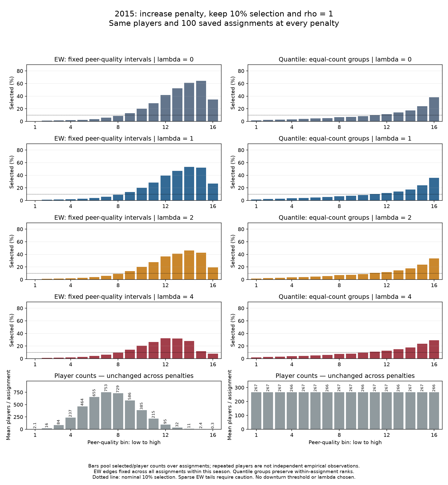
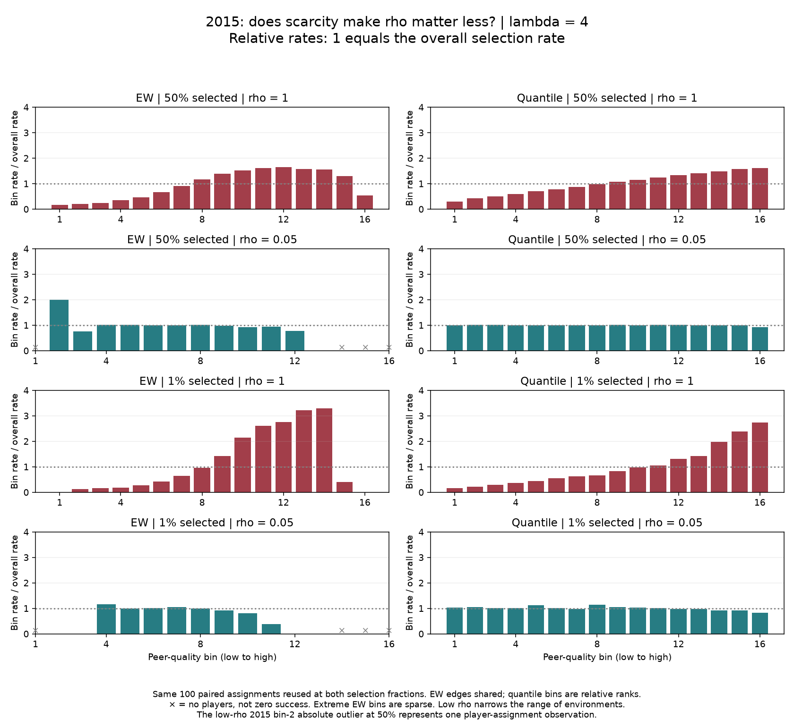

# Chapter 4

## A model of competitive congestion and advancement

## 4.1 Individual performance and success in groups

Individuals develop, work, and demonstrate their capabilities alongside others. Advancement, however, depends on how their accomplishments are recognized and how opportunities are allocated. Strong peers may contribute to learning and productive work while also competing for attention, responsibility, and recognition. An environment that supports performance can therefore have more complicated consequences for who advances.

This chapter connects the local social environments studied in network science with the allocation of recognition and advancement studied in the science of success. Our question is how the composition of an individual's group can affect subsequent selection among people with comparable performance. Group membership supplies the local structure; selection links individuals from those groups to a broader set of scarce opportunities. Scientific teams, organizational units, and athletic teams provide different settings in which to investigate this relationship. The phenomenon, rather than any one institutional setting, is the object of the model.

We develop the argument by beginning with the simplest account of selection: rank individuals by their performance and choose the highest-ranked candidates. We then relax perfect selection, ask what changes when group composition matters, and refine how we represent local competition. Each step introduces a feature absent from the preceding model. Once the advancement mechanism is specified, we describe how to construct artificial groups for controlled experiments and examine what the completed experiments and empirical fitting establish.

## 4.2 Selecting the highest performing individuals

Consider individuals who already belong to groups. Over a period of activity, each accumulates a record of performance. At the end of that period, a decision maker allocates a limited number of opportunities among the eligible individuals. In our first model, the decision maker can observe and compare their performance perfectly. Everyone is ranked, and the highest-ranked individuals receive the available places.

A season followed by an athletic draft offers one concrete illustration. The general model concerns any defined performance period and subsequent selection event. We begin with a common selection population spanning multiple groups. Here "global" means global relative to those local groups; it need not mean that every person in an institution, country, or profession is eligible.

### 4.2.1 Performance and the selection population

We summarize the record entering selection by $A_{i}$, the performance characteristic of individual i. A denotes that characteristic in general. The model takes these values as given at the selection stage; it does not simulate their accumulation over time. Depending on the application, $A_{i}$ may be a measured performance statistic or a specified characteristic in a simulation. It need not be innate talent, and a measured value may already reflect earlier environments. Perfect observation in this benchmark means perfect access to the stipulated $A_{i}$, rather than a claim that empirical performance reveals underlying talent without error.

Let I denote the eligible population and N its size. Each individual belongs to one group g(i). Group j has $n_{j}$ members, all groups are nonempty, and their sizes sum to N. Memberships can come directly from observed rosters. We do not yet need a model of how those groups formed.

Let K be the number of selection opportunities, with 0 ≤ K ≤ N. The selection fraction $K/N$ describes their scarcity: smaller fractions mean fewer opportunities relative to the eligible population. We generally study 0 \< K \< N, because selecting nobody or everybody leaves no variation in the binary outcome. Fixing K is a modeling assumption; it does not require that every application have an explicitly announced institutional quota.

### 4.2.2 The score and the selection rule

We distinguish the score used to compare candidates from the rule that awards places. Write the score as $S_{i}$. In this simplest model, individual performance is its only ingredient:

$$
S_{i} = A_{i}.
$$

The selection rule chooses the K highest scores. If $W_{K}(S)$ denotes that selected set and $Y_{i}$ records whether individual i is selected, then

$$
Y_{i} = 1\{ i \in \ W_{K}(S)\},\ \ \ \sum_{i \in \ I}Y_{i} = K.
$$

Thus scoring establishes competitive standing and selection allocates the opportunities. A fixed tie convention completes the deterministic rule when several people share the boundary score. The deterministic experiments use a reproducible ordering for ties; uncertainty deliberately introduced in the next section is a separate choice.

### 4.2.3 What group membership does in the benchmark

Groups exist in this first model, but they do not affect who is selected. Reassigning the same individuals among groups leaves their scores and the selected set unchanged. Increasing K instead expands the selected set by moving down the performance ranking, provided the tie convention remains fixed.

Group selection rates can nevertheless differ. A group containing many high-performing individuals can produce more selected candidates simply because of its composition. This is the structural reference against which we will evaluate a group effect: different outcomes across groups need not mean that membership changed anyone's competitive standing. Later comparisons at similar $A_{i}$ and experiments on the same individuals and memberships will ask whether an explicit local adjustment changes that conclusion.

## 4.3 Allowing uncertainty in selection

Perfect ranking is a useful starting point, but selection need not reproduce it exactly. Evaluators may observe incomplete records, disagree about candidates, or consider factors outside the model. A stronger record may increase a person's chance of selection without guaranteeing that every higher-performing candidate is chosen ahead of every lower-performing one.

We represent this uncertainty while retaining a fixed number of opportunities. The scores remain those supplied to selection; the identities receiving the K places can vary. At this stage the score is still $A_{i}$. The same selection rule can subsequently operate on a score that also incorporates group composition.

### 4.3.1 How strongly scores influence selection

A positive selection temperature, $t_{SELECT}$, controls how strongly a score difference favors one individual over another. Low temperature makes selection closely follow the score ranking. High temperature makes that ranking less decisive. This parameter describes uncertainty in selection conditional on the scores; a separate account of how performance is measured would require its own observation model.

The subscript distinguishes this selection temperature from the parameter $t_{MLE}$ in the empirical fitting specification introduced in Section 4.8. Their relationship is considered there, after both probability models have been defined.

### 4.3.2 Selecting exactly K individuals without replacement

We draw one individual at a time, favoring higher scores, and remove each selected individual before the next draw. The process ends after K draws. Let $I_{r}$ be the individual selected on draw r. The remaining candidates immediately before that draw are

$$
R_{r} = \mathcal{I} \smallsetminus \left\{ I_{1},\ldots,I_{r - 1} \right\},r = 1,\ldots,K
$$

For an individual still in $R_{r}$, the probability of being selected next is

$$
\Pr\left( I_{r} = i|I_{1},\ldots,I_{r - 1},\mathbf{S} \right) = \frac{\exp\left( S_{i}/t_{SELECT} \right)}{\sum_{h \in R_{r}}^{}{\exp\left( S_{h}/t_{SELECT} \right)}}
$$

Scores and group memberships remain fixed across draws. Only the set of candidates still eligible to be drawn changes. The final outcome is

$$
Y_{i} = 1\left\{ i \in \left\{ I_{1},\ldots,I_{K} \right\} \right\},\sum_{i \in \mathcal{I}}^{}Y_{i} = K
$$

The exponential terms are Gibbs weights. Sequential selection using these weights is the Plackett--Luce form of weighted sampling without replacement. The displayed probability describes the next draw, rather than the final marginal probability of belonging to the K winners. Draw order defines the probability distribution and need not represent an observed institutional ranking. \[1, 2\]

For an ordered sequence of distinct winners, its probability is the product of the successive conditional probabilities. The probability of an unordered selected set is the sum of those products over every ordering of that set. This distinction becomes important when we turn to fitting: exact-K outcomes cannot be treated as independent Bernoulli decisions with the same likelihood.

### 4.3.3 Limits and score units

The rule makes the comparison between two remaining candidates explicit. Their next-draw probability ratio is

$$
\frac{\Pr\left( I_{r} = i| \cdot \right)}{\Pr\left( I_{r} = h| \cdot \right)} = \exp\left( \frac{S_{i} - S_{h}}{t_{SELECT}} \right)
$$

A given score advantage therefore matters relative to the temperature. As $t_{SELECT}$ approaches zero, selection approaches deterministic top-K when there is no tie at the boundary. Boundary ties require separate treatment; the stochastic limit need not reproduce the deterministic code's fixed ordering. As temperature becomes arbitrarily large, each draw approaches uniform sampling among those remaining, and each person's final inclusion probability approaches $K/N$.

Adding the same finite constant to every score leaves all conditional probabilities unchanged. Multiplying every score and the temperature by the same positive constant also preserves them. These properties follow by cancellation in the normalized weights. They establish that score differences, measured relative to temperature, determine the stochastic comparison. Scores can be any finite real numbers, including negative values.

The mathematical definition applies without clipping scores or reducing the stipulated capacity. Appendix 4A documents qualifications needed when interpreting legacy software and distinguishes those implementations from this rule.

## 4.4 Introducing local competitive congestion

The two models so far allow performance and uncertainty to determine selection, but leave group membership irrelevant to an individual's score. They would treat the same person identically after a move to a different group, provided that person's $A_{i}$ stayed unchanged. We now ask whether that is a sufficient account of advancement when individuals work and become visible alongside others.

Strong peers can offer learning, collaboration, and access to productive activities. They can also compete for limited attention, responsibility, and distinction. We isolate this competitive side of the environment while holding the performance values entering selection fixed. A separate developmental benefit function is outside the present specification. Our question is whether local competition can change the standing with which individuals enter a broader selection process, even without reducing their measured performance.

We use $C_i$ to denote the effective congestion applied to individual $i$. The general score adjustment is

$$
S_i=A_i-\lambda C_i,\qquad \lambda\geq 0.
$$

The definition of $C_i$ changes as we develop the model. It first summarizes average performance and later the concentration of credible competitors. The index $i$ identifies whose score receives the adjustment; it does not require that every individual receive a different value. When congestion is shared by everyone in group $j$, we write that group value as $C_j$ and set $C_i=C_{g(i)}$. The naïve model in Section 4.2 has no congestion term; setting $\lambda=0$ recovers its score.

### 4.4.1 A first approximation using average peer performance

A simple starting point is to summarize the strength of the other individuals in a person's group. If stronger peers make distinction more difficult, average peer performance supplies an initial approximation to competitive pressure. Excluding the focal individual keeps this environmental summary separate from their own performance.

For a group with more than one member, define the leave-one-out peer average by

$$
C_{\mathrm{LOO},i}
=\frac{1}{n_{g(i)}-1}
\sum_{\substack{h:g(h)=g(i)\\h\ne i}} A_h,
\qquad C_i=C_{\mathrm{LOO},i}.
$$

The label LOO means leave one out. The sum runs over individuals in $i$'s group other than $i$. Because a different person is excluded for each calculation, members of the same group can receive different congestion values. A singleton has no peer average and requires separate treatment rather than an assigned value of zero. In this specification, the score is $S_i=A_i-\lambda C_{\mathrm{LOO},i}$.

Alternatively, we can treat the group's average performance as a shared environment. Let $T_j$ denote the mean of $A$ over every member of group $j$, including the focal individual. The corresponding quality-based congestion measure is

$$
C_{Q,i}=T_{g(i)}
=\frac{1}{n_{g(i)}}\sum_{h:g(h)=g(i)}A_h,
\qquad C_i=C_{Q,i}.
$$

Here $Q$ labels the use of average group performance, or group quality, as the congestion approximation. For every individual in group $j$, $C_{Q,i}=T_j$, and the score is $S_i=A_i-\lambda C_{Q,i}$. The two symbols have distinct roles: $T_j$ describes the group mean, whereas $C_{Q,i}$ identifies its use as the congestion term in an individual's score. The same $T_j$ will serve as the final group mean when we measure sorting and as an evolving centroid while we construct groups.

The difference between the two averages is explicit. For $i$ in group $j$ with $n_j>1$,

$$
C_{\mathrm{LOO},i}=\frac{n_jT_j-A_i}{n_j-1}.
$$

Thus including or excluding the focal individual is a modeling choice, rather than two names for the same quantity. Both specifications make average performance the basis of the congestion adjustment. At positive $\lambda$, individuals with equal $A_i$ can enter selection with different scores because their environments differ. Applying either the deterministic or stochastic selection rule then converts those scores into outcomes.

These are relative adjustments. If $A$ is standardized, a negative average raises the adjusted score above $A_i$. The statement that stronger peers impose a disadvantage concerns comparisons at fixed own performance, not a claim that these elementary measures are always positive absolute burdens. We introduce them as explanatory benchmarks; the completed experiments reported later use the refined congestion measure below. The numerical meaning of $\lambda$ depends on the congestion definition and its scale, so retaining the same symbol does not imply that a fitted or chosen value transfers unchanged between specifications.

### 4.4.2 From average peers to credible competitors

Average performance does not distinguish which group members are plausible candidates for an opportunity. Raising the performance of a person far below a relevant level changes the average even if that person remains unlikely to compete for advancement. Two groups can also have the same average while differing in how many members occupy the range from which credible candidates emerge. To represent that distinction, we next ask how much each member contributes to the competitive field.

We introduce a common performance threshold θ around which a member becomes competitively relevant. A sharp cutoff would classify members immediately below and above it very differently. Instead, a smooth transition allows relevance to increase gradually. For member h, define

$$
v_{h} = \sigma(\gamma(A_{h} - \theta)) = \frac{1}{1 + \exp\lbrack - \gamma(A_{h} - \theta)\rbrack}.
$$

Here θ locates the transition and γ \> 0 controls its sharpness. A member at θ contributes one half. Members far below it contribute little, and members far above it contribute nearly one. Saturation expresses the idea that an exceptionally high score does not generate an unlimited competitive burden.

This threshold refers to a common region of competitive relevance. It is not defined by whether a peer individually outperforms the focal person. Nor is it automatically the top-K selection cutoff: θ governs who contributes to local congestion, whereas K governs how many opportunities are awarded across the selection population. Their interaction is examined in Section 4.5.

The smooth transition can represent imprecision in where competitive relevance begins, but γ is not itself an estimated measurement-error variance. Selection temperature concerns uncertainty in choosing winners given scores. The sigmoid concerns how performance contributes to congestion before those scores enter selection. Keeping the two roles explicit allows each assumption to be examined separately.

### 4.4.3 Aggregating competitive relevance into a group adjustment

Having specified each member's contribution, we need to decide how those contributions describe the local environment. The refined model represents the concentration of credible candidates in a group through their mean contribution:

$$
C_j=\frac{1}{n_j}\sum_{h:g(h)=j}v_h
=\frac{1}{n_j}\sum_{h:g(h)=j}\sigma\!\left[\gamma(A_h-\theta)\right],
\qquad C_i=C_{g(i)}.
$$

Like the full-team performance average $C_{Q,i}=T_{g(i)}$, this definition includes every member and gives the same congestion value to everyone in a group. It replaces average performance with average competitive relevance. Compared with the initial leave-one-out measure $C_{\mathrm{LOO},i}$, it changes both what is averaged and whether the focal individual is included. This describes competitive concentration in the local setting; it is not a literal count of each person's other competitors.

A leave-one-out average of competitive relevance would instead equal

$$
\frac{n_jC_j-v_i}{n_j-1},\qquad i\in j,\quad n_j>1.
$$

That alternative averages the transformed contributions $v_h$, whereas $C_{\mathrm{LOO},i}$ in Section 4.4.1 averages performance $A_h$ itself. They are different quantities. We retain the full-group definition for the refined model and the completed experiments described here. The earlier mean-performance specifications are conceptual stepping stones, not algebraically identical forms of the refined score.

For finite inputs and positive γ, $C_{j}$ lies strictly between zero and one. It is a smooth proportion of competitively relevant members. Replicating a group's characteristic distribution at a larger size leaves this mean unchanged. With fixed equal group sizes, number and concentration move together; with unequal sizes, a count and a mean would represent different assumptions about the burden of competition.

The refined competitive score is

$$
S_i=A_i-\lambda C_i=A_i-\lambda C_{g(i)}.
$$

The coefficient λ ≥ 0 controls the congestion penalty, with λ = 0 recovering the performance-only benchmark. The coefficient in either elementary mean-performance score is not numerically interchangeable with λ here: the elementary measures average $A$, while the refined measure averages competitive relevance. With standardized A and raw $C_{j}$, λ has units of standard deviations of A per unit of mean relevance. Unless an experiment states otherwise, $C_{j}$ is the raw full-group mean above.

A lower score represents an adverse adjustment to standing in selection; it does not assert that the person's recorded performance or learning declined. Attention, visibility, and sponsorship provide possible substantive channels. Group composition is the structure represented by the model, without separately specifying interpersonal ties or a dynamic influence process for those channels.

### 4.4.4 How local composition changes global comparisons

The group adjustment now connects local structure to the allocation of opportunities across the population. Its effect is easiest to see by comparing candidates within and across groups. Because $C_{j}$ is shared by all group members, two members of the same group satisfy

$$
S_{i} - S_{h} = A_{i} - A_{h}.
$$

Their ordering by A is preserved. Across different groups, however,

$$
S_{i} - S_{h} = (A_{i} - A_{h}) - \lambda(C_{g(i)} - C_{g(h)}).
$$

A candidate with a performance advantage can therefore have a lower adjusted score if their group has sufficiently greater congestion. For $A_{i}$ \> $A_{h}$ and $C_{g(i)}$ \> $C_{g(h)}$, the scores coincide at

$$
\lambda = \frac{A_{i} - A_{h}}{C_{g(i)} - C_{g(h)}}.
$$

Above that value, their order reverses when the underlying performance and congestion quantities are held fixed. Under deterministic selection, such a reversal changes outcomes only if it changes membership at the top-K boundary. Under stochastic selection, altered score differences can change probabilities even before a reversal occurs. Environmental consequences for advancement therefore depend on both the score adjustment and the subsequent selection rule.

The selection population matters to this conclusion. If each local group instead had its own fixed quota and selected only among its own members, the common subtraction would cancel from within-group rankings and from the stochastic probabilities. This particular full-group penalty would not alter those winners. Its consequential comparisons occur across groups competing for common opportunities. Institutions without explicit local quotas can exhibit such comparisons; a model of selection entirely within groups would require a different or additional mechanism.

## 4.5 Mathematical behavior and parameter regimes

The model now specifies how local competitive concentration changes scores and how scores determine selection. We next examine when that connection has consequential effects. A group adjustment may be substantial in absolute size yet leave rankings unchanged if it is nearly identical across groups. A change in ranking may in turn leave selection unchanged if it occurs far from the boundary. The following analysis separates the roles of relevance, penalty strength, scarcity, and uncertainty before interpreting outcome curves.

### 4.5.1 Threshold location and transition sharpness

The threshold determines which part of the performance distribution contributes most strongly to congestion. Transition sharpness determines how distinctly members on either side are differentiated. To see where small performance differences matter most to relevance, differentiate the contribution function:

$$
\frac{\partial\ v_{h}}{\partial\ A_{h}} = \gamma\ v_{h}(1 - v_{h}).
$$

Sensitivity is greatest at $A_{h}$ = θ, where it equals γ/4, and declines toward either tail. The threshold determines where the transition occurs; γ determines its sharpness. Increasing γ raises contributions for members above θ and lowers them for members below θ. Its effect on a group's average therefore depends on that group's composition and need not have the same sign in every group.

Two limiting cases help locate the mechanism. As γ approaches zero with finite A and θ, all contributions approach one half, so every group receives the same penalty λ/2. Rankings and the stochastic selection probabilities are then those of the performance-only model. As γ becomes large, contributions approach one above θ and zero below θ, with one half at exact equality. Congestion approaches a threshold-based fraction. Moving θ far below or far above the entire population likewise makes group contributions nearly constant, respectively near one or near zero, leaving little differential penalty across groups.

These are consequences of the equations, not findings from a parameter sweep. A useful congestion regime requires heterogeneity in $C_{j}$ as well as a positive λ. A large coefficient cannot create cross-group differences when all groups have identical congestion.

### 4.5.2 Penalty strength and score scale

For λ \> 0, the raw penalty on any candidate lies strictly between zero and λ, and a cross-group penalty difference has magnitude less than λ. At λ = 0, both quantities are zero. Thus a performance advantage greater than λ cannot be reversed by this raw congestion term alone. The practical influence of λ also depends on the observed spread of $C_{j}$. If all groups have nearly equal congestion, the differential penalty may be small even when its common level is large.

For a fixed population, fixed groups, and a fixed threshold, each score is linear in λ. Pairwise rankings can change only at crossing values of the form derived in Section 4.4.4. Between crossing values, deterministic top-K membership remains unchanged. This explains why numerical scores can change continuously while the selected set changes in discrete steps. An increase in penalty strength is not itself evidence that more people have changed selection status.

Full-group congestion also means that changing $A_{i}$, while keeping the other members and θ fixed, changes both the direct score term and the shared group adjustment. In particular,

$$
\frac{\partial\ S_{i}}{\partial\ A_{i}} = 1 - \frac{\lambda\gamma}{n_{g(i)}}v_{i}(1 - v_{i}).
$$

A sufficient condition for this derivative to remain positive is λγ \< 4 $n_{g(i)}$. This is a local score calculation under the stated fixed-input conditions, not an empirical restriction we have estimated. It also does not contradict preserved within-group rankings: when $A_{i}$ changes, the same altered $C_{j}$ is applied to every member of that group. The derivative makes clear why the phrase "holding own performance constant" is useful when interpreting an environmental comparison.

### 4.5.3 Scarcity and the selection margin

The selection fraction $K/N$ acts on the score distribution after congestion has been computed. Lowering K moves the deterministic boundary upward; it does not change the sigmoid threshold θ unless an experiment explicitly couples those quantities. The experiments discussed below held θ fixed when varying $K/N$. Treating θ and K as independent controls distinguishes who contributes to local congestion from how many people receive the global outcome.

Holding all scores fixed, lowering K yields a smaller selected set. Holding the same K while changing the congestion penalty asks a different question: which identities replace which others? If two conditions each select K individuals and their winner sets are W and W′, the number of replaced places is

$$
D = K - |W \cap \ W'| = \frac{|W \bigtriangleup W'|}{2}.
$$

D counts each lost-and-gained place once. D/K is the fraction of selected places that change. Fewer changed people under scarce selection can coexist with a larger fraction of available places changing hands. Both quantities are needed when assessing how much a mechanism matters.

Under stochastic selection, the total number of winners still equals K in every realization, while their identities vary. Temperature controls that uncertainty; scarcity controls the count. Neither parameter should be interpreted as a substitute for the other. For example, very high temperature produces uniform selection with inclusion probability $K/N$, whereas K = N makes every candidate succeed at every temperature.

### 4.5.4 Why an outcome curve need not have a universal shape

A success curve plotted against peer quality combines individual performance, group composition, the score adjustment, and selection. An increasing segment can arise from the sorting of strong individuals into strong groups. A declining segment can arise when the congestion penalty offsets that association in a particular region. The equations do not guarantee an inverted U for every population or every parameter setting.

Conditioning on a fixed band of $A_{i}$ helps distinguish individual composition from variation in environments, but a broad band still contains differences in $A_{i}$. The most selective tail can also have sparse support in some environments. A comparison among very strong but not extreme performers can be scientifically informative without being presumed to display a downturn. Its definition and support must be reported whether the anticipated pattern appears or not.

An unconditional curve, a comparison within $A_{i}$ bands, and a count of changed winner identities answer different questions. The chapter uses mathematical properties to establish what the mechanism can do and completed simulations to show what it did in specified configurations. It does not infer a universal causal law from a visually appealing curve.

## 4.6 Generating artificial groups with controlled sorting

Until now, group memberships have been taken as given. To investigate the mechanism systematically, we also need populations in which we can vary who belongs with whom while retaining the same individuals and group capacities. Do similar performers cluster together, or are they distributed across heterogeneous groups? Constructing those alternatives makes sorting an experimental condition and lets us examine how it changes the local environments entering selection.

### 4.6.1 Why an assignment mechanism is needed

The assignment mechanism supplies controlled group memberships for simulation. Observed rosters already provide memberships and do not require this step. We use artificial groups to investigate the consequences of composition, without claiming to predict every institutional process through which real groups form.

We represent membership as a bipartite network, with individuals on one side and groups on the other. Each individual has one membership edge during the modeled period. Group j must ultimately have $n_{j}$ edges, preserving its specified roster capacity. Shared membership induces peer relationships in the individual projection, but the scoring mechanism can be evaluated directly from group membership without constructing that projection explicitly.

This representation preserves the structural constraints of a bipartite configuration-style reference while allowing characteristic-based attachment to affect which memberships form. The LG mechanism combines fixed roster capacities with a preference based on the metadata $A_{i}$. The similarity term does not reward a group merely for having already acquired many members. A separate experiment that relaxes fixed roster sizes is a different model and is not silently substituted for the mechanism described here.

### 4.6.2 Sequential assignment with evolving centroids

Before assignment, every group has zero members. Its centroid is initialized to the common population mean $\overline{A}$. Individuals are considered in randomized order. Let $R_{j}^{(m)}$ be the number of remaining places in group j at step m, and let $T_{j}^{(m)}$ be its centroid just before the next assignment. For the individual i arriving at that step, the assignment probability is

$$
p_{ij}^{(m)} = \frac{R_{j}^{(m)}\exp( - \rho|A_{i} - T_{j}^{(m)}|)}{\sum_{h}^{}R_{h}^{(m)}\exp( - \rho|A_{i} - T_{h}^{(m)}|)}
$$

A full group has zero remaining capacity and receives zero probability. The factor $R_{j}^{(m)}$ accounts for available slots; the exponential term favors similarity between $A_{i}$ and the current group centroid. The parameter ρ ≥ 0 controls that similarity preference. This capacity factor belongs to constrained allocation and should not be described as degree-based preferential attachment to already popular groups.

When the first person joins a group, that person's $A_{i}$ becomes its centroid. After every subsequent assignment, the centroid becomes the mean A of its current members. Once assignment ends, $T_{j}$ is the final group mean, including all $n_{j}$ members. Provided total capacity equals N, the sequential procedure assigns every individual and fills every group exactly.

At ρ = 0, assignment probabilities reduce to remaining capacity divided by the total remaining capacity. Choosing a group this way is equivalent to choosing uniformly among the remaining membership slots. Increasing ρ favors currently similar groups, subject to capacity constraints and the history of earlier assignments. Because the centroids evolve, the assignment order and random choices can affect the final partition.

### 4.6.3 Preference and realized sorting

The parameter ρ governs a generative preference. It does not directly measure the sorting realized in a completed population. We measure that structure using

$$
H_{\text{sort}} = 1 - \frac{\sum_{i}^{}\left( A_{i} - T_{g(i)} \right)^{2}}{\sum_{i}^{}\left( A_{i} - \overline{A} \right)^{2}},
$$

Here, $g(i)$ identifies the group containing individual $i$, $T_{g(i)}$ is that group's final mean of $A$, including individual $i$, and $\overline{A}$ is the population mean of $A$. Both sums run over all individuals in the population.

A denotes the characteristic and $A_{i}$ its value for individual i. $T_{j}$ is the evolving centroid during assignment and the final group mean afterward. Unlike the leave-one-out peer-quality measure, $H_{sort}$ uses full-group means.

For positive total variation in A, the within-group and between-group decomposition gives

$$
\sum_{i}(A_{i} - \overline{A})^{2} = \sum_{i}(A_{i} - T_{g(i)})^{2} + \sum_{j}\ n_{j}(T_{j} - \overline{A})^{2}.
$$

To see this, write $A_{i}$ − $\overline{A}$ as the sum of $A_{i}$ − $T_{g(i)}$ and $T_{g(i)}$ − $\overline{A}$. The cross terms sum to zero inside each group because deviations from that group's mean sum to zero. Consequently, $H_{sort}$ is the between-group share of total variation and lies between zero and one. If the population has no variation in A, its denominator is zero and the statistic is undefined rather than evidence of perfect or absent sorting.

Nonzero sorting can occur under random assignment in finite groups. With J fixed nonempty group sizes, uniform random allocation of the same N individuals, and positive total variation, the expected index is (J − 1)/(N − 1). One obtains this by applying the finite-population variance of each random group mean and summing its $n_{j}$-weighted squared deviation from $\overline{A}$. This analytic reference applies to the uniform allocation benchmark; a reference ensemble remains useful for variability and for procedures with additional constraints.

Realized sorting therefore depends on ρ, the A distribution, roster capacities, and stochastic assignment history. A comparison should report both the chosen preference and the resulting $H_{sort}$, rather than equating ρ = 0 with an observed index of zero. An empirical $H_{sort}$ below a simulated reference does not establish that real assignment was random.

### 4.6.4 Connecting assignment to mechanism experiments

A controlled simulation first assigns individuals, then computes scores on the resulting groups, and finally selects winners. That is the chronological ASSIGN → SCORE → SELECT pipeline. The chapter introduced the components in a different order to establish the advancement mechanism before explaining how its artificial environments are generated.

When comparing penalties on the same assignments, the population, capacities, and groups can be held exactly fixed. When comparing assignment preferences, paired arrival orders and random draws reduce avoidable simulation variation, but they do not hold the resulting groups fixed. Changes in ρ can alter the range of environments, the association between $A_{i}$ and those environments, and winner identities. Those channels must be considered when interpreting a changed success curve.

## 4.7 What the completed mechanism experiments establish

The mathematical results identify ways in which local group structure can change selection. The completed simulations ask how large those changes are in specified populations and whether they appear in selection profiles across peer environments. We begin by asking whether congestion changes any selected identities, then examine how penalty strength, sorting, and scarcity affect the result. The empirical source supplies performance distributions and group capacities; the simulations address the general mechanism rather than recreate all features of that source institution.

### 4.7.1 Experimental setting and interpretation

The completed experiments reported here used basketball-derived characteristic distributions and group capacities for 2014, 2015, and 2016, with 100 paired assignments per season. Individual performance was within-season standardized points per minute. The score used raw full-group mean congestion, γ = 10, and a θ fixed at the season's 99th performance percentile. The selection rule was deterministic top-K. Thus these experiments demonstrate behavior of the deterministic member of the model family; they are not results from the unrestricted stochastic SELECT rule. \[14\]

The characteristic values came from measured basketball production and should not be relabeled portable or innate talent. The 2015 working population contained 4,267 players on 351 teams. The same athlete can appear in more than one year, and repeated assignments do not create independent empirical populations. These are controlled mechanism experiments, not a held-out prediction exercise or a causal estimate of basketball peer effects.

### 4.7.2 Congestion can change winners without similarity preference

At approximately 2.7% selection and λ = 1, introducing congestion replaced an average of 1.51--2.21 winners under ρ = 0, depending on season. Under the preferential-assignment condition, the corresponding averages were 4.25--5.61. Congestion therefore changed some winners even without a similarity preference in these configurations. \[14\]

This answers a narrow necessity question. It does not establish that a pronounced rise-and-fall outcome curve appears without assortativity, nor that assortativity is universally required for such a curve. Changing selected identities and changing curve shape are distinct criteria. The approximately 2.7% setting was a domain-motivated scenario derived from a career-exit outcome proportion, not a verified annual capacity for every simulated season.

The penalty's numerical scale helped explain the small initial changes. At λ = 1, its standard deviation was approximately 0.026--0.033, compared with one for standardized performance. The penalty could rearrange close competitors while leaving broad performance differences dominant. A coefficient of one therefore did not mean that congestion and individual performance varied on comparable scales. \[15\]

### 4.7.3 Penalty strength and the visibility of the tail

Holding ρ = 1 and selection near 10% fixed, the next comparison varied λ across 0, 1, 2, and 4 on the same saved assignments. At λ = 4, equal-width peer-quality bins displayed a rise and fall in all three seasons, while quantile-bin rates continued to rise. The two displays summarized the same selected outcomes. Quantile bins combined a broad upper-peer-quality region, whereas equal-width bins separated the extreme tail. \[16\]

In 2015 at λ = 4, equal-width bins 12--15 had selection rates of approximately 32.3%, 31.8%, 27.8%, and 11.9%. Their mean populations per assignment fell from about 95 to 32, 11, and 2.4. The last bin averaged only 0.26 players per assignment. The upper-tail decline was therefore not solely the last bar, but its outermost estimates were supported by few observations. Figure 4.1 retains the population-count row so that the visual pattern can be judged alongside its support.

This comparison also explains why binning is part of the scientific interpretation. An absence of a visible downturn in a quantile display does not prove an absence of local tail declines. Conversely, a striking sparse bar does not establish a stable downturn. Empty environments must remain missing support, not be coded as zero success.

Figure 4.1 Penalty strength and binning in the 2015 simulation. Rows compare λ = 0, 1, 2, and 4; the final row shows mean player counts per assignment. Assignment preference is ρ = 1 and global selection is near 10%. Equal-width bins are at left and quantile bins at right. The horizontal variable is leave-one-out mean standardized teammate performance. Rates pool selected and eligible counts across 100 assignments. These are simulated outcomes; sparse extreme bins limit interpretation. Source \[16\].

### 4.7.4 Assignment preference and scarcity

A later comparison held λ = 4 fixed and compared ρ = 1 with ρ = 0.05 at selection fractions of 50% and 1%. It reused the same saved paired assignments rather than generating new teams for each scarcity level. Lower preference substantially flattened the relative selection profile and narrowed the occupied range of peer environments. The contrast persisted at 1% selection. Figure 4.2 expresses each bin's rate relative to the achieved overall selection rate, making small absolute probabilities visible on a comparable relative scale. \[17\]

Winner identities supplied a complementary measure. In 2015, changing preference replaced an average of 57.81 of 2,134 winners at 50% selection, or 2.71%. At 1%, it replaced 10.53 of 43 winners, or 24.49%. Across the three seasons the corresponding changed shares were approximately 2.5--2.7% and 24--27%. Scarcity reduced the absolute number of changed winners while increasing their share of the selected group in this comparison.

These findings do not support the simple hypothesis that extreme scarcity necessarily makes assignment preference unimportant. They also do not establish that scarcity explains the observed basketball pattern. The 50% condition was an exploratory higher-opportunity scenario, not a fitted representation of Army promotion. The model did not simulate basketball lineups or a five-player court constraint.

Figure 4.2 Assignment preference under two levels of scarcity in the 2015 simulation. The upper two rows show selection near 50%; the lower two show selection near 1%. Red indicates ρ = 1 and teal ρ = 0.05. The penalty is λ = 4 throughout. The vertical scale is each bin's selection rate divided by the achieved overall rate. Crosses indicate unoccupied environments. Quantile groups refer to ranks within their respective assignment distributions, not identical individuals or identical numerical environments. Source \[17\].

### 4.7.5 What remains to be established

The completed work demonstrates that congestion can change winners without preferential assignment and that assignment preference can shape both outcome profiles and the identities selected. It also demonstrates sensitivity to penalty strength, scarcity, and how the peer-quality axis is summarized. These are conditional findings from declared configurations. They do not prove a universal necessity theorem for assortativity or guarantee a downturn within every high-performance band.

The analytic discussion in Section 4.5 explains the roles of γ, θ, λ, $K/N$, and $t_{SELECT}$. It should not be mistaken for a completed systematic simulation sweep of every parameter. In particular, a controlled comparison of the intended stochastic rule, fixed own-performance bands, and the relevant parameter interactions remains a separate evidentiary task. Any new experiment should address a stated claim that the current mathematics and saved results cannot yet support.

## 4.8 The bridge to empirical fitting

The mechanism experiments ask what the specified model can produce. Empirical fitting asks whether a probability model accounts for outcomes on observed populations, what its parameters mean in that setting, and whether those estimates support useful empirical comparisons. Observed rosters allow the fitting stage to begin without generating teams through ASSIGN. This distinction is essential: evaluating parameters on fixed memberships does not jointly estimate the process that created those memberships.

The completed historical fitting procedure used a season-wise softmax probability specification with an independent Bernoulli working likelihood. It was different from the exact-K without-replacement rule in Section 4.3. In the notation used here, its board logit and probability were

$$
\eta_{is} = \frac{A_{is}}{t_{MLE}} - \lambda_{MLE}C_{g_{s}(i),s}\left( \gamma,\theta_{s} \right)
$$

$$
p_{is} = \frac{\exp\left( \eta_{is} \right)}{\sum_{h \in \mathcal{I}_{s}}^{}{\exp\left( \eta_{hs} \right)}},\sum_{i \in \mathcal{I}_{s}}^{}p_{is} = 1
$$

The objective was the Bernoulli log-likelihood

$$
\mathcal{l}_{B}(\lambda_{MLE},\gamma,t_{MLE}) = \sum_{s}^{}{\sum_{i \in \mathcal{I}_{s}}^{}\lbrack}Y_{is}\log p_{is} + (1 - Y_{is})\log(1 - p_{is})\rbrack.
$$

The later joint optimization estimated γ, $\lambda_{MLE}$, and $t_{MLE}$. The season thresholds $\theta_{s}$ were constructed before optimization, and assignment preference ρ was outside this outcome likelihood. The saved joint estimates were approximately 19.5723, 1.3024, and 1.0699, respectively. Those are estimates from the historical fitting specification, not fitted parameters of the chapter's exact-K stochastic selection model. Appendix 4A preserves the sample description, exact values, equations, and source record. \[4--9\]

Three interpretation issues are consequential. First, the probabilities sum to one within a season, so the working Bernoulli model implies one expected positive outcome per season before numerical clipping. Second, the historical observations are player-season rows with eventual-draft labels, so a person's positive outcome can occur on multiple rows; these are not independent annual selection events merely because the likelihood multiplies their contributions. Third, the threshold used observed positive-label counts in preprocessing. These issues must be addressed before the fitted probabilities are treated as calibrated individual advancement probabilities or the parameters are interpreted as those of an annual fixed-capacity process.

There is also a coefficient-scale distinction: dividing A alone by $t_{MLE}$ is not the same as dividing A − λC by temperature while retaining the same numerical λ. An algebraic reparameterization can match logits for fixed congestion, but it does not turn the Bernoulli likelihood into the likelihood of exact-K selection. No completed exact-K refit has been established in the verified record. \[11, 12\]

The model chapter therefore establishes a mechanism, its mathematical consequences, and the behavior demonstrated by completed simulations. The subsequent empirical treatment must align the eligible population, outcome timing, congestion definition, and selection likelihood before drawing substantive conclusions from fitted parameters. The detailed fitting record is retained below to make that bridge explicit and auditable, while keeping the chapter's main argument centered on competitive congestion and advancement.

## Appendix 4A Technical qualifications and the historical fitting record

### 4A.1 The intended stochastic rule and legacy software

The mathematical rule permits any finite real score. Negative scores still yield positive exponential weights, and adding the same constant to every score leaves every draw probability unchanged. This matters when comparing the definition with legacy code. The shared selection helper first replaces negative scores by zero and sets the draw count to the smaller of $K$ and the number of strictly positive scores. If no score is positive, it returns no selections. It also uses deterministic fallbacks at very small temperatures or when the numerical weights collapse. Consequently, some historical runs through that helper need not follow the unrestricted equation above or return exactly $K$ winners. The cap does not mean that every zero-clipped candidate is excluded: when Gibbs sampling occurs, such candidates receive positive exponential weights. \[3\]

The equation above defines the intended model. Establishing which completed runs implement it requires identifying the code version and selection path used in each run, checking whether clipping, capping, or numerical fallbacks were active, and determining whether any reported result changes under an implementation that preserves the stated rule. That verification remains open. It should be completed before describing all legacy stochastic results as realizations of this exact model.

### 4A.2 Observational units and the fitted probability model

For season $s$, let $\mathcal{I}_{s}$ denote the player-season observations entering the likelihood. The measured performance quantity $A_{is}$ was points per minute standardized within season by the analysis pipeline. The binary outcome $Y_{is}$ indicated whether the player was ever drafted. The fitting panel retained all eligible player-season observations rather than restricting outcomes to one final-season observation per athlete. Accordingly, the same eventual draft outcome could appear on several rows belonging to one player. These are the observational units of the historical fit; they should not be described as independent annual draft decisions or as distinct draft selections merely because the likelihood multiplies contributions across rows. A revision intended to model annual selection would need to establish a corresponding eligible population and outcome timing. \[5\]

Congestion was computed on the observed team-season rosters using the full-group definition introduced in Section 4.4.3. With $g_{s}(i)$ denoting the group containing individual $i$ in season $s$, the fitted congestion term was

$$C_{js}\left( \gamma,\theta_{s} \right) = \frac{1}{n_{js}}\sum_{h:g_{s}(h) = j}^{}\sigma\left( \gamma\left( A_{hs} - \theta_{s} \right) \right),\sigma(x) = \frac{1}{1 + \exp( - x)}$$

The mean included the focal player as well as the other retained members of the group. In the code this quantity was stored as $\mathtt{pool\_ c\_ smooth\_ team}$ and was often denoted $L^{C}$ in development documents. Here $C_{js}$ denotes the shared congestion of group $j$ in season $s$; the effective congestion applied to individual $i$ is therefore $C_{g_s(i),s}$. This congestion quantity differs from the leave-one-out peer-quality mean used on some HERO horizontal axes. A plot conditioned on peer quality and a likelihood using congestion can coexist, but the two quantities must remain identified separately when interpreting an empirical comparison. \[6\]

The intermediate quantity supplied to the probability calculation, called the board logit in the implementation, was

$$\eta_{is} = \frac{A_{is}}{t_{MLE}} - \lambda_{MLE}C_{g_{s}(i),s}\left( \gamma,\theta_{s} \right)$$

The script converted these quantities to probabilities by applying a softmax function within each season:

$$p_{is} = \frac{\exp\left( \eta_{is} \right)}{\sum_{h \in \mathcal{I}_{s}}^{}{\exp\left( \eta_{hs} \right)}},\sum_{i \in \mathcal{I}_{s}}^{}p_{is} = 1$$

The softmax specifies the probabilities; the Bernoulli model specifies how those probabilities contribute to the likelihood of the observed binary outcomes. The historical likelihood and log-likelihood were

$$\mathcal{L}_{B}(\lambda_{MLE},\gamma,t_{MLE}) = \prod_{s}^{}{\prod_{i \in \mathcal{I}_{s}}^{}p_{is}^{Y_{is}}}(1 - p_{is})^{1 - Y_{is}},$$

$$\mathcal{l}_{B}(\lambda_{MLE},\gamma,t_{MLE}) = \sum_{s}^{}{\sum_{i \in \mathcal{I}_{s}}^{}\lbrack}Y_{is}\log p_{is} + (1 - Y_{is})\log(1 - p_{is})\rbrack.$$

For numerical evaluation, the implementation clipped each probability to the interval $\left\lbrack 10^{- 15},1 - 10^{- 15} \right\rbrack$ before taking logarithms. It minimized the negative log-likelihood using L-BFGS-B over the logarithms of the positive parameters $\lambda_{MLE}$, $\gamma$, and $t_{MLE}$. Congestion was recomputed as $\gamma$ changed during joint optimization. A separate option held $\gamma$ fixed and optimized the other two parameters. Reported overlap between the highest-probability observations and positive outcomes was a diagnostic, not the objective being optimized. \[4\]

### 4A.3 Normalization and threshold construction

The season normalization has a consequential implication. Before numerical clipping, the working independent Bernoulli model, conditional on the thresholds treated as fixed during fitting, satisfies

$$E\left\lbrack \sum_{i \in \mathcal{I}_{s}}^{}Y_{is}|\mathbf{A},\mathbf{g},\theta_{s} \right\rbrack = \sum_{i \in \mathcal{I}_{s}}^{}p_{is} = 1$$

The code did not multiply the probabilities by the observed number of positive outcomes, fit a season intercept to that count, or condition the likelihood on selecting exactly $K_{s}$ individuals. This is the historical working Bernoulli specification, but its normalization does not match a season containing many observed positive outcomes. Consequently, the saved probabilities should not be presented as validated individual draft probabilities. What remains to be established is whether this objective is defensible as a working calibration criterion for the intended scientific comparison, or whether a different outcome likelihood and observational unit are required. Neither a satisfactory ranking diagnostic nor a successful optimizer convergence message resolves that question.

The viability threshold $\theta_{s}$ was fixed during optimization, although its value was calculated separately for each season. The preprocessing routine counted positive draft labels among that season's rows with observed performance, used $K_{s}^{Y} = \max\left( 1,\sum_{i}^{}Y_{is} \right)$, and set

$$\theta_{s} = Q_{1 - K_{s}^{Y}/N_{s}}\left( \left\{ A_{is} \right\} \right)$$

where $N_{s}$ and the empirical quantile refer to that preprocessing population. The superscript $Y$ distinguishes this count of positive labels from a separately established institutional capacity. Because the labels describe eventual drafting on player-season rows, their season total is not automatically the number drafted in that calendar year. Thus, the outcome count affected the fit indirectly through the construction of congestion, even though the Bernoulli likelihood imposed no fixed-capacity constraint. The interpretation and timing of this threshold must be revisited if the outcome population is changed. \[7\]

Assignment preference ρ was outside the outcome likelihood because team membership was observed and held fixed. A separate calibration compared simulated and empirical values of the sorting statistic $H_{sort}$. The saved longitudinal result selected $\rho = 0$, at the lower boundary of the assignment calibration. The empirical mean sorting statistic remained below the simulated mean at that boundary, so this result does not establish that actual team assignment was random. It describes the closest setting reported for that calibration. The Gibbs selection temperature was also treated separately: it was swept in simulation, with a replay starting value of one, rather than jointly estimated as part of an exact-$K$ likelihood. \[1, 8\]

### 4A.4 Saved estimates and parameter transfer

The joint fitting artifact saved on 28 August 2026 reports

$\widehat{\gamma} = 19.57233208$, ${\widehat{\lambda}}_{MLE} = 1.30243058$, ${\widehat{t}}_{MLE} = 1.06989673$,

with log-likelihood -8865.70116079, $46,306$ player-season observations, and $1,133$ positive outcome flags across 11 season batches. The optimizer reported convergence. These are historical point estimates, not evidence by themselves of precise identification, causal effects, or a validated generative selection model. \[9\]

The run's analysis-window documentation is internally inconsistent. Its filename, saved metadata, and campaign description identify 2009--2021. However, the inspected panel loader constructs a 2011--2021 panel before applying the requested window, which is consistent with the saved total of 11 seasons. We therefore report both the recorded 2009--2021 run label and the implemented 2011--2021 restriction rather than asserting that the fit contains all thirteen seasons. Confirmation of the original run's input seasons and code version remains necessary to finalize its sample description. An earlier 2013--2021 fit, with $\gamma = 18$ fixed, instead reported ${\widehat{\lambda}}_{MLE} = 2.57150065$ and ${\widehat{t}}_{MLE} = 1.06556159$. Those estimates belong to a different fitting specification and should not be merged with the later joint estimates. \[5, 9, 10\]

There is a further distinction between the scale of the fitted logit and the score used in the generative model. In the fitting code, temperature divides measured performance alone; in stochastic SELECT it divides the entire score. Algebraically,

$$\frac{A_{i}}{t_{MLE}} - \lambda_{MLE}C_{g(i)} = \frac{A_{i} - t_{MLE}\lambda_{MLE}C_{g(i)}}{t_{MLE}}$$

For fixed congestion values, reproducing those same logits with a score of the chapter's form would require a score coefficient $\lambda = t_{MLE}\lambda_{MLE}$ and, for the Gibbs weights, $t_{SELECT} = t_{MLE}$. This identity clarifies the change of parameter scale; it is not a historical decision to equate the two temperatures or evidence that their likelihoods are equivalent. Even ranking by the fitted probabilities need not agree with ranking by $A_{i} - \lambda_{MLE}C_{g(i)}$ when the numerical penalty coefficient is transferred unchanged. \[4, 11\]

An exact-$K$ fit would evaluate the probability of the observed selected set under the without-replacement process. If selection order is unobserved, that probability sums over the possible orders of the selected individuals. It is not the product of the independent Bernoulli contributions used above. Development documents considered such a likelihood, but explicitly retained Bernoulli estimation for the completed fitting procedure. No completed exact-$K$ refit has been established in the verified record. \[2, 12\]

The empirical bridge consequently remains a separate methodological task. Before treating the historical estimates as fitted parameters of deterministic top-$K$ or stochastic exact-$K$ selection, the analysis must align the outcome population and timing, the congestion definition and scale, the selection implementation, and the probability model used for estimation. A refit or an explicit justification for using the earlier estimates is still required. This distinction allows the completed fitting work and mechanism experiments to be documented together while preserving the limits of what their combination currently establishes. \[13\]

### 4A.5 Alternative congestion specifications

After introducing the two mean-performance benchmarks, the main chapter uses refined full-group congestion $C_i=C_{g(i)}$, a common threshold, raw congestion, and global selection. A leave-one-out version changes the congestion quantity assigned to each individual. A sum in place of the mean changes the role of group size. Scaling congestion changes the units of λ. Moving the threshold with K couples competitive relevance to the outcome capacity, whereas holding it fixed permits those quantities to be varied independently. These choices require explicit identification wherever their results are compared.

Earlier implementations explored some of these alternatives. Their existence does not make them interchangeable versions of a single numerical result. The completed experiments in Section 4.7 used the raw full-group mean with a fixed percentile threshold, while the historical fit used season-specific thresholds constructed from outcome counts. The specification, input population, and selection rule must accompany each result; development chronology alone cannot establish equivalence.

## Appendix 4B Sources for the equations and completed results

The following notes identify the repository sources supporting the implementation and empirical statements in this chapter. They are a reproducibility record rather than an external literature bibliography. Algebraic deductions are stated and explained in the main text; they are not new simulation results. Final dissertation preparation will require stable bibliographic citations for the general network and choice-model literature in addition to these project records.

\[1\] The stochastic replay decision and distinction between temperatures are documented in [MBB_empirical_roster_select_replay.md](file:///Users/charleslevine/Library/CloudStorage/Dropbox/1-Documents/00-%20Dissertation/0-Next_Chapter/Code_and_Data/New%20SQL%20and%20PY%20Code/Cursor%20Workspace%20PDE/3-Master_Plan/re_entry/HEROs_and_PASSes/MBB_empirical_roster_select_replay.md), lines 370--418 and 454--462. The direct user instruction is preserved in [.specstory/history/2026-06-11_08-19-11-0400-compass.md](file:///Users/charleslevine/Library/CloudStorage/Dropbox/1-Documents/00-%20Dissertation/0-Next_Chapter/Code_and_Data/New%20SQL%20and%20PY%20Code/Cursor%20Workspace%20PDE/.specstory/history/2026-06-11_08-19-11-0400-compass.md), line 331818, with the subsequent implementation authorization at line 332351. The lock was for empirical-roster replay; it does not retroactively change earlier deterministic runs.

\[2\] [PD20_softmax_K_winners_explainer.md](file:///Users/charleslevine/Library/CloudStorage/Dropbox/1-Documents/00-%20Dissertation/0-Next_Chapter/Code_and_Data/New%20SQL%20and%20PY%20Code/Cursor%20Workspace%20PDE/3-Master_Plan/Alex_stuff/PD20_softmax_K_winners_explainer.md), lines 190--199, describes the observed-set likelihood for sequential proportional sampling. [PD20_notes.md](file:///Users/charleslevine/Library/CloudStorage/Dropbox/1-Documents/00-%20Dissertation/0-Next_Chapter/Code_and_Data/New%20SQL%20and%20PY%20Code/Cursor%20Workspace%20PDE/transcripts/PD20_notes.md), lines 121--127, identifies the weighted without-replacement procedure as Plackett--Luce.

\[3\] [sports/tier1_pool_assignment.py](file:///Users/charleslevine/Library/CloudStorage/Dropbox/1-Documents/00-%20Dissertation/0-Next_Chapter/Code_and_Data/New%20SQL%20and%20PY%20Code/Cursor%20Workspace%20PDE/sports/tier1_pool_assignment.py), lines 1111--1128 and 1131--1215, defines the shared helper. Score clipping occurs at line 1159; the positive-score cap at lines 1161--1165; deterministic fallback branches at lines 1193--1197 and 1203--1209; weighted sampling without replacement at line 1212. This caveat concerns the inspected helper and runs invoking it, not every SELECT implementation in the repository.

\[4\] [sports/scripts/pd21_draft_bernoulli_mle.py](file:///Users/charleslevine/Library/CloudStorage/Dropbox/1-Documents/00-%20Dissertation/0-Next_Chapter/Code_and_Data/New%20SQL%20and%20PY%20Code/Cursor%20Workspace%20PDE/sports/scripts/pd21_draft_bernoulli_mle.py), lines 111--191 and 327--409, implements fixed-roster congestion, the exact board logits, softmax, the numerically clipped Bernoulli objective, and joint optimization. LOG_EPS is defined at line 60; the logit temperature guard is at line 164. The fixed-gamma optimization option and main dispatch are in the same script. No fitting code was run for this draft.

\[5\] [ASSORT_20260927_SCOUT_response_selection_population_and_reigning_alignment.md](file:////Users/charleslevine/Library/CloudStorage/Dropbox/1-Documents/00-%20Dissertation/0-Next_Chapter/Code_and_Data/New%20SQL%20and%20PY%20Code/Cursor%20Workspace%20PDE/3-Master_Plan/VECTOR_work/new_VECTOR_work/assort_analysis/docs/source_review/ASSORT_20260927_SCOUT_response_selection_population_and_reigning_alignment.md), lines 94--115, documents all-player-season rows and repeated ever-drafted labels. The loader is [sports/scripts/grandchild_selection_inverted_u_diagnostic.py](file:///Users/charleslevine/Library/CloudStorage/Dropbox/1-Documents/00-%20Dissertation/0-Next_Chapter/Code_and_Data/New%20SQL%20and%20PY%20Code/Cursor%20Workspace%20PDE/sports/scripts/grandchild_selection_inverted_u_diagnostic.py), lines 89--122. It sets within-season standardized points per minute and fixes the initial panel bounds from FULL_PANEL_SEASON_MIN = 2011 and FULL_PANEL_SEASON_MAX = 2021 at lines 46--47. The later requested-window filter cannot restore excluded 2009--2010 rows. Historical input-season provenance remains to be confirmed rather than inferred solely from a filename.

\[6\] [sports/tier1_pool_assignment.py](file:///Users/charleslevine/Library/CloudStorage/Dropbox/1-Documents/00-%20Dissertation/0-Next_Chapter/Code_and_Data/New%20SQL%20and%20PY%20Code/Cursor%20Workspace%20PDE/sports/tier1_pool_assignment.py), lines 772--781 and 870--912, implements logistic viability and full-team mean congestion. It clips the logistic argument to \[-500, 500\] for numerical stability. The distinction from the leave-one-out HERO axis also appears in [MBB_empirical_roster_select_replay.md](file:///Users/charleslevine/Library/CloudStorage/Dropbox/1-Documents/00-%20Dissertation/0-Next_Chapter/Code_and_Data/New%20SQL%20and%20PY%20Code/Cursor%20Workspace%20PDE/3-Master_Plan/re_entry/HEROs_and_PASSes/MBB_empirical_roster_select_replay.md), lines 464--471.

\[7\] [sports/scripts/grandchild_selection_inverted_u_diagnostic.py](file:///Users/charleslevine/Library/CloudStorage/Dropbox/1-Documents/00-%20Dissertation/0-Next_Chapter/Code_and_Data/New%20SQL%20and%20PY%20Code/Cursor%20Workspace%20PDE/sports/scripts/grandchild_selection_inverted_u_diagnostic.py), lines 139--158, specifies the season threshold, positive-outcome count, and max(1, count) guard. The MLE script invokes this routine before attaching congestion. This is a preprocessing rule, not a free threshold estimated by the optimizer.

\[8\] [REIGNING_PD21_rho_hsort_calibrate_2009_2021_mg10_min20_09_21_fit_bracket.json](file:////Users/charleslevine/Library/CloudStorage/Dropbox/1-Documents/00-%20Dissertation/0-Next_Chapter/Code_and_Data/New%20SQL%20and%20PY%20Code/Cursor%20Workspace%20PDE/3-Master_Plan/re_entry/HEROs_and_PASSes/sports_sandbox/reigning_hero/calibration/rho/REIGNING_PD21_rho_hsort_calibrate_2009_2021_mg10_min20_09_21_fit_bracket.json), lines 332--345, reports longitudinal rho = 0, simulated mean H_sort = 0.0823114512, and empirical mean H_sort = 0.0644102092. These are assignment-calibration results, not output-likelihood estimates.

\[9\] [REIGNING_PD21_draft_bernoulli_mle_2009_2021_mg10_min20_09_21.json](file:////Users/charleslevine/Library/CloudStorage/Dropbox/1-Documents/00-%20Dissertation/0-Next_Chapter/Code_and_Data/New%20SQL%20and%20PY%20Code/Cursor%20Workspace%20PDE/3-Master_Plan/re_entry/HEROs_and_PASSes/sports_sandbox/reigning_hero/calibration/mle/REIGNING_PD21_draft_bernoulli_mle_2009_2021_mg10_min20_09_21.json), lines 2--21 and 76--85, supplies the date, window label, counts, estimates, objective value, and convergence flag. Full stored estimates are gamma = 19.572332081866243, lambda = 1.3024305834948529, t = 1.0698967300656186, and log-likelihood = -8865.70116078651. The campaign label is also in [calibration/manifest.json](file:///Users/charleslevine/Library/CloudStorage/Dropbox/1-Documents/00-%20Dissertation/0-Next_Chapter/Code_and_Data/New%20SQL%20and%20PY%20Code/Cursor%20Workspace%20PDE/3-Master_Plan/re_entry/HEROs_and_PASSes/sports_sandbox/reigning_hero/calibration/manifest.json). [sports/scripts/reigning_hero_calibration.py](file:///Users/charleslevine/Library/CloudStorage/Dropbox/1-Documents/00-%20Dissertation/0-Next_Chapter/Code_and_Data/New%20SQL%20and%20PY%20Code/Cursor%20Workspace%20PDE/sports/scripts/reigning_hero_calibration.py), lines 40--41 and 82--99, requests the 2009--2021 window. Read these alongside note \[5\] when describing the effective sample.

\[10\] [PD21_draft_bernoulli_mle_2013_2021.json](file:///Users/charleslevine/Library/CloudStorage/Dropbox/1-Documents/00-%20Dissertation/0-Next_Chapter/Code_and_Data/New%20SQL%20and%20PY%20Code/Cursor%20Workspace%20PDE/3-Master_Plan/re_entry/HEROs_and_PASSes/pd21_mle/PD21_draft_bernoulli_mle_2013_2021.json), lines 2--21, records the fixed-gamma fit: gamma = 18, lambda = 2.571500648851351, t = 1.065561586816066, 38,123 rows, 882 positive flags, and nine seasons. The older [PD21_draft_bernoulli_mle_2011_2021.json](file:///Users/charleslevine/Library/CloudStorage/Dropbox/1-Documents/00-%20Dissertation/0-Next_Chapter/Code_and_Data/New%20SQL%20and%20PY%20Code/Cursor%20Workspace%20PDE/3-Master_Plan/re_entry/HEROs_and_PASSes/pd21_mle/PD21_draft_bernoulli_mle_2011_2021.json) records a grid-best point with gamma = 10 fixed, lambda = 2, t = 1, and bfgs = null; it must not be substituted for the later joint estimate.

\[11\] [MBB_empirical_roster_select_replay.md](file:///Users/charleslevine/Library/CloudStorage/Dropbox/1-Documents/00-%20Dissertation/0-Next_Chapter/Code_and_Data/New%20SQL%20and%20PY%20Code/Cursor%20Workspace%20PDE/3-Master_Plan/re_entry/HEROs_and_PASSes/MBB_empirical_roster_select_replay.md), lines 374--387, explicitly distinguishes A/t - lambda L_C from the Gibbs weight exp(S/t). The coefficient identity in the chapter explains that mismatch algebraically; no equivalence of Bernoulli and exact-K likelihoods is asserted.

\[12\] [MLE_basics.md](file:///Users/charleslevine/Library/CloudStorage/Dropbox/1-Documents/00-%20Dissertation/0-Next_Chapter/Code_and_Data/New%20SQL%20and%20PY%20Code/Cursor%20Workspace%20PDE/3-Master_Plan/MLE/MLE_basics.md), lines 208, 244--250, and 420--426, states that empirical fitting ended with the Bernoulli optimization, with no Phase B re-estimation, while describing exact-K estimation as an alternative. The later replay lock in note \[1\] kept that fitting procedure unchanged.

\[13\] [VECTOR_PD44_Dissertation_Work_Map_and_Model_Chapter_Outline.md](file:///Users/charleslevine/Library/CloudStorage/Dropbox/1-Documents/00-%20Dissertation/0-Next_Chapter/Code_and_Data/New%20SQL%20and%20PY%20Code/Cursor%20Workspace%20PDE/3-Master_Plan/VECTOR_work/new_VECTOR_work/VECTOR_PD44_Dissertation_Work_Map_and_Model_Chapter_Outline.md), lines 197--201, requires an equivalence argument or justified approximation before claiming parameter transfer and flags implementation verification. The present account includes explicit descriptions of the verified mismatches without resolving them by assumption.

\[14\] ASSORT_20260927_three_season_mechanism_v1_report.md and ASSORT_20260927_selection_rate_comparison_v1_report.md, under assort_analysis/docs/results, document the fixed populations, 100 paired assignments per season, score settings, and winner changes. The consolidated account is ASSORT_20260928_Alex_Rehearsal_Stop_the_Presses_to_Three_Questions.md, Sections 6--8, under assort_analysis/docs/briefings. These are deterministic mechanism simulations.

\[15\] ASSORT_20260927_penalty_magnitude_v1_report.md documents the raw penalty scale relative to standardized individual performance. Numerical values quoted in Section 4.7 are taken from the completed report.

\[16\] ASSORT_20260927_penalty_bars_v1_report.md records the λ = 0, 1, 2, 4 comparison and the bin-support qualification. Figure 4.1 is the saved 2015_penalty_bars.png under assort_analysis/outputs/penalty_bars_v1. The report identifies its specification, code, bin summaries, and execution record.

\[17\] ASSORT_20260927_rho_scarcity_v1_report.md records the paired ρ = 1 versus 0.05 comparison at 50% and 1% selection, including changed-winner counts and their denominators. Figure 4.2 is the saved 2015_relative.png under assort_analysis/outputs/rho_scarcity_v1. The report links the saved rates, population support, identity summaries, and run record.
