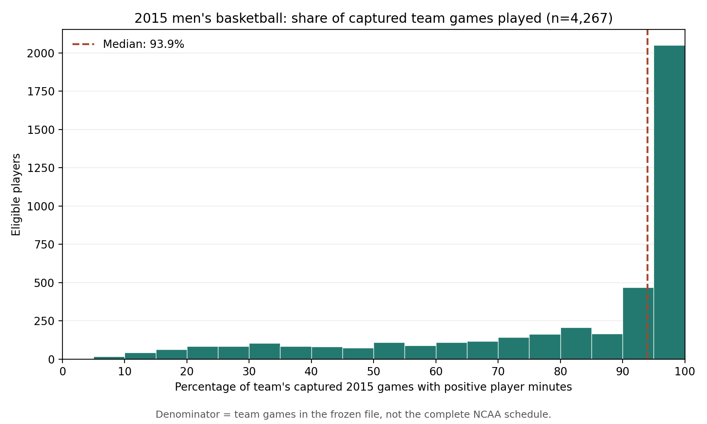

# From “stop the presses” to the assortativity tests
## Research narrative and findings — September 28, 2026

**Prepared:** September 27, 2026, for review.  
**Purpose:** One continuous account of why we took each step, what it showed, what it did not show, and how far we have answered the three research questions.  
**Evidence status:** This document consolidates completed, documented audits and model runs. No new experiment was executed to write it. Historical meeting statements are identified as such; current model results are not empirical validation. PDF conversion remains a separate step.

## 1. The investigation in brief

We paused the original assortativity experiment because we were concerned that our basketball performance measure and player pool were hiding the team differences we expected. We checked that concern rather than assuming weak measured sorting meant weak recruiting assortativity.
>
The tested playing-time restrictions did not uncover strong sorting in points per minute. But changing the performance measure changed the result: Player Efficiency Rating showed more sorting, and its high-minute player comparison behaved differently from points per minute. That means the measurement concern was legitimate, even though we did not find a simple filter that solved it.
>
We then returned to the model and separated three things: who is assigned together, how congestion changes scores, and how many people are selected. Equal-width plots revealed upper-tail downturns that our quantile plots concealed. With an explicit penalty we could produce a rise-and-fall pattern. Lowering assignment preference greatly flattened that pattern.
>
Finally, we tested whether extreme scarcity made assignment preference almost irrelevant. In the configurations we tested, it did not. Relative profiles remained different at 1% selection, and changing preference affected a larger fraction of the selected group, although fewer people changed in absolute numbers.
>
So we have made progress on the mechanism question, but we have not shown that assortativity is universally necessary or that scarcity explains the empirical basketball curve.

The rest of this document supplies the supporting evidence. Read Sections 2–7 for the path, Section 8 for the three-question assessment, and Section 9 for language to use carefully. The final appendix inventories every saved plot in this investigation so nothing disappears from the record.

## 2. Why we stopped: the measurement problem was plausible

Charles's concern was concrete. A strong program can contain many excellent basketball players even when its recorded points-per-minute values span a broad range. Only five people can play at once; roles, minutes, possessions, opponents, and coaching influence recorded performance. A short appearance can also yield an unstable scoring rate.

That raised two distinct possibilities: our measurement and population might conceal relevant sorting, or our assumption that the model needs assortativity might be wrong. We should investigate both rather than use one to dismiss the other.

Season points per minute (PPM) is constructed from retained game totals:

$$
\mathrm{PPM}_i=\frac{\sum_g \mathrm{points}_{ig}}{\sum_g \mathrm{minutes}_{ig}}.
$$

It is a derived panel column, not an independent ESPN-supplied rate. Within-season standardization changes its units, not the sorting index for a fixed population. We treated it as measured performance, not pure portable talent.

The accepted 2015 working population was rebuilt and source-audited: **4,267 players on 351 teams**. Corrections and unresolved point/minute treatment were recorded in an isolated working copy; historical sources were not changed. The twenty-minute floor is a season total. The accepted team rule retains at least eleven captured games. Charles's recollection that six was an earlier working rule and eleven a later test is historical context, not a reason to silently switch the audited population.

The five-player court limit motivated the investigation, but none of the later assignment simulations explicitly models lineups, court occupancy, or a possessions budget.

**Source:** [Rotation and source audit](../results/ASSORT_20260927_rotation_audit_v1_report.md); [initial scientific interpretation](../scientific_questions/20260925_MBB_Assort_issue_thoughts_VECTOR.md).

## 3. First we investigated the pool, without simply deleting the players we hoped to understand

### Brief-playing teammates affected the peer average, but that was not evidence of stronger sorting

Of the accepted players, **339 (7.95%)** averaged fewer than five minutes per game in which they had positive playing time. They supplied only **0.672%** of captured eligible minutes.

Leaving those teammates out of the peer average changed that average for about **60%** of focal players. The average increase was **0.071 standardized PPM units**. There were no zero- or one-peer cases: the minimum restricted peer count was seven.

That established sensitivity of the measured environment to who entered its average. It did not establish greater sorting, because changing only a peer average leaves each player's performance and team membership unchanged.

So we separately examined sorting after restricting the player population. The sorting index rose from **0.06194 to 0.07127**, but its population-specific random-allocation reference rose from **0.08203 to 0.08929**. The reference-adjusted difference was only about **0.0021**. Both observed indices were below their random-reference ranges.

**What this told us:** this five-minute rule did not uncover strong sorting of PPM hidden by brief participants. It did not establish that those players lacked talent or that recruitment was random.

**Source:** [Sorting sensitivity](../results/ASSORT_20260927_sorting_sensitivity_v1_report.md).

### Participation plots clarified what our floors actually meant

The median player appeared with positive minutes in **30 games**, or **93.9%** of the team's captured games. There was nevertheless a long lower-participation tail.

{width=95%}

All retained 2015 teams had **28–40 captured games**. Requiring anywhere from eleven through 28 would therefore retain the same teams in this population. This explains why simply nudging the team-game floor was unlikely to change this particular result. Captured games are not independently verified complete schedules.

Next we separated how often a player appeared from how long they played when present. **268 of the 339 short-stint players (79.1%)** appeared in fewer than half their team's captured games. The “tiny stint in almost every game” pattern was rare.

{width=95%}

We also tested whether game-box listing, including “did not play,” could define season-long presence without filtering on minutes. It could not usefully distinguish the proposed population: **4,258 of 4,267 players** were listed in at least half of captured team games. The proposed rule would exclude only nine, and none of the 339 short-stint players. We withdrew it.

The position plots showed broadly overlapping PPM distributions for guards, forwards, and centers. They did not establish that adjusting for position would solve the low sorting result; no position adjustment was adopted.

**Sources:** [Games played](../results/ASSORT_20260927_games_played_distributions_v1_report.md), [participation and duration](../results/ASSORT_20260927_participation_duration_crosscheck_v1_report.md), [listing consistency](../results/ASSORT_20260927_box_listing_consistency_v1_report.md), [position distributions](../results/ASSORT_20260927_ppm_by_position_v1_report.md).

### Describing teams with high-minute anchors narrowed intervals without resolving PPM sorting

Charles proposed keeping players in the competition pool but using the ten highest-season-minute players to describe team intervals. “Top ten” means ten players, not a ten-minutes-per-game threshold.

The resulting PPM intervals narrowed more than matched-size random within-team subsets. But the sorting index was **0.06742**, compared with **0.06194** for all players and a mean **0.07936** for random within-team tens. Central interval overlap remained extensive.

{width=95%}

**The distinction:** narrower ranges do not automatically mean stronger sorting. The within-team subset reference is also different from shuffling people across teams; those benchmarks must not be conflated.

SCOUT implemented this comparison; the version-two report records corrections to how the random reference was aggregated. Version one is preserved but is not the current numerical basis.

**Source:** [Corrected rotation-core comparison](../results/ASSORT_20260927_rotation_core_intervals_v2_report.md).

## 4. Then we changed the performance measure—and learned why the pool finding was conditional

On the same **4,161 players and 350 teams**, measured sorting was:

- **PPM: 0.06338.**
- **Player Efficiency Rating (PER): 0.10892.**
- **Box Plus/Minus (BPM): 0.32515.**

PER records broader box-score production than scoring rate. Yet its full-pool standardized team intervals were almost as wide as PPM's. BPM showed much greater clustering but includes team performance in its construction. Its high index does not independently reveal latent recruiting assortativity.

The common sample omitted 106 accepted players, including all 13 Cleveland State players because PER was unavailable. Twenty-four predetermined source/identity checks agreed, but the exact historical matching lineage and some source-minute differences remain qualifications. We did not identify a universally superior talent measure.

Charles then made a crucial correction: **the disappointing pool findings were for PPM, not necessarily for every measure.** We applied the same high-minute anchor identities to PPM and PER on a matched sample.

PPM anchor sorting was **0.06995**, below its random-subset mean **0.08102**. PER anchor sorting was **0.13768**, above its random-subset mean **0.12602** and above all 100 sampled reference values. That is a descriptive finite comparison, not proof that no random subset could exceed it. PER intervals narrowed more, but broad overlap remained.

{width=95%}

**What we learned:** the performance measure and descriptive player pool interact. We should not call pool exploration a universal dead end. Nor did we adopt PER, exclude bench players from the model, or establish portable talent. The subsequent model experiments continued with the fixed PPM baseline.

**Sources:** [Three-measure audit](../results/ASSORT_20260927_performance_metric_audit_v1_report.md), [matched PPM/PER anchor comparison](../results/ASSORT_20260927_ppm_per_top_ten_anchor_v1_report.md).

## 5. A separate request: applying the fitted score to actual rosters

We also applied the saved fitted score to the actual accepted 2015 rosters and compared the top 45 to the 45 observed annual draftees. Ability-only ranking and fitted congestion ranking each found **the same three draftees**. The lists shared 43 names: **two places were replaced**, involving four distinct players.

This did not improve annual draft matching. But it was not a held-out predictive evaluation: 2015 lies within the fitting window, the fitted outcome population differs, and the likelihood's season-normalized probabilities are not inclusion probabilities for a 45-person selection.

Charles correctly raised last-player-season versus all-player-season timing. The reigning empirical career-exit presentation and this annual roster diagnostic ask different questions. This diagnostic cannot justify “PPM is universally useless for draft prediction” or “the model has failed.”

The fitted ranking used $A_i/t^*-\lambda^*C_j$. The later controlled simulations used $A_i-\lambda C_j$ with declared scenario parameters. Those coefficients must not be presented as interchangeable.

**Source:** [Actual-roster fitted-score diagnostic](../results/ASSORT_20260927_empirical_selection_replay_v1_report.md). The separate plot appears in the appendix inventory.

## 6. We returned to the main mechanism question

### Keep assignment, score, and selection separate

Assignment preference $\rho$ changes who joins whom. Realized sorting $H_{\mathrm{sort}}$ describes the resulting grouping; it is not rho itself. Zero preference does not force the measured sorting index to zero in finite groups.

The scoring rule was

$$
S_i=A_i-\lambda C_j,
\qquad
C_j=\frac{1}{n_j}\sum_{i\in j}
\frac{1}{1+\exp[-10(A_i-\theta)]}.
$$

Here $A_i$ is standardized PPM, $C_j$ is raw mean team viability including the focal player, and $\theta$ is the season's fixed 99th performance percentile. Lambda determines the penalty. The selection step then takes the highest $K$ scores. The fraction $K/N$ determines how many places exist.

Congestion uses a full-team quantity; the plotted peer-quality axis excludes the focal player. The 99th-percentile viability threshold did not move when the selection fraction changed.

We evaluated 2014, 2015, and 2016 separately, with **100 paired assignments per season**. The same athlete can appear in multiple years; assignments are not independent empirical seasons. Source corrections were more extensive for 2015; approved omissions of unresolved point/minute pairs remain qualifications for 2014 and 2016.

### First result: congestion changed some winners even without preferential assignment

At approximately 2.7% selection and lambda one, congestion replaced an average **1.51–2.21 winners without preference**, versus **4.25–5.61 with preference**, depending on season.

That answers a narrow necessity question: preferential assignment is not required for congestion to change some winners. It does not answer whether preference is required for a rise-and-fall curve.

The original quantile plots were roughly flat without preference and rising with it. Raising selection to 10% changed more people in absolute numbers but a smaller proportion of the selected group. Those quantile plots still did not show a clear downturn.

{width=85%}

The historical **2.7%** motivating the scenario was 615 ever-drafted careers among 22,795 last-player-season observations, as reported in the reigning manifest. It is not the annual rate of 45 among 4,267, and applying it to all players in a simulated season does not reproduce that career-exit estimand.

**Sources:** [Initial model comparison](../results/ASSORT_20260927_three_season_mechanism_v1_report.md), [10% readout](../results/ASSORT_20260927_selection_rate_comparison_v1_report.md).

### Then we inspected the penalty rather than assuming “lambda one” meant strong congestion

The raw penalty's standard deviation was approximately **0.026–0.033**, compared with one for standardized performance. It could rearrange close competitors without overwhelming broad performance differences.

In the 2015 preferential condition, the highest quantile group's average performance advantage over the next was about **0.292**, while its extra penalty was only **0.049**. That was a descriptive clue, not a proof about the whole selection curve.

**Source:** [Penalty magnitude diagnostic](../results/ASSORT_20260927_penalty_magnitude_v1_report.md).

## 7. Charles's visual experiments made the next steps clearer

### EW and quantile charts exposed different parts of the same result

Charles asked to see bar charts, not simply numerical matrices. We held rho one and 10% selection fixed and compared lambda 0, 1, 2, and 4 in both 16-bin EW and quantile views.

At lambda four, EW showed a rise and fall in all three seasons; the quantile bars continued rising. The quantile upper group combined a broader peer-quality region, obscuring local tail detail.

{width=85%}

**Correction to preserve:** our earlier “no clear downturn” language applied to the plotted quantile presentation. It should not be inflated into a claim that no upper-tail decline existed. EW even showed some local decline at lambda one in 2014 and 2015, though not consistently across all three seasons.

The extreme EW bins are sparse. In 2015, bins 12–16 average about 95, 32, 11, 2.4, and 0.26 players per assignment. Very dramatic last bars cannot carry the argument alone.

An early automatic numerical definition of “substantial” was proposed without sufficient discussion, then rejected and disabled before execution. The executed sequence uses transparent visual interpretation, not a hidden pass/fail rule.

### Holding lambda four fixed, we reduced selection

At rho one, lowering selection from 10% through 5%, 2.7%, and 1% made absolute differences smaller. But the EW downturn remained in relative-rate plots. A relative rate is the bin's rate divided by the achieved overall selection fraction.

{width=85%}

This did not support the simple hypothesis that scarcity alone erases the relative downturn at these settings. The peak sometimes moved, and thin tails remained a limitation.

### The 50% sidestreet established a higher-opportunity comparison

Charles next asked for a similar curve at 50% selection, inspired by the Army comparison. We tried lambda 0, 1, 2, 4, 8, and 16 at rho one. Both four and eight gave a downturn; eight made the descent more pronounced. Charles retained **four** for the next comparison.

{width=85%}

This was not a reproduction of Army data, and 50% was not independently established here as the Army's empirical rate. Curves averaging 10% and 50% cannot have identical heights. The purpose was qualitative mechanism exploration.

### Lowering rho at 50% greatly flattened the profile

At 50% selection and lambda four, changing rho from one to **0.05** flattened most of the profile near 50%, leaving a modest upper-end decline. Mean realized sorting fell from roughly **0.36 to 0.088**.

{width=85%}

The player-count rows are essential. Lower preference narrowed the range of team environments. Many extreme EW bins became empty, not unsuccessful. Thus changing rho changed both the distribution of environments and the association of individual performance with those environments.

### Finally, we tested the intended scarcity question directly

We reused those same assignments at **1% selection**, retaining lambda four. This supplied the missing comparison: does lowering rho still matter when opportunities are extremely scarce?

**Yes, in this tested sense it does.** The relative profiles remain different at 1%. Rho one retains strong structure; rho 0.05 is much flatter.

{width=85%}

The identities tell a complementary story. In 2015, changing rho replaced an average **57.81 of 2,134 winners at 50% (2.71%)**, and **10.53 of 43 at 1% (24.49%)**. Across the three seasons, the corresponding proportions were approximately **2.5–2.7% versus 24–27%**.

Fewer people changed under scarcity, but a larger fraction of available places changed hands. Curves and identities are distinct: moving people among environments can substantially change a curve even if many winners remain the same.

This result limits the proposed explanation; it is not a failure of the investigation. We did not keep adjusting parameters until our preferred hypothesis became true.

**Sources for this sequence:** [Penalty bars](../results/ASSORT_20260927_penalty_bars_v1_report.md), [scarcity](../results/ASSORT_20260927_scarcity_bars_v1_report.md), [50% sweep](../results/ASSORT_20260927_selection50_v1_report.md), [rho reduction](../results/ASSORT_20260927_rho005_v1_report.md), [direct rho/scarcity comparison](../results/ASSORT_20260927_rho_scarcity_v1_report.md).

## 8. How much of the three-question agenda have we answered?

The [scientific brief](../../../VECTOR_PD41_Assortativity_Scientific_Brief.md) consolidates Charles's research agenda into the three questions below. Its transcript account attributes the general assortativity priority to PD41 and the willingness to accept no necessity to PD40. These three questions are a consolidated formulation, not verbatim transcript quotations.

### Question 1: Does assortativity matter to the model?

**Answer: yes, conditionally and demonstrably in the tested configurations.**

Changing rho changes realized sorting, environment coverage, outcome profiles, and some selected identities. At fixed lambda four and 50% selection, lowering rho to 0.05 flattened the broad profile. The distinction persisted at 1%.

This is evidence of a shaping role. It does not prove a universal necessity theorem or identify empirical recruiting preferences.

### Question 2: Can congestion produce the same effect without assortative assignment?

**Answer: partially answered; the meaning of “effect” determines the answer.**

If the effect means **changing winners**, yes: at rho zero and lambda one, switching congestion on changed winners in all three seasons on average.

If the effect means **the same meaningful rise-and-fall shape**, we have not established it without preferential assignment. The later strong-penalty shape explorations were at rho one, and the lower-preference comparison was rho 0.05, not exactly zero. Small tail declines are not an exact match to the broader reference curve.

A shape-only necessity claim remains open. We should not substitute evidence about changed winners for evidence about a particular curve.

### Question 3: Can unusually scarce selection make basketball a boundary case?

**Answer: the simple neutralization hypothesis was not supported in the range tested.**

At lambda four, reducing selection to 1% did not remove the relative distinction between rho one and 0.05. Changing rho altered a larger fraction of winners at 1%, although fewer winners in absolute numbers. Small absolute differences can look nearly flat on a large plotting scale without indicating a vanished mechanism.

This does not exclude all possible boundary behavior at other settings. It does not test the five-player court constraint. It does mean that we cannot currently offer these runs as evidence that scarcity explains the weak empirical basketball downturn.

## 9. Limits on interpretation

- **“We found no basketball assortativity.”** We found weak sorting of a specified measured performance variable; latent talent and recruitment remain different constructs.
- **“Filtering was a dead end.”** The tested PPM filters did not uncover strong sorting; PER's anchor comparison differed.
- **“BPM solved the problem.”** Its team adjustment changes what its sorting can establish.
- **“The model only got three right, so PPM is useless.”** The actual-roster diagnostic had a narrow population, outcome, timing, and fitting interpretation.
- **“Quantile plots were wrong.”** They aggregate differently and can conceal a narrow tail pattern.
- **“The uppermost players always succeed.”** Relative protection is the hypothesis; even exceptional players need not be immune to a sufficiently strong penalty.
- **“We proved assortativity is necessary.”** We showed a conditional shaping role, not universal necessity.
- **“Scarcity explains basketball.”** That remains unestablished; the tested neutralization story did not occur.

The band of excellence remains the idea that very good players just below the extreme top may be more sensitive to their environment. Holding own measured performance within a band is how a later plot can investigate it. The present aggregate curves do not isolate that comparison. Historical panels 7–8 address conditional descriptive outcomes; they were not rerun here and have their own population/window definitions.

## 10. The remaining research decision

We now have an auditable path through the measurement concern and a clearer separation of model claims. Performance measure and pool definition matter to measured sorting. Assignment preference matters to the tested model's shape. Congestion can change winners without preferential assignment. But universal necessity for the downturn remains open, and the scarcity explanation we tested did not neutralize rho.
>
Before extending the search, the remaining claim the dissertation needs should be specified. Is the priority demonstrating a conditional shaping role, constructing a no-preference downturn example, or returning to the empirical conditional band-of-excellence comparison?

Those are discussion choices, not an approved menu of further experiments. Nothing additional was run while preparing this document.

## Appendix A. Evidence and reproducibility

Every linked results report identifies its population, methods, outputs, and run records. All new artifacts remain under the isolated assort_analysis workspace; source files and prior results remain preserved. Code uses the sports_net environment in the recent executed model comparisons. This document consolidates the saved reports rather than rerunning every historical audit tonight.

The empirical audits principally concern 2015. The subsequent mechanism runs use 2014, 2015, and 2016 separately, not one pooled season. The 100 repetitions describe model assignment variation; they are not 100 independent empirical datasets. Sparse bins and repeated players limit empirical claims.

The main figures above use 2015 to maintain a consistent illustrative population. The appendix below links every saved PNG, including the corresponding 2014 and 2016 results and alternative absolute views. The earlier rotation-core version-one plot is historical; use version two for current numbers. No PDF was regenerated.

## Appendix B. Complete saved-plot register

The following register is generated from the workspace's saved PNG artifacts. Figures embedded above follow the main research sequence; the register preserves all supporting and alternate views. Paths are relative to this document so the existing converter can resolve the images and links locally.

- [box_listing_consistency_2015 — ASSORT_20260927_box_listing_consistency_v1_team_dnp_share](../../outputs/box_listing_consistency_2015/ASSORT_20260927_box_listing_consistency_v1_team_dnp_share.png)
- [empirical_selection_replay_2015 — ASSORT_20260927_empirical_selection_replay_v1_peer_bin_comparison](../../outputs/empirical_selection_replay_2015/ASSORT_20260927_empirical_selection_replay_v1_peer_bin_comparison.png)
- [games_played_2015 — ASSORT_20260927_games_played_distributions_v1_games_count](../../outputs/games_played_2015/ASSORT_20260927_games_played_distributions_v1_games_count.png)
- [games_played_2015 — ASSORT_20260927_games_played_distributions_v1_percentage_captured_team_games](../../outputs/games_played_2015/ASSORT_20260927_games_played_distributions_v1_percentage_captured_team_games.png)
- [participation_duration_2015 — ASSORT_20260927_participation_duration_crosscheck_v1_heatmap](../../outputs/participation_duration_2015/ASSORT_20260927_participation_duration_crosscheck_v1_heatmap.png)
- [participation_duration_2015 — ASSORT_20260927_participation_duration_crosscheck_v1_short_vs_other_frequency](../../outputs/participation_duration_2015/ASSORT_20260927_participation_duration_crosscheck_v1_short_vs_other_frequency.png)
- [penalty_bars_v1 — 2014_penalty_bars](../../outputs/penalty_bars_v1/2014_penalty_bars.png)
- [penalty_bars_v1 — 2015_penalty_bars](../../outputs/penalty_bars_v1/2015_penalty_bars.png)
- [penalty_bars_v1 — 2016_penalty_bars](../../outputs/penalty_bars_v1/2016_penalty_bars.png)
- [ppm_by_position_2015 — ASSORT_20260927_ppm_by_position_v1_distribution](../../outputs/ppm_by_position_2015/ASSORT_20260927_ppm_by_position_v1_distribution.png)
- [ppm_per_top_ten_anchor_2015 — ASSORT_20260927_ppm_per_top_ten_anchor_v1_comparison](../../outputs/ppm_per_top_ten_anchor_2015/ASSORT_20260927_ppm_per_top_ten_anchor_v1_comparison.png)
- [rho005_v1 — 2014_rho_comparison](../../outputs/rho005_v1/2014_rho_comparison.png)
- [rho005_v1 — 2015_rho_comparison](../../outputs/rho005_v1/2015_rho_comparison.png)
- [rho005_v1 — 2016_rho_comparison](../../outputs/rho005_v1/2016_rho_comparison.png)
- [rho_scarcity_v1 — 2014_absolute](../../outputs/rho_scarcity_v1/2014_absolute.png)
- [rho_scarcity_v1 — 2014_relative](../../outputs/rho_scarcity_v1/2014_relative.png)
- [rho_scarcity_v1 — 2015_absolute](../../outputs/rho_scarcity_v1/2015_absolute.png)
- [rho_scarcity_v1 — 2015_relative](../../outputs/rho_scarcity_v1/2015_relative.png)
- [rho_scarcity_v1 — 2016_absolute](../../outputs/rho_scarcity_v1/2016_absolute.png)
- [rho_scarcity_v1 — 2016_relative](../../outputs/rho_scarcity_v1/2016_relative.png)
- [rotation_core_intervals_2015 — ASSORT_20260927_rotation_core_intervals_v1_comparison (historical version; use v2 for current results)](../../outputs/rotation_core_intervals_2015/ASSORT_20260927_rotation_core_intervals_v1_comparison.png)
- [rotation_core_intervals_2015 — ASSORT_20260927_rotation_core_intervals_v2_comparison](../../outputs/rotation_core_intervals_2015/ASSORT_20260927_rotation_core_intervals_v2_comparison.png)
- [scarcity_bars_v1 — 2014_scarcity_absolute](../../outputs/scarcity_bars_v1/2014_scarcity_absolute.png)
- [scarcity_bars_v1 — 2014_scarcity_relative](../../outputs/scarcity_bars_v1/2014_scarcity_relative.png)
- [scarcity_bars_v1 — 2015_scarcity_absolute](../../outputs/scarcity_bars_v1/2015_scarcity_absolute.png)
- [scarcity_bars_v1 — 2015_scarcity_relative](../../outputs/scarcity_bars_v1/2015_scarcity_relative.png)
- [scarcity_bars_v1 — 2016_scarcity_absolute](../../outputs/scarcity_bars_v1/2016_scarcity_absolute.png)
- [scarcity_bars_v1 — 2016_scarcity_relative](../../outputs/scarcity_bars_v1/2016_scarcity_relative.png)
- [selection50_v1 — 2014_sweep](../../outputs/selection50_v1/2014_sweep.png)
- [selection50_v1 — 2015_reference_comparison](../../outputs/selection50_v1/2015_reference_comparison.png)
- [selection50_v1 — 2015_sweep](../../outputs/selection50_v1/2015_sweep.png)
- [selection50_v1 — 2016_sweep](../../outputs/selection50_v1/2016_sweep.png)
- [selection_rate_comparison_v1 — selection_curves_10pct](../../outputs/selection_rate_comparison_v1/selection_curves_10pct.png)
- [three_season_mechanism_v1 — selection_curves](../../outputs/three_season_mechanism_v1/selection_curves.png)
