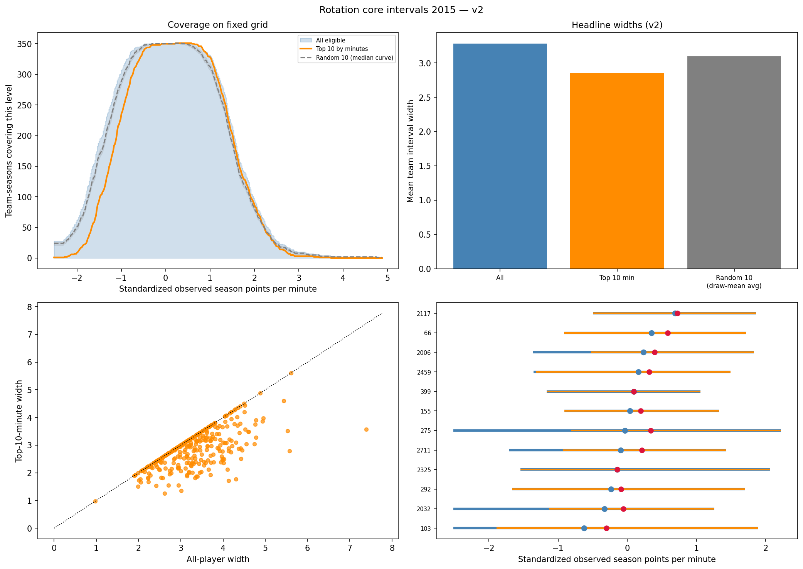
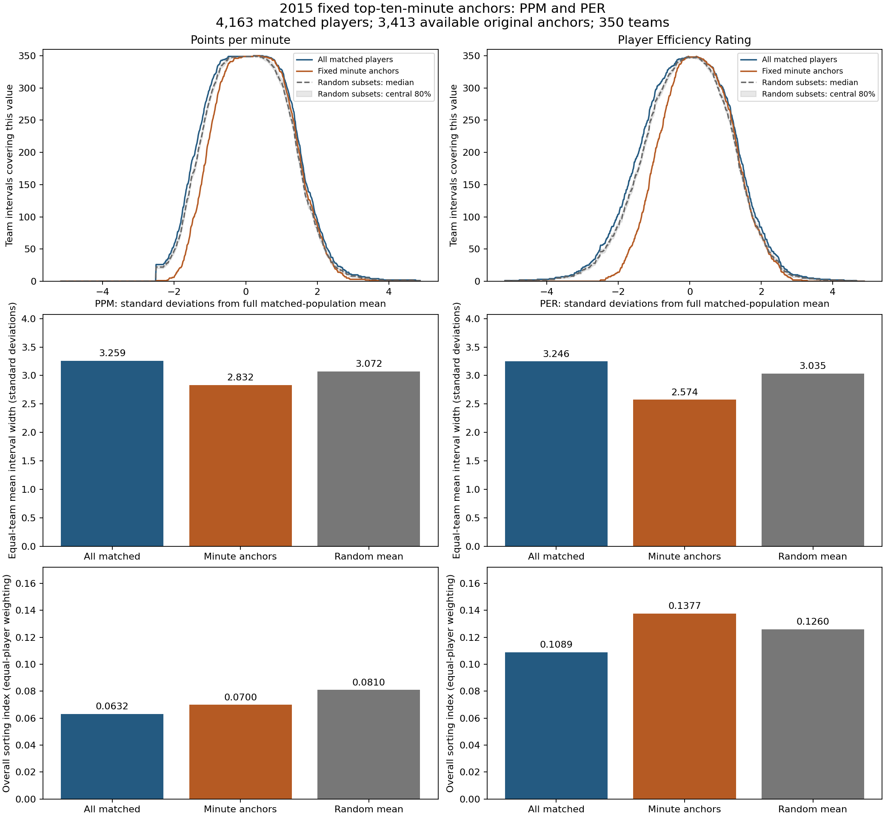
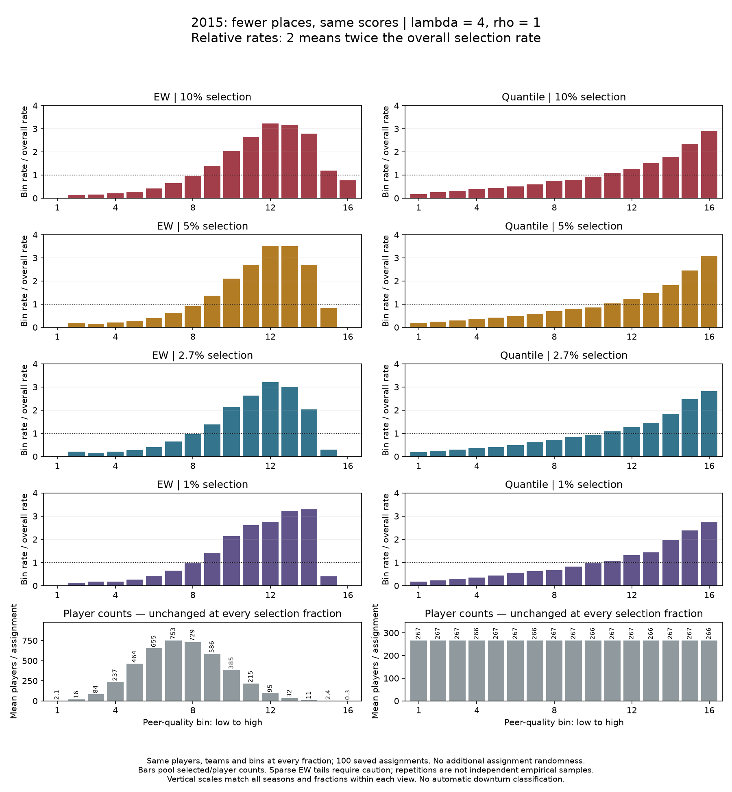
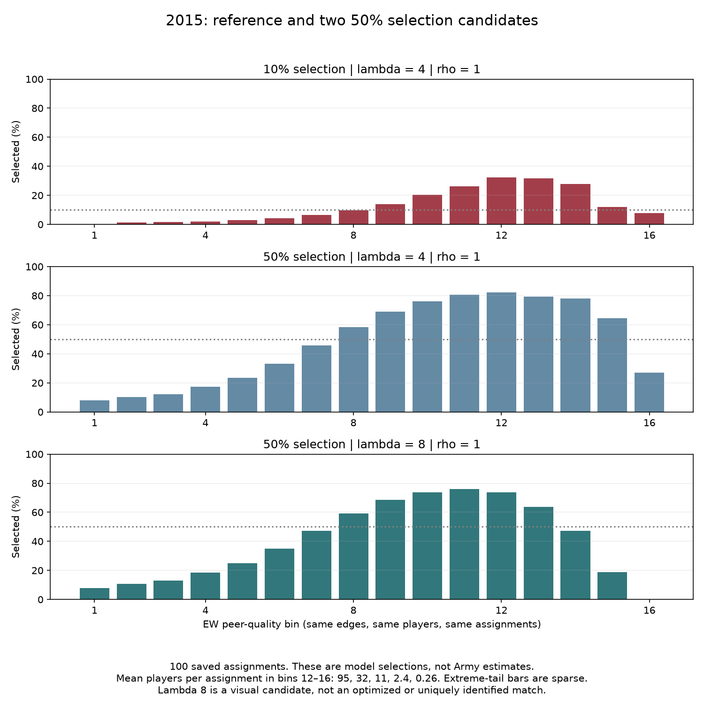
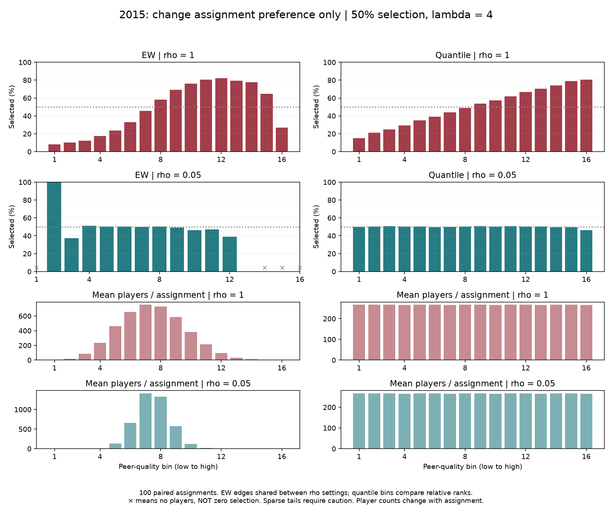

# Stop-the-presses assortativity investigation — structured research outline

**Last synced:** 2026-09-28  
**Status:** Interpretive outline of completed work. It does not authorize or report any new experiment.  
**Companion narrative:** [From “stop the presses” to assortativity tests](ASSORT_20260928_Alex_Rehearsal_Stop_the_Presses_to_Three_Questions.md)

This version presents the same investigation in outline form. The bold numbered statements are the main scientific points. The lettered items beneath them contain the evidence, explanation, qualification, and source trail. The companion narrative remains the fuller chronological account.

## 1. The whole investigation in twelve points

1. **We paused the planned sensitivity experiment because the empirical basketball pool looked implausibly homogeneous under points per minute.**
   a. The immediate concern was that brief-playing teammates might have noisy points-per-minute values and might blur meaningful differences among teams.  
   b. The broader concern was that the apparent lack of sorting could be caused by the performance measure or the player-pool definition rather than by the absence of basketball sorting.

2. **Brief-playing teammates changed the measured peer environment, but removing them did not uncover strong sorting.**
   a. The five-minute participation rule changed the peer average for about 60% of focal players.  
   b. The average change was 0.071 standardized points-per-minute units.  
   c. Nevertheless, the sorting increase was only about 0.0021 after comparison with the appropriate random-allocation reference.

3. **The participation audit showed that fixed season-minute and team-game thresholds were crude, but it did not identify a clearly superior replacement pool.**
   a. Players and teams faced different season lengths and participation opportunities.  
   b. Share-of-team-games and share-of-available-minutes measures were therefore more informative descriptions.  
   c. Those descriptions did not reveal a pool adjustment that transformed the substantive sorting result.

4. **Restricting team summaries to the ten highest-minute players narrowed team intervals, but that was not evidence of stronger-than-random sorting.**
   a. The fixed top-ten sorting index was $0.06742$.  
   b. The full-pool sorting index was $0.06194$.  
   c. Random sets of ten teammates had a higher mean sorting index of $0.07936$.  
   d. High-minute anchors changed the description of the team core without resolving the central sorting question.

5. **The pool-definition work was a useful negative result for points per minute, not a universal rejection of filtering.**
   a. It showed that several plausible points-per-minute pool restrictions did not uncover the expected sorting.  
   b. A different performance measure may interact differently with eligibility rules.  
   c. Any renewed filter exploration should be small, measure-specific, and justified by a concrete measurement problem.

6. **Changing the performance measure changed the apparent amount of sorting far more than the pool restrictions did.**
   a. On a common sample, the sorting index was $0.06338$ for points per minute, $0.10892$ for player efficiency rating, and $0.32515$ for box plus/minus.  
   b. Player efficiency rating produced a modest increase.  
   c. Box plus/minus produced a large increase, but its team adjustment means that it cannot be interpreted as uncontaminated individual ability.

7. **The fitted basketball score changed only a few top selections relative to ability alone.**
   a. The ability-only and fitted-congestion top-45 lists shared 43 names.  
   b. Congestion replaced two slots, involving four distinct players.  
   c. Each list contained the same three observed draftees.  
   d. This was an in-sample structural diagnostic, not a draft-prediction validation exercise.

8. **In the controlled model, congestion changed who was selected even when assignment preference was absent.**
   a. At the 2.7% selection rate and congestion-penalty magnitude $\lambda=1$, congestion changed roughly 1.5–2.2 winners per assignment without assignment preference.  
   b. With strong assignment preference, it changed roughly 4.3–5.6 winners.  
   c. Congestion can therefore matter without assortative assignment, while assortative assignment can strengthen its effect.

9. **A visible rise-and-fall outcome curve required a stronger congestion penalty than the initial fitted-scale experiment supplied.**
   a. Equal-width bars at a 10% selection rate showed a clear rise-and-fall pattern at $\lambda=4$ under strong assignment preference.  
   b. Quantile bars continued to rise because they redistribute sparse upper-tail observations across equal-count groups.  
   c. The two plots answer different questions and are not contradictory.

10. **Extreme selection scarcity did not erase the model difference between strong and weak assignment preference.**
    a. Moving from 10% to 1% selection reduced the absolute number of changed winners.  
    b. It increased the changed share of the selected set.  
    c. Strong- and weak-preference curves remained visibly different at 1% selection.

11. **The model supports a conditional shaping role for assortative assignment, but it does not establish universal necessity.**
    a. Lowering the assignment-preference parameter $\rho$ from 1 to 0.05 greatly flattened the equal-width curve at 50% selection with $\lambda=4$.  
    b. The corresponding realized sorting index fell from about $0.36$ to about $0.088$.  
    c. Congestion still changed some selections at weak preference, so a stronger claim of absolute necessity would exceed the evidence.

12. **The clean next decision is conceptual rather than computational.**
    a. We must decide whether the immediate dissertation claim concerns a conditional model mechanism, an empirical basketball band-of-excellence pattern, or the possibility of a downturn without assortative assignment.  
    b. Those are related questions, but they require different evidence and should not be collapsed into one test.

## 2. Vocabulary that keeps the mechanisms separate

1. **Assignment preference ($\rho$): a rule used while forming teams.**
   a. Higher $\rho$ makes similar players more likely to be assigned together.  
   b. It is a model input.  
   c. In plain language, it controls how strongly assignment favors similarity.

2. **Realized sorting ($H_{\mathrm{sort}}$): the team pattern produced after assignment.**
   a. It is measured from the completed player-to-team arrangement.  
   b. It is an outcome of assignment, roster sizes, and the available player population.  
   c. It should not be used as another name for $\rho$.

3. **Congestion-penalty magnitude ($\lambda$): the strength of the environmental penalty in the selection score.**
   a. The controlled model uses
   $$
   S_i=A_i-\lambda C_j,
   $$
   where $A_i$ is the player’s standardized performance measure and $C_j$ is the congestion associated with team $j$.  
   b. Larger $\lambda$ gives congestion more power to change the selection ranking.

4. **Selection rate ($K/N$): the fraction of eligible players selected.**
   a. $N$ is the eligible population.  
   b. $K$ is the number selected.  
   c. A smaller value means greater selection scarcity.

5. **Equal-width bars: fixed locations on the performance scale.**
   a. These plots retain the same performance intervals across conditions.  
   b. They are useful for detecting where a downturn occurs.  
   c. The far-right intervals can contain very few players and must be read with their counts.

6. **Quantile bars: equal-sized groups of players.**
   a. Each bar contains roughly the same number of players.  
   b. These plots are statistically more stable in the upper tail.  
   c. They may combine several sparse equal-width intervals and therefore hide a highly localized downturn.

7. **Band of excellence: a conditional comparison among very good players.**
   a. The intended question is whether players with similar high own performance have different selection experiences in different environments.  
   b. It is not simply the declining far-right portion of an aggregate curve.  
   c. A proper band-of-excellence analysis must hold own performance approximately fixed before comparing environments.

## 3. Did brief-playing teammates create the apparent homogeneity?

1. **Question:** Were players with very little game participation distorting points per minute and the measured peer environment?

2. **Why we asked:** Points per minute appears to separate production from total opportunity, but a rate based on only a few minutes can be unstable and may poorly represent a player’s season.

3. **What was held fixed:** The reigning 2015 basketball construction and the existing 20-minute season floor remained the starting point.

4. **What changed:** We examined an additional rule based on average minutes in games in which a player recorded positive playing time.

5. **Evidence:**
   a. 339 accepted players, or 7.95%, averaged fewer than five minutes per positive-minute appearance.  
   b. Those players supplied only 0.672% of captured eligible minutes.  
   c. Removing them from peer averages changed the peer measure for about 60% of focal players.  
   d. The mean increase in the peer measure was 0.071 standardized points-per-minute units.  
   e. The restricted peer count never fell below seven, so the result was not created by zero- or one-peer teams.

6. **Result:** Brief-playing teammates had little playing-time weight but affected many unweighted peer averages.

7. **Meaning:** The measured environment was sensitive to who entered the peer average.

8. **Limit:** Changing a peer average does not itself demonstrate stronger sorting because players’ performance values and team memberships remain unchanged.

9. **Next step:** Recalculate sorting on the restricted population and compare it with a population-specific random-allocation reference.

## 4. Did the five-minute restriction uncover stronger sorting?

1. **Question:** After restricting the player population, was the observed team arrangement more sorted than expected under random allocation?

2. **Why we asked:** A raw increase in a sorting index can occur simply because the population size or team-size geometry changed.

3. **Evidence:**
   a. Full-pool sorting index: $0.06194$.  
   b. Five-minute restricted sorting index: $0.07127$.  
   c. Full-pool random reference: $0.08203$. 
   d. Restricted-population random reference: $0.08929$.  
   e. Reference-adjusted change: approximately $0.0021$.  
   f. Both observed values were below their corresponding random-reference ranges.

4. **Result:** The restriction raised the raw index, but nearly all of that increase was explained by the changed population and assignment-size geometry.

5. **Meaning:** The five-minute rule did not uncover strong sorting of points per minute that had been hidden by brief-playing teammates.

6. **Limits:**
   a. This does not establish that the brief-playing players lacked talent.  
   b. This does not establish random recruitment.  
   c. This tests sorting in the chosen points-per-minute representation.

7. **Decision:** Treat the five-minute restriction as a useful sensitivity result rather than as a new canonical player-pool rule.

## 5. What did the broader participation audit teach us?

1. **Question:** Were the existing absolute thresholds—20 season minutes for players and 10 captured games for teams—appropriate across unequal season lengths?

2. **Why we asked:** The meaning of 10 games differs between a team with 12 captured games and a team with 35 captured games. The same problem applies to a player’s season minutes.

3. **Evidence:**
   a. The median accepted player appeared in 30 positive-minute games and in 93.9% of the team’s captured games.  
   b. Retained teams had between 28 and 40 captured games.  
   c. Team thresholds between 11 and 28 games retained the same teams in this slice.  
   d. Of the 339 short-stint players, 268, or 79.1%, appeared in fewer than half of their team’s captured games.  
   e. A stricter test based on consistent “did not play” listings excluded only nine accepted players and none of the 339 short-stint players.

4. **Result:** Relative participation measures described the population better than absolute thresholds, but the available game listings did not support a clean new eligibility rule.

5. **Meaning:**
   a. The original thresholds deserve caution.  
   b. The 2015 retained-team result was not sensitive to moving the team-game threshold within the tested 11-to-28 range.  
   c. Missing or inconsistent bench listings limited what could be inferred from a share-of-games rule.

6. **Limit:** A better descriptive variable does not automatically supply a scientifically defensible exclusion threshold.

7. **Decision:** Do not replace the current pool merely because a relative measure appears conceptually preferable.

## 6. Did position explain the broad overlap?

1. **Question:** Did guards, forwards, and centers occupy distinct points-per-minute distributions that should be standardized separately?

2. **Evidence:** The empirical position distributions overlapped heavily.

3. **Result:** Position-specific adjustment was not indicated by the observed points-per-minute distributions.

4. **Meaning:** Position did not explain why team performance intervals overlapped so broadly.

5. **Decision:** Do not add position adjustment to the immediate investigation.

## 7. Did high-minute anchor players reveal a more meaningful team core?

1. **Question:** Could all eligible players remain available as congestion-affected individuals while only the highest-minute players defined each team’s performance interval?

2. **Why we asked:** Removing low-minute players entirely might suppress the very congestion we wanted to study. Using anchor players for team description offered a way to preserve those players while changing only the team summary.

3. **Design:**
   a. Full eligible roster.  
   b. Fixed ten highest-minute players on each team.  
   c. Random sets of ten players on each team, repeated 100 times.

4. **Evidence:**
   a. Full-pool sorting index: $0.06194$.  
   b. Fixed top-ten sorting index: $0.06742$.  
   c. Random-ten mean sorting index: $0.07936$; median $0.0790$.  
   d. The top-ten intervals were narrower, but broad central overlap remained.

5. **Result:** The high-minute core produced narrower team intervals, but its sorting index remained below the random-ten benchmark.

6. **Meaning:** Playing-time selection created a more concentrated description of team cores without producing evidence that those cores were more sorted than comparable random subsets.

7. **Limit:** This was an interval and sorting diagnostic. It did not test whether low-minute players experience congestion.

8. **Decision:** Retain high-minute anchoring as a descriptive option, not as a solution to the assortativity problem.

## 8. Was the performance measure the larger issue?

1. **Question:** Did alternative player-season performance measures reveal more realized team sorting than points per minute?

2. **Why we asked:** The pool restrictions changed sorting very little, while points per minute may describe scoring rate rather than the broader basketball performance recognized in team construction and professional evaluation.

3. **Common-sample comparison:** 4,161 players on 350 teams had all three measures available.

4. **Evidence:**
   a. Points per minute sorting index: $0.06338$.  
   b. Player efficiency rating sorting index: $0.10892$.  
   c. Box plus/minus sorting index: $0.32515$.

5. **Result:** Apparent sorting depended strongly on the chosen performance representation.

6. **Meaning:** The failure to observe substantial sorting in points per minute cannot be generalized to every plausible basketball performance measure.

7. **Important distinction:**
   a. Points per minute records scoring production per minute of opportunity.  
   b. Player efficiency rating combines several box-score contributions into an individual efficiency measure.  
   c. Box plus/minus estimates broader contribution and includes team adjustment, so it partly reflects the environment whose influence the dissertation ultimately wants to separate.

8. **Limit:** A measure that sorts teams well is not automatically a purer measure of portable player capacity.

9. **Sample qualification:** The common sample excluded 106 players, including 13 Cleveland State players, because alternative metrics were unavailable.

10. **Decision:** Treat player efficiency rating as the most useful nearby comparison and box plus/minus as a scientifically informative but environmentally entangled measure.

{width=95%}

## 9. What did the fixed-anchor comparison add?

1. **Question:** Did selecting the ten highest-minute players create more sorting than randomly choosing ten teammates when performance was measured with player efficiency rating?

2. **Evidence:**
   a. Points per minute fixed-anchor sorting: $0.06995$.  
   b. Points per minute random-ten mean: $0.08102$.  
   c. Player efficiency rating fixed-anchor sorting: $0.13768$.  
   d. Player efficiency rating random-ten mean: $0.12602$.  
   e. The player efficiency rating fixed-anchor value exceeded all 100 random draws.

3. **Result:** The high-minute core appeared meaningfully more sorted under player efficiency rating than under points per minute.

4. **Meaning:** Pool definition and performance measure can interact. The negative result for points-per-minute filtering should not be mechanically transferred to every other measure.

5. **Limit:** This was a descriptive result from one season and 100 random draws. It was not a preregistered inferential test or a final measure choice.

6. **Decision:** If one tightly bounded measurement follow-up is conducted, this interaction is more promising than reopening a wide filter sweep.

## 10. What did the fitted score select on the actual rosters?

1. **Question:** On observed rosters, how much did the fitted congestion score change the top-ranked players relative to ability alone?

2. **Compared rankings:**
   a. Ability only.  
   b. Fitted score including congestion.

3. **Evidence:**
   a. The top-45 lists shared 43 names.  
   b. Two slots changed, involving four distinct players.  
   c. Both lists included the same three observed draftees.

4. **Result:** Under this specification, the fitted congestion term reordered only a small part of the very top of the 2015 ranking.

5. **Meaning:** The fitted congestion contribution was weak relative to the ability component at the top-45 cutoff.

6. **What this did not test:**
   a. It was not held-out prediction; 2015 contributed to fitting.  
   b. It did not establish that points per minute is useless.  
   c. It did not establish that the mechanism failed.  
   d. It compared annual top-45 model rankings with observed draft outcomes constructed under different timing and population rules.

7. **Technical warning:** The fitted calibration score
   $$
   \frac{A_i}{t^*}-\lambda^* C_j
   $$
   is not automatically interchangeable with the controlled-model score
   $$
   A_i-\lambda C_j.
   $$
   Moving parameter values between them requires explicit mathematical alignment.

## 11. Can congestion matter without assignment preference?

1. **Question:** If players are assigned without a preference for similar teammates, can congestion still change who is selected?

2. **Design:**
   a. Seasons 2014, 2015, and 2016.  
   b. 100 paired assignments per condition.  
   c. Same assignment compared with congestion turned off and on.  
   d. Selection rate initially set to 2.7%.  
   e. Congestion-penalty magnitude initially set to $\lambda=1$.

3. **Evidence:**
   a. With no assignment preference, congestion changed roughly 1.51–2.21 selected players per assignment.  
   b. With strong assignment preference, congestion changed roughly 4.25–5.61 selected players.

4. **Result:** Congestion changed winners even when assignment preference was absent.

5. **Meaning:** Assortative assignment was not necessary for congestion to alter individual selection identities in this experiment.

6. **Additional meaning:** Strong assignment preference amplified the number of selections changed by congestion.

7. **Limit:** Changing some winners is a weaker condition than reproducing the empirical rise-and-fall outcome curve.

8. **Next step:** Separate two questions: does congestion change who wins, and does it create the specific nonlinear curve of substantive interest?

## 12. Why did we add equal-width bar charts?

1. **Question:** Was the upper-tail downturn visible in fixed performance locations even when it was muted in quantile summaries?

2. **Why we asked:** Humans cannot reliably infer the magnitude and shape of a nonlinear pattern from a matrix of numbers alone.

3. **Evidence:**
   a. At a 10% selection rate under strong assignment preference, congestion-penalty magnitudes of $\lambda=0,1,2,4$ were compared.  
   b. At $\lambda=4$, the equal-width plots showed a clear rise and fall in all three seasons.  
   c. The quantile plots continued to rise.

4. **Result:** The visible curve depended partly on how the performance axis was grouped.

5. **Meaning:**
   a. Equal-width bars answered where on the performance scale the downturn occurred.  
   b. Quantiles answered how equal-sized groups differed.  
   c. A localized sparse-tail phenomenon can appear in the first and be averaged into the highest group in the second.

6. **Upper-tail warning:** In the 2015 equal-width plot, the last five bins averaged approximately 95, 32, 11, 2.4, and 0.26 players. The far-right decline was therefore scientifically suggestive but statistically sparse.

7. **Decision:** Keep both views and display counts. Do not call either view the uniquely correct representation.

{width=85%}

{width=85%}

## 13. Did extreme scarcity erase the downturn?

1. **Question:** Could basketball’s very small selected fraction make the congestion pattern disappear even if the same model produced a downturn at a higher selection rate?

2. **Design:** Hold $\lambda=4$ and strong assignment preference fixed while comparing 10%, 5%, 2.7%, and 1% selection rates.

3. **Evidence:**
   a. Absolute selection percentages necessarily became smaller as the selected fraction fell.  
   b. Relative-to-baseline equal-width profiles continued to show an upper-tail decline.  
   c. The decline became noisier because very few upper-tail observations remained.

4. **Result:** Scarcity compressed the vertical scale but did not erase the relative rise-and-fall pattern in this model.

5. **Meaning:** The simple explanation “the selection rate is so small that the mechanism becomes invisible” was not supported by this experiment.

6. **Limit:** This test did not represent the five-player-on-court institution directly. It varied the final selection fraction in the model.

7. **Decision:** Examine assignment preference directly rather than attributing the empirical weakness to scarcity alone.

{width=85%}

## 14. What happened at a 50% selection rate?

1. **Question:** At a selection rate closer to the Army domain, what congestion penalty reproduced the kind of downturn seen at 10% selection?

2. **Design:**
   a. Selection rate fixed at 50%.  
   b. Strong assignment preference fixed at $\rho=1$.  
   c. Congestion-penalty magnitudes $\lambda=0,1,2,4,8,16$ examined.

3. **Evidence:** Clear downturns appeared at $\lambda=4$ and $\lambda=8$.

4. **Result:** $\lambda=4$ remained sufficient to generate the desired qualitative pattern at 50% selection.

5. **Meaning:** A high selection rate did not eliminate the congestion-generated downturn. The same qualitative penalty magnitude worked at both 10% and 50% under strong assignment preference.

6. **Decision:** Retain $\lambda=4$ for the immediate controlled comparison rather than escalating the penalty merely to maximize visual curvature.

{width=85%}

## 15. What happened when assignment preference was lowered?

1. **Question:** With selection at 50% and $\lambda=4$, would lowering assignment preference flatten the outcome curve?

2. **Design:** Compare strong preference, $\rho=1$, with weak preference, $\rho=0.05$.

3. **Evidence:**
   a. The strong-preference condition produced a pronounced rise-and-fall curve.  
   b. The weak-preference condition was largely flat near the 50% baseline, with only a modest upper-tail decline.  
   c. The realized sorting index fell from about $0.36$ to about $0.088$.  
   d. The range of team environments narrowed under weak preference, leaving some environmental bins empty.

4. **Result:** Lower assignment preference greatly flattened the modeled pattern.

5. **Meaning:** Assortative assignment shaped the distribution of team environments and strengthened the nonlinear congestion pattern.

6. **Limit:** Weak preference did not create exactly zero realized sorting, and the residual tail behavior prevents a claim that the mechanism becomes mathematically impossible without preference.

7. **Decision:** Describe assignment preference as a strong shaper under these conditions, not as a proven universal necessity.

{width=85%}

## 16. Did very low selection make assignment preference irrelevant?

1. **Question:** At the extreme 1% selection boundary, did the strong- and weak-preference conditions converge?

2. **Why we asked:** If scarcity overwhelmed the assignment mechanism, then changing $\rho$ might cease to matter when only a tiny number of players could be selected.

3. **Evidence:**
   a. In 2015 at 50% selection, the strong- and weak-preference conditions changed an average of 57.81 player identities out of 2,134 selected, or 2.71%.  
   b. At 1% selection, they changed an average of 10.53 identities out of 43 selected, or 24.49%.  
   c. Across the three seasons, the corresponding shares were about 2.5–2.7% at 50% selection and about 24–27% at 1% selection.  
   d. The relative outcome profiles remained visibly different.

4. **Result:** Scarcity reduced the absolute number of affected players but increased the affected share of the selected set.

5. **Meaning:** Extreme scarcity did not make assignment preference irrelevant in this controlled model.

6. **Plain-language example:** Changing 10 winners may sound smaller than changing 58 winners. But if only 43 people are selected, changing about 10 of them alters roughly one-quarter of the selected class. If 2,134 are selected, changing 58 alters less than 3%.

7. **Limit:** This establishes the result only for the tested model, parameter values, seasons, and performance construction.

8. **Decision:** Do not use selection scarcity alone as the explanation for weak empirical basketball curvature.

{width=85%}

## 17. Direct answers to the three mechanism questions

1. **Does assortative assignment matter?**
   a. **Answer:** Yes. In the controlled experiments it materially shaped realized environments, changed selection identities, and strengthened the equal-width rise-and-fall pattern.  
   b. **Strength of answer:** Strong for the tested model conditions.  
   c. **Limit:** This is not proof that assortative assignment is universally necessary in every formulation or domain.

2. **Can congestion matter without assortative assignment?**
   a. **Answer:** Yes, if “matter” means changing which players are selected.  
   b. **Evidence:** Congestion changed some winners even at $\rho=0$.  
   c. **Unresolved component:** The experiments did not establish that weak or absent assignment preference reproduces the same pronounced rise-and-fall curve.

3. **Can extreme selection scarcity explain the weak empirical basketball downturn?**
   a. **Answer:** Not by itself in the tested model.  
   b. **Evidence:** The relative downturn persisted as the selected fraction fell, and strong- versus weak-preference conditions remained different at 1%.  
   c. **Unresolved component:** Basketball-specific institutions, including playing-time allocation and the five-player-on-court constraint, were not directly modeled by merely changing $K/N$.

## 18. What the empirical and model evidence jointly support

1. **The empirical points-per-minute pool exhibits little realized sorting under the examined definitions.**

2. **Plausible points-per-minute pool restrictions did not reveal a large hidden sorting pattern.**

3. **Alternative performance measures, especially box plus/minus, exhibit more sorting, but they also change the scientific object being measured.**

4. **In the controlled model, assignment preference creates more differentiated environments in which congestion can generate a stronger nonlinear outcome pattern.**

5. **Congestion can still alter some selection identities without assignment preference.**

6. **Selection scarcity does not automatically suppress the mechanism; under the tested conditions it can make each changed identity more consequential as a share of the selected class.**

7. **The empirical weakness of the basketball curve therefore remains a measurement-and-mechanism question rather than a result explained by one obvious boundary condition.**

## 19. What we should not claim

1. **Do not claim that basketball has no assortativity.** Points per minute showed little sorting; other measures showed more.

2. **Do not claim that filtering was useless.** The filter audit ruled out plausible explanations, revealed data limitations, and clarified which pool changes did and did not matter.

3. **Do not claim that box plus/minus solved the measurement problem.** Its large sorting signal is scientifically informative, but its team adjustment entangles player and environment.

4. **Do not claim that the fitted-score diagnostic proved points per minute cannot predict draft.** It was not a held-out prediction design.

5. **Do not claim that equal-width bars are correct and quantile bars are wrong.** They preserve different features of the data.

6. **Do not claim that the top performers always succeed.** The sparse far-right bars and conditional nature of selection do not support that universal statement.

7. **Do not claim that assortative assignment is mathematically necessary for congestion to matter.** Congestion changed winners at zero assignment preference.

8. **Do not claim that scarcity explains the basketball result.** The controlled experiment did not support that simple explanation.

9. **Do not call an aggregate upper-tail downturn the band of excellence.** The band-of-excellence claim requires a comparison among players with similar own performance across different environments.

## 20. The disciplined next research decision

1. **If the immediate claim is about the model mechanism:**
   a. Formalize the conditional statement that assignment preference expands environmental differentiation and strengthens congestion-generated curvature.  
   b. Retain the qualifications that congestion can change winners without it and that scarcity did not erase its influence.

2. **If the immediate claim is about empirical basketball:**
   a. Conduct one bounded comparison using a clearly justified performance representation.  
   b. Avoid reopening an unrestricted search across metrics, filters, seasons, binning rules, and penalty values.

3. **If the immediate claim is about the band of excellence:**
   a. Hold own performance approximately fixed within a high-performance band.  
   b. Compare outcomes across meaningfully different team environments.  
   c. Treat that as a later conditional analysis rather than as a label for the aggregate curves already produced.

4. **Rabbit-hole guardrail:** Choose one of these claims before authorizing another experiment. A new run should have one question, one primary contrast, one stopping rule, and a written statement of what the result can and cannot establish.

## 21. Principal source trail

1. **Full chronological interpretation:** [Companion narrative](ASSORT_20260928_Alex_Rehearsal_Stop_the_Presses_to_Three_Questions.md)

2. **Short-participation and sorting audit:** [Sorting sensitivity report](../results/ASSORT_20260927_sorting_sensitivity_v1_report.md)

3. **Participation and game-share audit:** [Playing-time and participation report](../results/ASSORT_20260927_participation_duration_crosscheck_v1_report.md)

4. **Rotation-core intervals:** [Top-ten and random-ten report](../results/ASSORT_20260927_rotation_core_intervals_v2_report.md)

5. **Performance-measure comparison:** [Points per minute, player efficiency rating, and box plus/minus report](../results/ASSORT_20260927_performance_metric_audit_v1_report.md)

6. **Fixed-anchor comparison:** [Points per minute versus player efficiency rating top-ten report](../results/ASSORT_20260927_ppm_per_top_ten_anchor_v1_report.md)

7. **Observed-roster fitted-score diagnostic:** [Fitted selection comparison](../results/ASSORT_20260927_empirical_selection_replay_v1_report.md)

8. **Initial controlled mechanism test:** [Mechanism question report](../results/ASSORT_20260927_three_season_mechanism_v1_report.md)

9. **Penalty and scarcity sweep:** [Penalty bars](../results/ASSORT_20260927_penalty_bars_v1_report.md) and [fixed-penalty scarcity](../results/ASSORT_20260927_scarcity_bars_v1_report.md)

10. **Assignment-preference and scarcity comparison:** [Boundary-condition report](../results/ASSORT_20260927_rho_scarcity_v1_report.md)

11. **Decisions and scientific rationale:** [Experiment choices and rationale](../decisions/ASSORT_20260925_experiment_choices_and_rationale.md)
