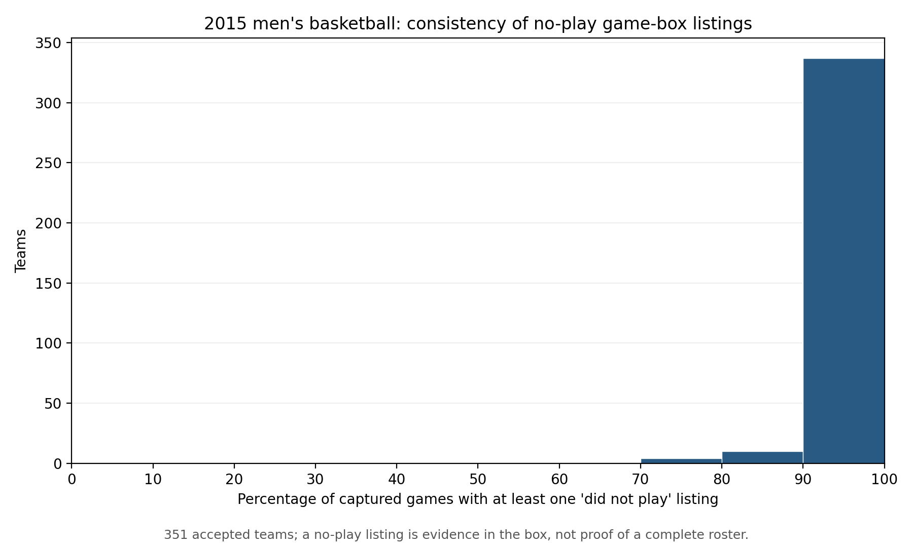

# Are “did not play” game-box listings consistent enough to define a continuity pool?

**Status:** Bounded 2015 source audit executed and internally checked on September 27, 2026. The plot was visually inspected; saved output hashes and row counts match the [run record](../run_records/ASSORT_20260927_box_listing_consistency_v1_run_record.json). No player-pool rule, sorting index, or performance metric was changed.

## The answer

The frozen box data record “did not play” listings **consistently in most captured games**, but listing is **almost universal for the accepted players**, making my proposed half-season continuity rule unhelpful as an alternative 2015 pool. Of **4,267** accepted players, **4,181** are listed in *every* captured game for their team and **4,258** are listed in at least half. The half-season rule would exclude only **nine players (0.21%)** and **none of the 339** who average fewer than five minutes when they play. I therefore **withdraw that particular rule as a useful pool comparison for this 2015 population**. This is an evidence-based revision of the earlier conversational suggestion, not a change to any historical panel.

This does not mean all listed players were genuinely available to play each day. A feed may repeat a season roster in each game box; internal consistency cannot distinguish that from verified game-day presence. The source's `active` field had **no true entries** in these retained rows, so it did not provide a separate positive check of availability.

## What we checked

First, the recent participation audit showed that the 339 short-stint players were generally not *playing* in most of their team's games. I suggested checking whether *listing* in a game box, including a “did not play” row, could distinguish steady roster members from brief cameos without filtering on playing time. We next audited **all named source rows for the 351 accepted 2015 teams**—not just the 4,267 players who met the twenty-minute floor. This covered **11,429 captured team-games** and **175,014 player-game listings**. The [driver](../../code/ASSORT_20260927_box_listing_consistency_v1.py) verified the frozen source, prior accepted player file, source reader, and two minutes-recovery overlays against their saved checksums before counting.

There are **59,003** rows marked `did_not_play=True`; all **59,003** have both minutes and points missing after the accepted source overlays. None has verified positive minutes, and no row with both statistics missing lacks the “did not play” flag. Thus the flag and blank statistics line up exactly **within this dataset**. That establishes source-field coherence; it does not validate a person’s actual game-day availability.

At least one “did not play” row appears in **11,292 of 11,429 team-games (98.8%)**. **296 of 351 teams** have such a row in *every* captured game, and the other **55** have a mix of games with and without one. There are **137 games** without a “did not play” flag; **129** list only players with positive verified minutes. In **14** of the mixed teams, the median listed-player count is at least three higher in games with a “did not play” row than in games without one. Those are concrete warnings that some game boxes may contain only participants or otherwise incomplete listings. The team-by-team and game-by-game records are saved below; this audit did not independently verify those fourteen game boxes against an external roster source.

The median accepted team-game lists **15 players**, with **10** recording positive minutes; the median difference is **five** unplayed listings. Across teams, **199** have the *same number* of listed players in every captured game. Constant counts do not prove identical names or a complete roster, but the near-universal player listing and repeated no-play entries make the proposed half-season threshold almost nondiscriminating.

## Scientific implication and stopping point

The audit supports a narrow statement: **this source usually includes nonplaying names in a game's box table**. It does not support the stronger statement that a row means the athlete was present, healthy, eligible, or competing for minutes on that date. Nor can a half-season listing rule isolate a substantially different observed player pool here: it keeps **99.8%** of the current players and **all** of the short-stint group. We should not run a sorting comparison under that rule and portray it as a serious alternative-pool test. Whether points per minute is masking talent sorting remains open; this listing audit neither proves nor disproves that measurement concern.

The [team-game file](../../outputs/box_listing_consistency_2015/ASSORT_20260927_box_listing_consistency_v1_team_game.csv), [team summary](../../outputs/box_listing_consistency_2015/ASSORT_20260927_box_listing_consistency_v1_team_summary.csv), [accepted-player listing shares](../../outputs/box_listing_consistency_2015/ASSORT_20260927_box_listing_consistency_v1_accepted_players.csv), [source flag table](../../outputs/box_listing_consistency_2015/ASSORT_20260927_box_listing_consistency_v1_source_flags.csv), and [numeric summary](../../outputs/box_listing_consistency_2015/ASSORT_20260927_box_listing_consistency_v1_summary.json) preserve the evidence. No further source inspection, panel rebuild, alternate filter, or experiment was undertaken in this step.
