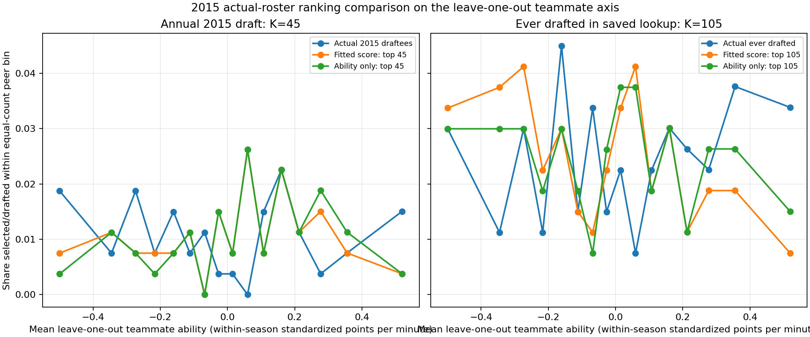

# Actual-roster selection comparison: fitted congestion changed names, not the 2015 draft match

**Experiment:** ASSORT_20260927_empirical_selection_replay_v1  
**Status:** Completed and independently checked  
**Population:** 4,267 players on 351 teams in the frozen 2015 roster population

## What we asked

Using the already estimated points-per-minute (PPM) model, does adding the fitted team-congestion term change which players rank in the top 45 on the actual 2015 rosters? Does that ranking match more actual 2015 draft picks than a ranking based on ability alone?

This is a retrospective ranking comparison on observed rosters. It is not a new fit, held-out prediction, stochastic draft simulation, test of whether assortative assignment is necessary, or causal estimate.

## What we did

We applied the previously estimated parameters without changing them:

- $\gamma^* = 19.572332081866243$
- $\lambda^* = 1.3024305834948529$
- $t^* = 1.0698967300656186$

For each player $i$ on team $g(i)$, we computed the existing fitted score

$$
z_i = \frac{A_i}{t^*} - \lambda^* C_{g(i)},
$$

where $A_i$ is standardized ability and $C_j$ is the model's full-roster team-congestion quantity. That quantity is calculated from the fitted $\gamma^*$ and threshold $\theta$ over all members of the team, including the focal player. The ability-only comparison ranks $A_i$ by itself. We then selected the 45 highest-ranked players under each score and compared each list with the 45 people actually drafted in 2015.

The fitted selection calibration was estimated on 2009–2021 data, a window that includes 2015. Its likelihood is a Bernoulli product using season-level softmax probabilities whose probabilities sum to one. It was not fitted as a probability model for selecting 45 people. Therefore, this exercise uses the fitted scores only as a deterministic ranking and compares a top-45 list to the 45-person draft class. The fitted probabilities should not be read as individual draft-inclusion probabilities.

## What we found

| Ranking rule | Actual 2015 draft picks in top 45 | Precision | Recall |
|---|---:|---:|---:|
| Fitted ability plus congestion score | 3 of 45 | 6.67% | 6.67% |
| Ability alone | 3 of 45 | 6.67% | 6.67% |

The same three drafted players appear in both lists: Cameron Payne, Bobby Portis, and Tyler Harvey. Thus the congestion score did not improve top-45 overlap with the actual 2015 draft class.

The two rankings were not identical. They shared 43 of their 45 names. The congestion score replaced Jalan West and Mike La Tulip, who were in the ability-only top 45, with Chavaughn Lewis and Leland King II. None of those four players was drafted in 2015. In this comparison, the congestion term changed four identities without changing the number of actual draft picks captured.

For scale only, a uniformly random set of 45 drawn from 4,267 people has an arithmetic expected overlap of $45^2/4267 = 0.475$ people with a fixed set of 45. We did not draw random lists, calculate a sampling distribution, or conduct a significance test. The observed overlap of three is above that arithmetic expectation, but this alone does not establish statistical significance or predictive validity.

A secondary comparison used the 105 people in the accepted population who were ever drafted, with the 105 highest-ranked players under each rule. Each ranking included 10 of those 105 people. This outcome is more closely related to the historical fit outcome family and is not independent validation.

## What the result does and does not say

The result says that, for this frozen roster population and these unchanged fitted parameters, the congestion term altered a small number of top-ranked identities and did not improve the 2015 annual draft-class overlap over ability alone.

It does not establish that congestion is unimportant in general, that the model cannot explain draft outcomes, or that assortative assignment is unnecessary. The rosters were held fixed; the assignment mechanism and fitted assortativity parameter $\rho$ were not part of this comparison. The result also does not independently validate the fitted parameters: 2015 contributed to the 2009–2021 estimation window.

This is a narrow diagnostic. Its useful finding is that simply applying the current fitted congestion score to the observed 2015 roster does not add matches to the actual draft class relative to ability-only ranking.

## Distributional display

The figure groups players into 16 equal-count bins by leave-one-out mean teammate ability. The annual-draft outcome is sparse within these bins: there are only 45 annual draft outcomes across the full population. Treat the bin display as descriptive; it does not support a smooth curve or a claim about a parabola.

## Provenance and verification

The frozen player population contains 4,267 players on 351 teams. All 45 annual 2015 draft identities were present in both the accepted population and the draft lookup, and all were classified as high-confidence matches. The comparison used the saved fitted PPM parameters and the exact score definition from the existing calibration implementation. Scores were sorted in descending order, with athlete identifier as the deterministic tie-break.

After execution, an independent read-only check re-sorted the saved player-score output, verified the top-45 and top-105 membership against the driver results, checked the 45 actual identities, recomputed the annual overlap, and confirmed that the recorded input and method hashes matched the files before and after the run. The seven recorded outputs also matched their output hashes. No research code was rerun during this independent check.

No existing research source, calibration file, or shared output was modified. The driver, settings, run outputs, run record, and this report are kept together under the dedicated empirical-selection-replay_2015 experiment folder structure.

## Files

- Detailed scope and decisions: docs/decisions/ASSORT_20260927_empirical_selection_replay_v1_scope.md
- Driver: code/empirical_selection_replay_2015/ASSORT_20260927_empirical_selection_replay_v1.py
- Settings: code/empirical_selection_replay_2015/ASSORT_20260927_empirical_selection_replay_v1_settings.json
- Run record: docs/run_records/ASSORT_20260927_empirical_selection_replay_v1_run_record.json
- Player scores: outputs/empirical_selection_replay_2015/ASSORT_20260927_empirical_selection_replay_v1_player_scores.csv
- Actual and selected identities: outputs/empirical_selection_replay_2015/ASSORT_20260927_empirical_selection_replay_v1_selected_and_actual_players.csv
- Ranking comparison table: outputs/empirical_selection_replay_2015/ASSORT_20260927_empirical_selection_replay_v1_selection_comparison.csv
- Peer-bin summary: outputs/empirical_selection_replay_2015/ASSORT_20260927_empirical_selection_replay_v1_peer_bin_summary.csv
- Team summary: outputs/empirical_selection_replay_2015/ASSORT_20260927_empirical_selection_replay_v1_team_summary.csv
- Machine-readable summary: outputs/empirical_selection_replay_2015/ASSORT_20260927_empirical_selection_replay_v1_summary.json
- Figure: outputs/empirical_selection_replay_2015/ASSORT_20260927_empirical_selection_replay_v1_peer_bin_comparison.png

