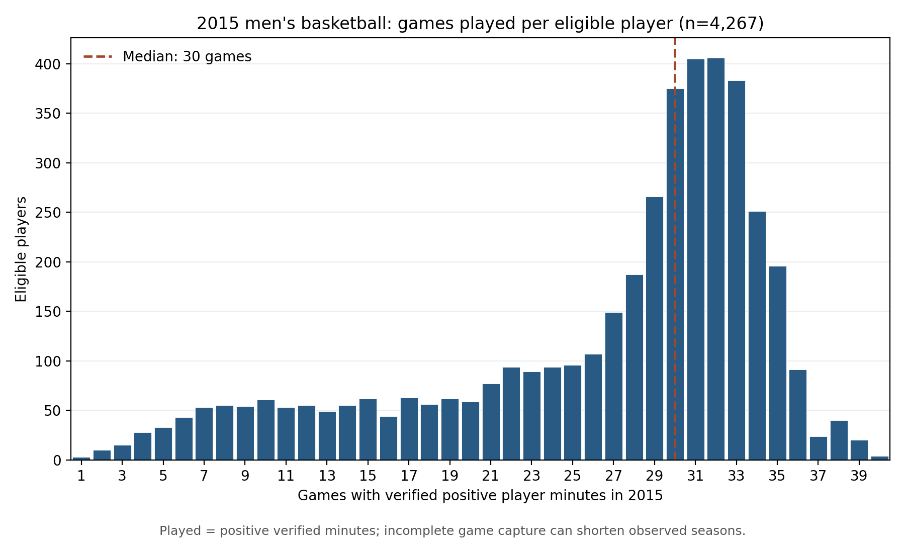

# How often did eligible 2015 basketball players appear?

**Status:** Two descriptive plots executed and visually inspected on September 27, 2026, using the accepted 2015 men's basketball player population. Their saved hashes match the run record, and the plotted data contain 4,267 player rows. They describe game participation; they do not measure talent, sorting, congestion, or draft outcomes.

## What the plots show

The first plot counts **games with verified positive player minutes** for each of the **4,267 eligible players**. The median is **30 games**. One quarter appeared in **22 or fewer** such games; one quarter appeared in **32 or more**. The range is **1–40**. These are appearances in the accepted captured game records, not a player's official season schedule.

The second plot divides each player's positive-minute appearances by the number of **distinct games captured for that player's team** in the frozen 2015 file. Its median is **93.9%**. The lower quarter is at **69.7% or less**, while the upper quarter reaches **100%**. The large rightmost bar includes players who appeared in **95–100%** of their team's captured games. This denominator is *not* a separately verified complete National Collegiate Athletic Association schedule.

The 351 teams in this eligible 2015 population have **28–40 captured games** each (median **32**). The eleven-captured-game rule was the *minimum for entry*, not the actual number of games observed for most teams in this season.

## Why this follows the previous result

First, the rotation audit showed that 339 eligible players averaged fewer than five minutes in games where they registered positive minutes. Removing those players from the measured peer pool changed many peer averages. Next, the sorting comparison showed that removing them from the *player population* produced only a small reference-adjusted change in points-per-minute sorting. Neither result described how frequently those players entered games.

So we next counted **participation frequency**, in two forms: the number of games with positive minutes, and that number as a percentage of captured team games. The plots show a strong concentration near full-season participation, alongside a long lower-participation tail. They do not yet tell us whether the short-minute players are in that tail. A player can appear briefly in thirty games; another can log heavy minutes in ten. Games played and minutes *per appearance* are different dimensions of opportunity. These figures also cannot tell whether points per minute is a faithful measure of latent talent or why its team-sorting index is low.

## Definitions and provenance

The player universe and each person's positive-minute appearance count came from the previously validated [rotation-audit player file](../../outputs/rotation_audit_2015/ASSORT_20260927_rotation_audit_v1_players.csv.gz). The new [plotting driver](../../code/ASSORT_20260927_games_played_distributions_v1.py) verified that file's checksum, then used the frozen `datasets/mbb/mbb_df_player_box.csv` and the exact [2015 source reader](../../code/ASSORT_20260925_v1.py) to count distinct captured game identifiers by team after the established placeholder-name exclusion. It checked that all 351 team identifiers matched the accepted player population and that each player's positive-minute appearances were no greater than their captured player-game records or their team's captured games. The verified minutes overlays affect whether a player's appearance has positive minutes, but they do not add or remove a game identifier from the team denominator.

The [plotted player values](../../outputs/games_played_2015/ASSORT_20260927_games_played_distributions_v1_player_values.csv), [numeric summary](../../outputs/games_played_2015/ASSORT_20260927_games_played_distributions_v1_summary.json), and [run record](../run_records/ASSORT_20260927_games_played_distributions_v1_run_record.json) are isolated under this investigation. The frozen source, earlier audit, sorting outputs, and paused experiment were not changed.
