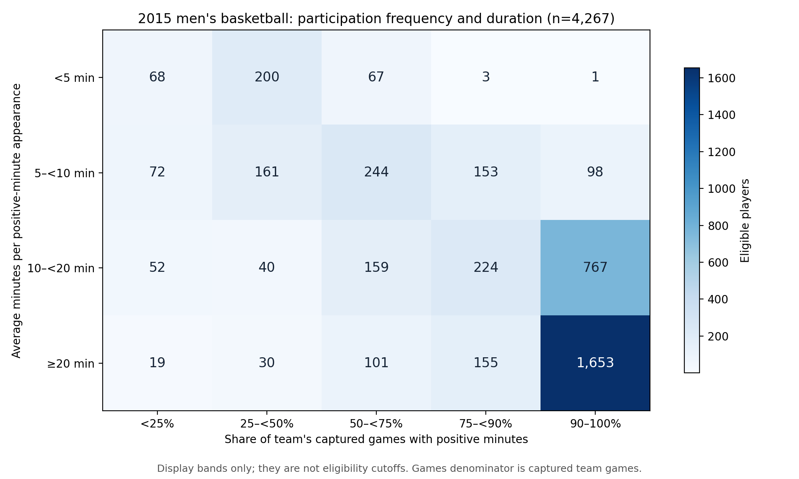
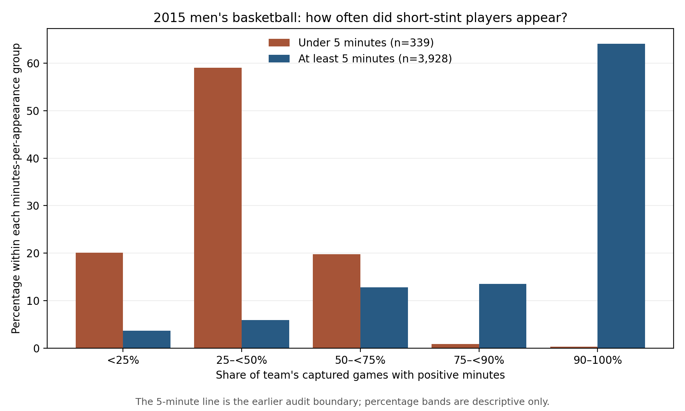

# Participation frequency, stint length, and the basketball player-pool question

**Status:** Descriptive 2015 comparison executed and internally checked on September 27, 2026. The charts have been visually inspected; their hashes match the run record; the plotted data contain all 4,267 eligible players. The display bands below are **not new filters**. This note records an assessment, not a change to the production panel or paused experiment.

## The comparison Charles requested

We previously found 339 eligible players who averaged fewer than five minutes in games where they logged verified positive minutes. The single-variable games-played plots could not tell whether they were perennial short-stint participants or people who appeared only occasionally. We therefore put **share of captured team games with positive minutes** on one axis and **average minutes per such appearance** on the other for those same 4,267 players.

The answer is quite definite for this sample: **268 of the 339 short-stint players (79.1%) appeared in fewer than half of their team's captured games**. Only **four** appeared in at least three quarters, and only **one** appeared in at least 90%. The illustrative cell “occasionally present but playing at least twenty minutes when present” has **19** players below one quarter of captured team games. A person's season total can therefore arise from very different participation patterns, but the particular “tiny stint in almost every game” pattern is rare among the 339 after the existing twenty-minute season floor.

The heatmap contains the complete count table: the short-stint row is **68, 200, 67, 3, 1** from the lowest to highest game-share bands. These are descriptive bands, chosen to display the joint distribution rather than to optimize any result. The [underlying 4,267 player values](../../outputs/participation_duration_2015/ASSORT_20260927_participation_duration_crosscheck_v1_player_values.csv) preserve the continuous measures.

## What this changes in our interpretation

First, the accepted 2015 population showed many players near full-season participation, but it also had a long tail. Next, we asked whether the 339 short-stint players lived in the full-season cluster. They overwhelmingly did **not**: most appeared in fewer than half of their team's captured games. This makes “perennial short stints” an unlikely *dominant* explanation for their measured peer contribution in this particular population. It does not establish why they played little, whether they were less talented, or whether they competed for minutes or draft attention. The earlier peer-audit and sorting results remain exactly as reported.

The two axes still matter separately. For example, three minutes in thirty games and twenty-five minutes in four games both yield roughly a hundred observed minutes, but describe different roles. Total season minutes speaks to how much data underlie the points-per-minute rate; game share describes how regularly the player enters games; minutes per appearance describes the size of that player's typical court-time opportunity. None is itself a direct measure of latent basketball talent.

## Joint assessment of Charles's three proposals

**1. Reconsider the twenty-minute player-season minimum — yes, as a definition of the player pool.** The current floor admits all 339 short-stint players; 268 of them appeared in fewer than half of captured team games. Twenty total minutes therefore does **not** certify regular rotation participation or a stable points-per-minute estimate. But raising the floor blindly would be a different choice, and this analysis contains no players *below* the current twenty-minute rule, so it cannot quantify what lowering the floor would add. Total minutes remains useful as a minimum exposure check for a rate: a player who appeared in all thirty games for one minute apiece has high game share but only thirty minutes of scoring data. The historical twenty-minute floor should remain identified as the reigning-panel rule until a separately named sensitivity is specified; this finding does not retroactively invalidate its past results.

**2. Reconsider the team-season game minimum — retain its source-quality purpose while questioning its exact number.** The historical configuration `min_team_season_games = 10` means *drop ten or fewer distinct captured games and retain at least eleven*; this is confirmed by `sports/sports_pipeline/config.py`, `sports/sports_pipeline/panel_rebuild.py`, and `3-Master_Plan/re_entry/HEROs_and_PASSes/pd22_minutes/BOX_QC_panel_build_policy.md`. It was adopted to avoid treating one-game opponents as full-season teams. In the newly checked 2015 data, **638** team identifiers appear before that rule and **351** survive it; every surviving team has **28–40** captured games. Thus the eleven-game boundary is a broad guard against fragmentary team records here, not a finely discriminating cutoff among retained 2015 teams. Requiring anywhere from **11 through 28** captured games would retain the same 2015 teams. That does **not** prove another cutoff would have no effect in other seasons, or that all 28–40 captured games equal a verified complete schedule. A true *team coverage percentage* needs an independent count of games the team actually played; dividing captured games by themselves would be meaningless.

**3. Use relative participation measures — promising, with two distinct purposes.** The player's **share of team games played** is already available for this 2015 population and exposes episodic versus regular presence. A player's **share of all team court minutes** would indicate how much of the team's finite playing time the player occupied. For an intuitive scale, if the data support a complete team-minute denominator, we could report $5 M_i / M_{\mathrm{team}}$, where $M_i$ is the player's captured season minutes and $M_{\mathrm{team}}$ is the sum of verified player-minutes for that team across its captured games. This is the fraction of one hypothetical full-time on-court slot used by the player; unscaled $M_i/M_{\mathrm{team}}$ is the share of all five slots and is ordinarily at most about one fifth. We have **not** calculated that measure in this comparison. Its denominator needs a completeness and missing-minute audit, including overtime, before it can support a filter.

Relative measures would make team-season length less confounding, but no single percentage answers all questions. Court-minute share combines frequency and stint length, so it can give similar values to a regular brief participant and an occasional heavy-minute participant. It also reflects coaching decisions and team depth. If a talented player gets fewer minutes because a strong team is crowded, filtering that player out could erase the very congestion mechanism we want to investigate. For that reason, an eventual alternative pool should be named as a **different target population**, and any effect on measured sorting should be compared with its own random-allocation reference rather than judged by whether the raw index rises.

**Overall judgment:** Charles is right to question absolute floors as sufficient definitions of a credible rotation pool. The evidence does not yet justify replacing both existing rules with a single relative threshold. A bounded next design would preserve the historical panel, inspect the team-minute denominator, then specify *one* alternate rotation-pool definition in advance using frequency, court-time share, and a minimum amount of observed minutes for points-per-minute reliability. We should compare that named pool with the baseline before considering a performance-metric change, without tuning cutoffs to recover a preferred sorting index or hero curve. This is a recommendation for a decision, **not authorization to execute that next analysis**.

## Sources, validation, and limits

The [driver](../../code/ASSORT_20260927_participation_duration_crosscheck_v1.py) matched both saved inputs to their run-record checksums, merged by athlete and team identity, verified the participation arithmetic, and generated only these descriptive outputs. The [counts](../../outputs/participation_duration_2015/ASSORT_20260927_participation_duration_crosscheck_v1_cross_tab_counts.csv), [numeric summary](../../outputs/participation_duration_2015/ASSORT_20260927_participation_duration_crosscheck_v1_summary.json), and [run record](../run_records/ASSORT_20260927_participation_duration_crosscheck_v1_run_record.json) preserve the result. No eligibility filter, scoring measure, assignment simulation, draft analysis, or older research artifact was modified.

The game-share denominator is the team's captured games in the frozen 2015 file, not an independently verified official schedule. The population already passed the accepted twenty-minute player minimum and eleven-captured-game team rule. The five-minute and frequency bands describe *observed* court-time participation; they are not evidence that a player was or was not talented enough to compete for a role.
