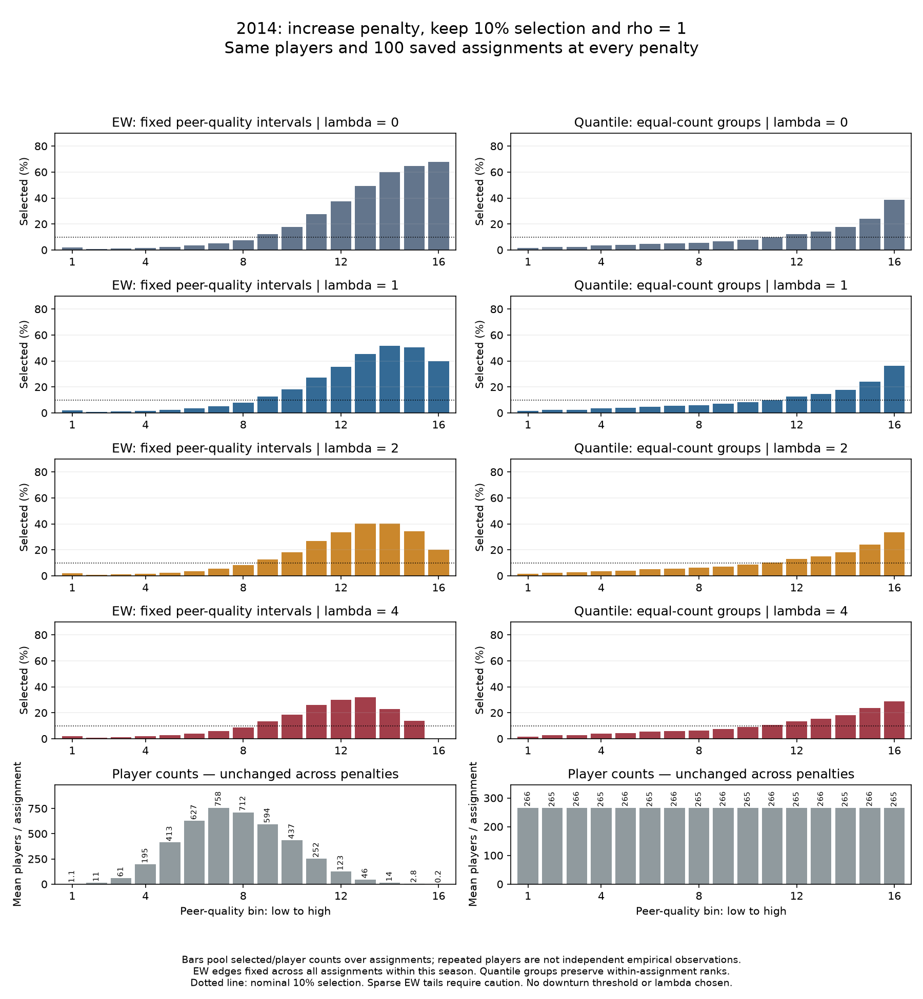
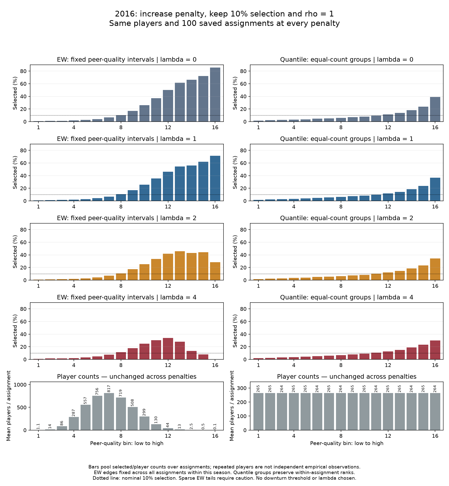

# Penalty exploration: the bar charts reveal a tail that quantile bins conceal

**Last synced:** 2026-09-27  
**Status:** First visual stage completed. No penalty chosen for the next experiment. No lower-selection-rate or rho comparison executed.

## Where we are and why we did this

Our immediate question is whether the model can produce a meaningful downturn before we ask whether extreme selection scarcity weakens it. Charles proposed starting at 10% selection, increasing the congestion penalty, then freezing a useful penalty and reducing the number of available places. Comparing assignment preference comes later.

VECTOR initially proposed numerical criteria for a substantial downturn without enough discussion. Charles stopped that approach. The unexecuted automatic-search draft is now marked superseded and its script disabled. We instead agreed to inspect bar charts together, using 16 equal-width (EW) bins and 16 quantile bins.

This first stage used the same saved 2014, 2015, and 2016 populations and 100 simulated assignments per season. Assignment preference stayed at $\rho=1$. Selection stayed near 10%: 425 of 4,248 players in 2014; 427 of 4,267 in 2015; and 423 of 4,234 in 2016. We changed only the penalty coefficient, comparing $\lambda=0,1,2,4$.

The score remained

$$
S_i=A_i-\lambda C_j.
$$

Individual performance $A_i$ remained standardized points per minute. Congestion $C_j$ remained the raw team mean of logistic viability, including the focal player. Its threshold and sharpness were unchanged. Selection took the highest $K$ scores, without additional randomness. These are simulated assignments and selections, not actual draft predictions.

## What the charts tell us

**At lambda four, the EW bars visibly rise and then fall in all three seasons. The quantile bars still rise.** This is a visual, descriptive observation, not an automatic declaration that the downturn meets our scientific needs.

The contrast is useful. Quantile groups put roughly 265–267 players into each group in each assignment. Their highest group combines a relatively broad stretch of upper peer quality. EW divides that same axis into equal distances, separating the far-right tail into several small groups. The two charts summarize the same selections differently; they are not conflicting computations.

For example, in 2015 at lambda four, the EW selection rate is about 32.3% in bin 12, 31.8% in bin 13, 27.8% in bin 14, and 11.9% in bin 15. The downturn is therefore not solely the height of the very last bar. However, those bins contain progressively fewer players.

This also qualifies our earlier language about not demonstrating a downturn. The earlier quantile plots did not display a clear downturn. The new EW view shows upper-tail declines even at lambda one in 2014 and 2015, although not consistently across all three seasons. We should not turn a finding about one binned presentation into a claim that no tail decline existed anywhere.

## Why the player-count row matters

At lambda four, the 2015 EW bins 12–15 contain averages of approximately 95, 32, 11, and 2.4 players per assignment. The last bin averages only 0.26 players and is occupied in seven of the 100 assignments.

In 2016 the extreme tail is thinner still: EW bin 16 contains only seven player-assignment observations across the entire hundred repetitions, appearing in two assignments. Its zero selection rate must not carry the interpretation by itself.

The curves show a model pattern worth examining, but the farthest tail is weakly populated. Repeating assignments does not create new independent empirical players or additional basketball seasons. The current figures are descriptive; they do not establish statistical significance.

## How to read the sheets

Each season has its own sheet. Read downward from no congestion penalty to lambda four. The EW chart is on the left, the quantile chart on the right. Selection panels share the same vertical scale across all three sheets. The dotted line marks nominal 10% overall selection; individual groups can have much higher rates while others have lower rates.

The bottom row shows mean player counts per assignment. These counts are identical across penalties because neither players nor assignments changed.

EW edges are fixed across all 100 assignments within each season, from the minimum to maximum peer quality. Quantile memberships reuse the saved within-assignment groups. Peer quality in both cases is teammates' mean standardized performance excluding the focal player. EW edges differ across seasons, so the same bin number is not an identical numerical peer value across years. Exact edges are saved with the outputs.

A bar pools selected counts divided by player counts across assignments. An empty bin in a particular assignment contributes neither players nor selections. Saved summaries also give occupancy and per-assignment variation. These are new model readouts, not an exact reproduction of the empirical HERO plotting pipeline.

{width=100%}

{width=100%}

{width=100%}

## What we should decide together next

We have something to inspect before extending to eight or sixteen. My recommendation is to look at lambda four together, paying particular attention to where the downturn starts and how many players support it. I have not chosen it as the next experiment's penalty.

If Charles regards that pattern as a useful starting configuration, we can then hold the penalty fixed and examine selection scarcity. If it is too confined to a thin tail, we can discuss the already contemplated stronger penalties. No numerical definition of substantial downturn has been imposed.

Even a successful later scarcity demonstration would only support a possible explanation for basketball. It would not establish that our model is empirically correct, that this lambda describes basketball, or that the five-player court limit has been modeled. Assignment preference has not been varied in this stage.

## Files and verification

- [Agreed specification](../decisions/ASSORT_20260927_penalty_bars_v1_specification.md)
- [Script](../../code/penalty_bars_v1/ASSORT_20260927_penalty_bars_v1.py)
- [Bin summaries, including occupancy](../../outputs/penalty_bars_v1/bar_summary.csv)
- [Counts for every repetition](../../outputs/penalty_bars_v1/bin_counts_by_repetition.csv)
- [Execution record](../run_records/ASSORT_20260927_penalty_bars_v1_run_record.json)

The script ran in sports_net. All 1,200 selections passed independent sorting checks; lambda-one results exactly reproduced the previous 10% selections. Both binning methods accounted for every player and selected player. Congestion and peer quality were reconstructed independently, and source hashes were unchanged. All three saved chart sheets were visually inspected. Plotting used a temporary font cache because the standard cache directory was not writable; this did not prevent completion.

**Stopping point:** Charts and narrative saved. No lambda eight or sixteen, no lower selection fractions, no new assignments, and no PDF regeneration.

