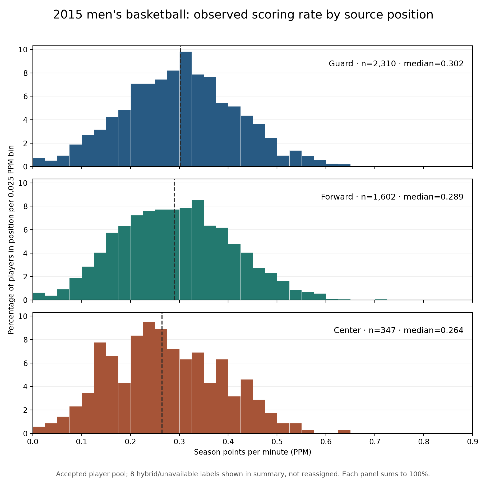

# 2015 points per minute by recorded basketball position

**Status:** One descriptive plot executed, visually inspected, and internally checked on September 27, 2026. The accepted 2015 basketball player population and its stored points-per-minute values were unchanged. The plotted-data row count and saved hashes match the [run record](../run_records/ASSORT_20260927_ppm_by_position_v1_run_record.json).

The three distributions overlap considerably. Median season points per minute is **0.302** for **2,310 guards**, **0.289** for **1,602 forwards**, and **0.264** for **347 centers**. Each panel shows the percentage *within that position* in equal-width points-per-minute bins, so the different group sizes do not by themselves make one histogram taller. The dashed line is that position's median. The full range, including the small high-rate tails, is shown.

The position labels came directly from `athlete_position_name` in the frozen ESPN-derived `datasets/mbb/mbb_df_player_box.csv`. Every accepted player had one consistent nonmissing source label across his captured 2015 game rows. The source also labels **one** player “guard/forward” and **seven** “not available”; those eight are counted in the [summary](../../outputs/ppm_by_position_2015/ASSORT_20260927_ppm_by_position_v1_summary.json) and [plotted-data file](../../outputs/ppm_by_position_2015/ASSORT_20260927_ppm_by_position_v1_player_values.csv), but not silently reassigned to one of the three main panels. The source has a broad “forward” label, not separate small- and power-forward categories in this field.

This describes **observed scoring rate**, not talent after adjusting for position or role. The medians differ modestly, and the distributions overlap; this picture alone cannot tell us whether position mix explains the low team-sorting index, whether points per minute measures ability comparably across positions, or how any alternate player pool would change the result. No position-based filter, sorting analysis, or performance-metric change was run.

The isolated [driver](../../code/ASSORT_20260927_ppm_by_position_v1.py) verified the checksums of the accepted player file and frozen game source, joined positions by athlete and team, required label consistency, and used the existing player-season points-per-minute column. The frozen source, earlier audits, and paused experiment remain unchanged.
