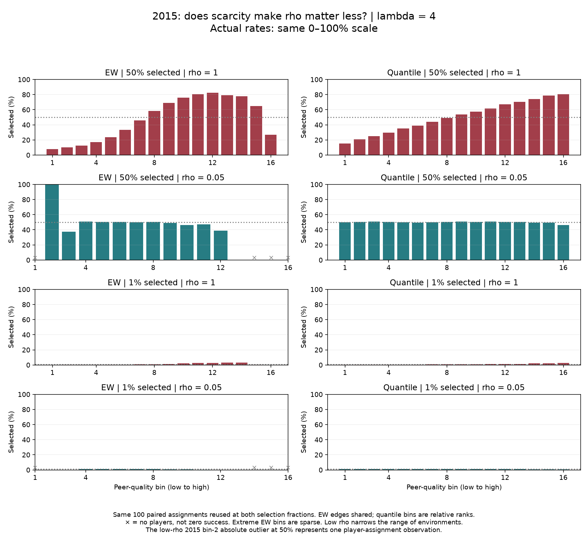

# Does extreme scarcity make assignment preference unimportant?

**Last synced:** 2026-09-27  
**Status:** The agreed 1% versus 50% comparison is complete; no additional experiments followed.

## Why this was the missing comparison

Charles's hypothesis was that very scarce selection might make changes in assignment preference almost meaningless. Our first scarcity experiment held rho one and lambda four fixed. It showed that reducing selection from 10% to 1% did not erase the relative EW downturn. Our subsequent 50% experiment showed that reducing rho from one to 0.05 greatly changed the profile.

Those observations did not directly answer whether rho still mattered at 1%. We therefore reused the exact same saved rho-one and rho-0.05 teams and compared their selections at both 50% and 1%, keeping lambda four throughout.

## What we found

**In these configurations, extreme scarcity did not make assignment preference unimportant.** At 1%, the relative profiles remained visibly different: rho one retained a pronounced association between peer environment and selection, including the EW tail decline; rho 0.05 was much flatter, with a modest upper-end decline.

On an absolute 0–100% axis the 1% panels look almost flat because all their probabilities are small. Dividing each bin's rate by the achieved overall selection rate reveals the continuing differences. This is a change of units within each curve, not a new model calculation.

For example, in 2015 at 1%, the highest quantile group's selection rate was approximately 2.76% under rho one and 0.82% under rho 0.05. These equal approximately 2.73 and 0.82 times their overall rate. The groups represent relative ranks within their respective assignment distributions, not the same players or identical numerical peer environments.

## A second meaning of “matters”: who gets a place?

We also counted how many rho-one winners were no longer selected under rho 0.05. Because both conditions select the same number, the number losing a place equals the number gaining one. We count each replaced place once, not twice.

In 2015, at 50% selection, an average 57.81 of 2,134 selected identities changed: about 2.71%. At 1%, an average 10.53 of 43 changed: about 24.49%.

The same pattern appeared in the other seasons. The changed shares at 50% and 1% were approximately 2.54% and 23.88% in 2014, and 2.74% and 26.55% in 2016.

Thus fewer people changed status under scarcity, but they constituted a larger share of the scarce selected group. This supports keeping absolute counts and proportions separate. It is not a claim that every possible effect measure grows with scarcity.

There is another important distinction: curves can change because players move into different environments even if many of the same individuals remain selected. A change in the curve and a change in winner identities are related but different findings. Neither is draft-prediction accuracy.

## What the charts do—and do not—establish

We varied assignment preference within the model using paired incoming-player orders and random draws, and kept the score coefficient fixed:

$$
S_i=A_i-4C_j.
$$

New assignments were not generated in this stage. We reused all 100 paired assignments in each of 2014, 2015, and 2016. Source populations, capacities, congestion settings, EW edges, and saved within-assignment quantile memberships were unchanged. Only the selection cutoff changed between 50% and 1%.

Low rho concentrates team environments around the middle. Several extreme EW bins therefore have no observations. Crosses denote missing environments, not zero selection probabilities. Sparse occupied tails can still produce unstable-looking bars. The earlier [rho comparison](ASSORT_20260927_rho005_v1_report.md) includes the player-count panels; the present saved summaries retain every bin's counts and occupancy.

These are descriptive model results from fixed populations, not independent empirical trials or a formal significance test. They do not prove assortativity is universally necessary. They do not establish that basketball's observed weak downturn is explained by scarcity, and they do not model the five-player court constraint.

## Read the comparison

The first two rows show rho one and 0.05 at 50% selection; the bottom two repeat the comparison at 1%. EW is left, quantile right. Red denotes rho one; teal denotes rho 0.05.

{width=100%}

The absolute-rate version intentionally uses one common 0–100% scale. Its tiny 1% bars illustrate why visual flatness on that scale alone is not sufficient evidence of a negligible effect.

{width=100%}

Other seasons:

- [2014 relative](../../outputs/rho_scarcity_v1/2014_relative.png) and [absolute](../../outputs/rho_scarcity_v1/2014_absolute.png)
- [2016 relative](../../outputs/rho_scarcity_v1/2016_relative.png) and [absolute](../../outputs/rho_scarcity_v1/2016_absolute.png)

## Where the investigation now stands

The simple hypothesis that selection near 1% neutralizes the effect of rho is not supported by this particular comparison. Assignment preference still changes relative outcome patterns and a material fraction of selected identities. That is a useful bounded answer; we need not search for another parameter combination merely to recover our initial expectation.

We should review this result together before deciding what Alex needs next. Band-of-excellence comparisons, additional rho values, and further parameter searches remain outside this completed step.

## Record and reproducibility

The run used sports_net. It reproduced all previous 50% selected sets and the prior rho-one 1% bar rates, checked nested selected sets, verified independent score rankings and count conservation, and confirmed unchanged source hashes. All six figures were visually inspected, and the relative plotting scale covers every saved bar.

- [Specification](../decisions/ASSORT_20260927_rho_scarcity_v1_specification.md)
- [Code](../../code/rho_scarcity_v1/ASSORT_20260927_rho_scarcity_v1.py)
- [Rates and bin counts](../../outputs/rho_scarcity_v1/bar_summary.csv)
- [Winner-change summary](../../outputs/rho_scarcity_v1/identity_summary.csv)
- [Winner changes for each repetition](../../outputs/rho_scarcity_v1/identity_changes.csv)
- [Run record](../run_records/ASSORT_20260927_rho_scarcity_v1_run_record.json)
- [Plot and report trail](ASSORT_20260927_model_plot_trail.md)

**Stopped after this comparison. No PDF regeneration.**

