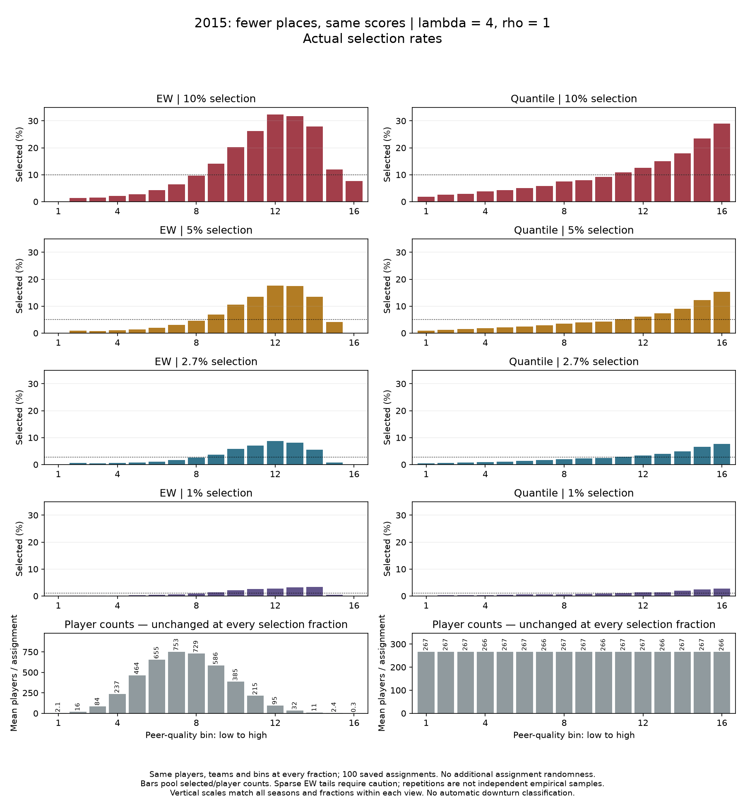

# Fewer places: does the downturn disappear?

**Last synced:** 2026-09-27  
**Status:** Authorized comparison completed. Pause for interpretation.

## The question and the answer so far

We first increased the congestion penalty while keeping selection near 10%. At lambda four, the EW charts rose and then fell in all three seasons, while quantile charts still rose. Charles agreed to use that configuration as the starting point for a scarcity comparison.

Next we kept the penalty, players, simulated teams, and bin memberships fixed. We reduced only the fraction selected: 10%, 5%, 2.7%, and 1%.

**The absolute bars became much shorter, but an upper-tail EW downturn remained visible in all three seasons after scaling by the overall selection rate.** This configuration does not demonstrate that reducing selection from 10% to 1% erases the downturn's relative shape. The shape is not perfectly invariant: its peak and tail heights change, particularly in 2015.

This is a useful result even though it does not provide the simple scarcity explanation we were considering. We tested an idea rather than tuning until it appeared true.

## What stayed fixed, and what changed

The score was still

$$
S_i=A_i-4C_j.
$$

Assignment preference stayed at $\rho=1$. We used the same 100 saved assignments in each of 2014, 2015, and 2016. Individual standardized points per minute, raw full-team congestion, viability settings, tie rules, and peer-quality bin memberships did not change. Selection took the highest $K$ scores. Every smaller selected group was verified to be a subset of the larger selected groups in the same assignment.

The 2014 population had 4,248 players: the four selection settings gave 425, 212, 115, and 42 places. For 2015, 4,267 players gave 427, 213, 115, and 43 places. For 2016, 4,234 players gave 423, 212, 114, and 42 places. Achieved fractions differ slightly from their targets because places are whole numbers.

No new assignments, data rebuilding, penalty changes, or comparisons of rho were performed. These are model selections, not real draft predictions. The 2.7% setting is a scarcity scenario, not an assertion about annual draft probability.

## Why we needed two views

On a common percentage scale, selecting only 1% makes nearly every bar small. That is a real reduction in absolute selection probabilities, but it can make a persistent pattern hard to see.

So the second view divides each bin's selection rate by the achieved overall rate:

$$
R_b=\frac{\text{selection rate in bin }b}{K/N}.
$$

A value of three means that players in that bin are selected at three times the overall rate. Dividing every bar in a given curve by the same positive number does not create or remove a peak; it lets us compare relative magnitudes across different overall selection rates.

Both views are useful. The absolute view answers how large the differences are in percentage points. The relative view asks how those differences compare with the available opportunity overall. Neither replaces the other.

## A concrete example, including the complication

In 2015, EW bin 12 had a selection rate of about 32.3% when 10% were selected overall. At 1% overall, its rate was about 2.78%. Those correspond to approximately 3.23 and 2.76 times the overall rate.

Farther right, bin 15 fell from 11.9% to 0.41%, or approximately 1.19 to 0.41 times the overall rate. Thus the contrast between those two environments did not disappear simply because there were fewer places.

But that is not the entire curve. At 1%, bin 14 reached about 3.31%, higher than bin 12's 2.78%. The highest bar moved toward the right before the drop into bin 15. We should not describe this as an unchanged shape or infer uniform weakening or strengthening from one pair of bins.

These numerical illustrations describe saved bars, not a new test statistic chosen to declare success. The full curves remain the basis for joint visual interpretation.

## The tail limitation remains important

Those 2015 bins contain averages of about 95 players in bin 12, 11 in bin 14, and 2.4 in bin 15 per assignment. At 1%, bin 15's 0.41% rate represents just one selected player-assignment observation out of 243 player-assignment observations across the hundred repetitions. Its precise height is fragile.

The most extreme EW bins are even thinner, especially in 2016. Repeating assignments provides a description of assignment variability within fixed populations, not additional empirical seasons or independent observations of new players. The figures do not establish statistical significance.

The quantile charts continue to show generally rising selection rates. They combine the upper peer-quality region into larger groups and do not resolve the same narrow tail detail. This remains a presentation and aggregation distinction, not disagreement between selection algorithms.

## Read the charts

Start with the 2015 pair below. Read downward as opportunities become scarcer. EW is on the left and quantile on the right. The bottom row records the unchanged player counts. All seasons share the same vertical scale within each view.

{width=100%}

{width=100%}

The other seasons provide the same comparison:

- [2014 actual rates](../../outputs/scarcity_bars_v1/2014_scarcity_absolute.png)
- [2014 relative rates](../../outputs/scarcity_bars_v1/2014_scarcity_relative.png)
- [2016 actual rates](../../outputs/scarcity_bars_v1/2016_scarcity_absolute.png)
- [2016 relative rates](../../outputs/scarcity_bars_v1/2016_scarcity_relative.png)

Bars pool selected and player counts across assignments, using the same fixed EW edges and saved quantile memberships as the penalty exploration. Empty bins contribute no players or successes; undefined rates are not replaced by zero. Detailed saved summaries include occupancy and conditional nonempty-assignment rate ranges. These ranges describe assignment variation, not confidence intervals.

## What we can say now

In these fixed-penalty, fixed-preference model configurations, scarcity reduces absolute outcome differences but does not visibly eliminate the relative EW downturn over the tested range. This limits the proposed explanation that extreme scarcity by itself accounts for a nearly absent relative downturn in basketball.

It does not establish what happens at every possible scarcity level, penalty, assignment preference, or empirical performance definition. It does not test the five-player court constraint, isolate a band of excellence, or demonstrate that the model accurately describes basketball.

The planned later question concerns changing rho. We have not done that yet. For now we should agree on this result's interpretation before selecting that experiment's settings. There is no need to expand this run automatically.

## Reproducibility and stopping point

The run used sports_net. All 1,200 selected sets had the correct number of winners; independent full-rank sorting agreed; lower-fraction winner sets were nested; and the previous lambda-four 10% winners and bars reproduced exactly. Both binning methods conserved every player and selected count. Source hashes were unchanged. All six chart sheets were visually inspected.

- [Approved specification](../decisions/ASSORT_20260927_scarcity_bars_v1_specification.md)
- [Script](../../code/scarcity_bars_v1/ASSORT_20260927_scarcity_bars_v1.py)
- [Bar summary](../../outputs/scarcity_bars_v1/bar_summary.csv)
- [Counts for each repetition](../../outputs/scarcity_bars_v1/bin_counts_by_repetition.csv)
- [Exact selection counts](../../outputs/scarcity_bars_v1/selection_counts.csv)
- [Run record](../run_records/ASSORT_20260927_scarcity_bars_v1_run_record.json)

**Execution is complete. No rho comparison, stronger penalty, additional scarcity setting, band-of-excellence experiment, or PDF regeneration followed.**

