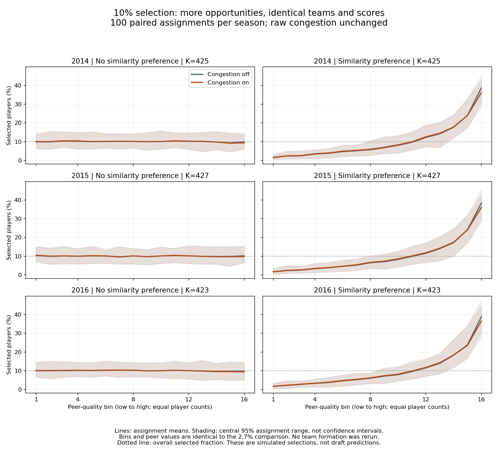

# More opportunities: 2.7% versus 10% selection on the same teams

**Status:** Executed and checked; September 27, 2026.  
**Question:** Does increasing the number of selection opportunities change congestion's effect or reveal a downturn?  
**Scope:** The same saved 2014–2016 populations and assignments; 100 paired repetitions per season.

## Why we did this next

Charles correctly pointed out that our previous counts described congestion's effect only at a 2.7% selection rate. Other domains may select a much larger fraction. We therefore tested one previously discussed alternative, 10%, while leaving 20% parked.

The comparison changes only the number of available spots. It does not change who is in the population, which teammates they have, how ability is measured, how congestion is calculated, or how scores are ranked.

## What we did

We reused all 300 saved pairs of assignments. For each assignment, we selected the highest-scoring 10% under ability-only scoring and under ability-minus-congestion scoring.

The selected counts increased as follows:

- 2014: from 115 to 425 out of 4,248 players.
- 2015: from 115 to 427 out of 4,267 players.
- 2016: from 114 to 423 out of 4,234 players.

The viability threshold remained at the 99th percentile. The transition sharpness remained ten and raw congestion weight remained one when enabled. These are the same scenario settings as before, not estimated coefficients. Moving to 10% did not automatically change the definition of congestion.

The code also reproduced every original 2.7% selected list and its counts exactly. No team formation or new random draws were needed.

## What changed in who was selected?

Here, a person changing means someone who was selected with congestion off lost that spot when congestion was turned on. Another person takes the spot; we count that exchange once, not twice.

For example: ability alone selects Alice, Bob, and Carlos; adding congestion selects Alice, Bob, and Diana. That is one person losing a selected spot, not two replacements. We do not know from this comparison whether Diana is a better real-world choice.

The following values are averages across 100 assignments. The percentage uses the number of selected people as its denominator.

| Season | Assignment preference | People losing a spot at 2.7% | Share of selected group | People losing a spot at 10% | Share of selected group |
|---|---|---:|---:|---:|---:|
| 2014 | None | 2.21 | 1.92% | 5.46 | 1.28% |
| 2014 | Similarity preference | 5.61 | 4.88% | 10.99 | 2.59% |
| 2015 | None | 2.14 | 1.86% | 5.38 | 1.26% |
| 2015 | Similarity preference | 5.47 | 4.76% | 10.62 | 2.49% |
| 2016 | None | 1.51 | 1.32% | 5.23 | 1.24% |
| 2016 | Similarity preference | 4.25 | 3.73% | 9.99 | 2.36% |

Take 2015 with similarity preference. When there were 115 spots, congestion changed about five or six selections: 4.76% of the selected group. With 427 spots, it changed about ten or eleven: 2.49% of the selected group.

So more people changed in absolute number, but a smaller fraction of the selected group changed. That pattern held in all three seasons and both assignment conditions. It would be misleading to describe congestion as simply stronger or weaker without saying which quantity we mean.

The replacement counts are not comparisons with actual draft picks and do not measure correct predictions.

## What happened to the curve?

{width=100%}

Each row is a season. The left column is assignment without similarity preference; the right column has similarity preference. The blue-gray line is congestion off; orange is congestion on.

At 10%, the no-preference curves remain approximately flat. Under similarity preference, selection rates rise toward stronger peer environments. The congestion penalty lowers the highest-bin rates somewhat, but the averaged curves still rise at the upper end. This did not reveal a clear downturn.

The plotted lines average 100 assignments, and the shading shows the central 95% assignment range. It is not an empirical confidence interval. Each assignment retains exactly the peer values and sixteen equal-count bins used in the 2.7% comparison. Those bins are relative peer-quality positions rather than identical numerical environments across assignments.

For the earlier figure, see the [2.7% experiment report](ASSORT_20260927_three_season_mechanism_v1_report.md). The two figures have different vertical scales because their overall selection rates differ. This is a descriptive curve comparison; we did not fit a quadratic or conduct a formal downturn test.

## What we learned and what remains open

Increasing opportunities from 2.7% to 10%, while holding everything else fixed, did not produce the downturn in these averaged curves. The qualitative finding persisted across the three season populations.

This narrows our evidence: the failure to demonstrate the downturn was not confined to the 2.7% setting. It does not show that scarcity never matters, that 20% would behave identically, or that every congestion formulation would have the same result.

We still cannot settle whether assortativity is necessary for the downturn because the tested configuration has not demonstrated that downturn in either assignment condition. We can say that congestion changes selected identities without similarity preference, with larger average counts under preference, at both tested selection fractions.

The raw congestion penalty and its viability threshold were held fixed deliberately. Whether those settings are adequate to represent the hypothesized mechanism is a separate discussion, not something we adjusted to obtain a preferred curve.

## Checks, files, and stopping point

The driver verified every selected set using both NumPy ranking and a separately expressed pandas ranking. All original 2.7% winner sets and change counts matched the saved experiment exactly. Every 10% selected set contains its corresponding 2.7% set, as it must when the scores and tie rules are unchanged. Input hashes were checked before and after. The six-panel figure was visually inspected.

Paths below are relative to assort_analysis/:

- Driver: code/selection_rate_comparison_v1/ASSORT_20260927_selection_rate_comparison_v1.py
- Results, per-repetition counts, curve tables, and saved 10% identities: outputs/selection_rate_comparison_v1/
- Run record: docs/run_records/ASSORT_20260927_selection_rate_comparison_v1_run_record.json
- Parent experiment settings: code/three_season_mechanism_v1/ASSORT_20260927_three_season_mechanism_v1_settings.json

The original experiment and source data were not changed. This bounded comparison is complete. Twenty percent remains untested; no further experiment starts automatically.
