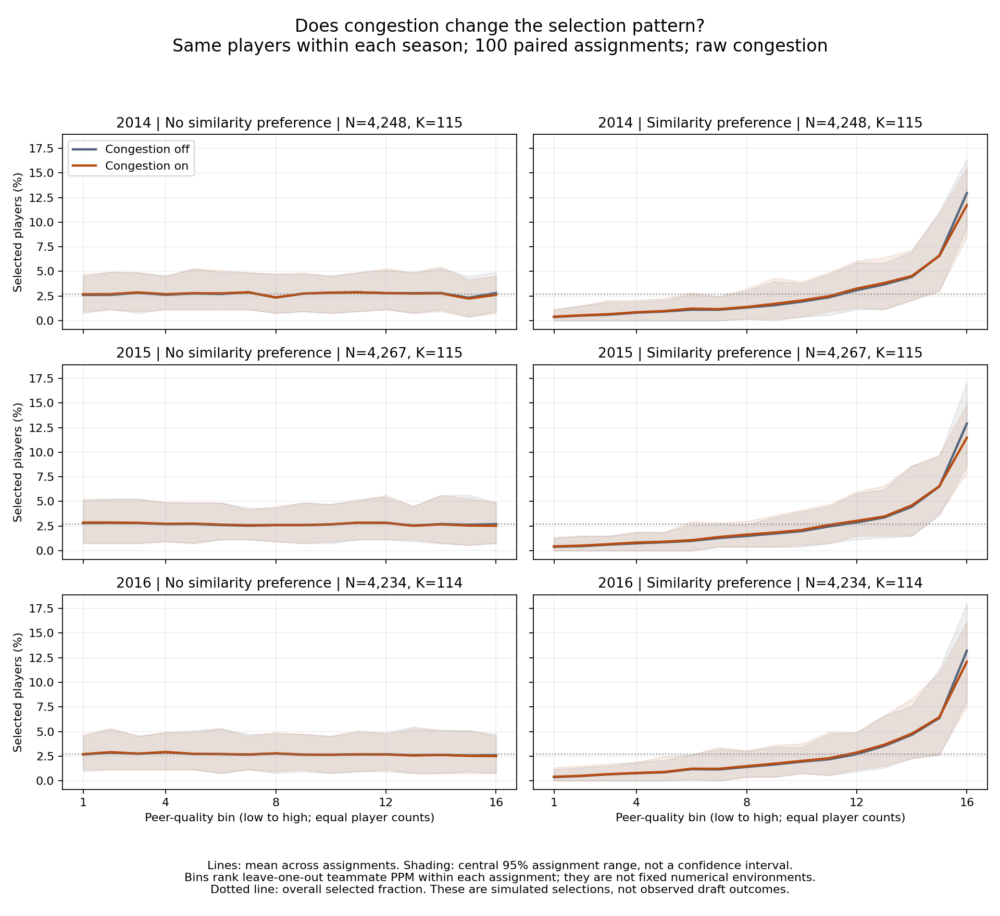

# Three-season assortativity experiment: what changed, and what remains unanswered

**Experiment:** ASSORT_20260927_three_season_mechanism_v1  
**Status:** Executed; saved numerical outputs independently checked; figure visually inspected.  
**Scope:** 2014, 2015, and 2016 evaluated separately; 100 paired assignment repetitions per season; approximately 2.7% selected; raw congestion.

## The finding in plain English

Across all three seasons, congestion changed a small number of selected players even when assignment had no preference for grouping similar players. Preferential grouping increased that number.

But the average curves did not show a clear congestion-induced downturn. With no assignment preference, the curves were roughly flat. With preference, they rose toward stronger peer groups. Congestion reduced the rightmost selection rates somewhat without turning those rising curves downward.

Thus we learned that preferential assignment is not required for congestion to change some winners in this model. We have not established whether it is necessary for the downturn: this particular configuration did not demonstrate that downturn in either assignment condition.

These are two different findings. We must not substitute the first for the second.

## First we secured the population, because unreliable PPM would confuse the experiment

Charles asked us to extend beyond one season. We checked 2014 and 2016 and found 351 teams in each with at least eleven captured games. The source had 111 questionable point/minute pairs in 2014 and 100 in 2016. Charles authorized the previously used fallback: omit both statistics in the new working copy while retaining the game identifier for coverage.

After canonical-team assignment and the twenty-minute player floor:

- 2014 contains **4,248 players on 351 teams**, with **115** selected per case.
- 2015 retains the accepted audit's **4,267 players on 351 teams**, with **115** selected.
- 2016 contains **4,234 players on 351 teams**, with **114** selected.

In 2014, 104 omitted rows touched 103 final eligible players (about 2.42% of the final population), removing 722 recorded points from their construction. In 2016, 88 omitted rows touched 87 final eligible players (about 2.05%), removing 495 points. These numbers concern the final eligible population; the preflight counts also included records outside it. No missing minutes were invented. The source fallback is a limitation because it omits some recorded scoring without reconstructing the missing facts.

One 2014 player appeared on both teams in the same game with identical statistics. The approved positive-playing-appearances ordering retained his predominant playing team. No unresolved played-team tie remained. The minimum eligible team sizes were nine in 2014 and eight in 2016.

The 2015 input preserves its previously verified source recoveries and fallback. Its PPM and standardized values were checked against the original accepted artifact without numerical change. The additional seasons received no new external source-recovery campaign. That difference in available corrections remains documented.

## Then we changed assignment while keeping the players fixed

The comparison uses the same people and the same roster capacities within a season. It does not keep their actual team memberships.

Each repetition creates two assignments:

- Without similarity preference, every remaining seat has equal chance of receiving the next player. A team with more remaining seats has proportionally more chance.
- With similarity preference, players are more likely to join teams whose current average performance is closer to their own.

Both assignments use the same randomly ordered players and the same underlying uniform draws, while allowing their different probability rules to produce different memberships. This pairing makes the comparison more direct.

The assignment preference settings are zero and one. Realized sorting was measured rather than assumed: mean H_sort was approximately 0.081–0.083 without preference and 0.362–0.366 with preference. This confirms that the assignment manipulation changed the grouping substantially. The nonzero sorting without preference is expected from finite random groups; it is not evidence that the rule secretly preferred similar players.

## Next we switched congestion off and on within each assignment

Ability here means standardized season points per minute, not independently measured innate talent. Each season's PPM was standardized once and held fixed.

The model assigns each player a smooth viability value using a threshold at that season's 99th ability percentile and transition sharpness ten. A team's congestion is the average viability of its full roster, including the focal player.

The score is

$$
S_i=A_i-\lambda C_{g(i)}.
$$

With congestion off, $\lambda=0$ and the score is ability alone. With congestion on, $\lambda=1$ and raw team congestion is subtracted. Everyone on a team receives the same subtraction. These are the previously documented scenario settings; they are not the fitted coefficients from the annual-draft diagnostic.

We then selected exactly the highest K scores, breaking exact ties by ascending athlete identifier. There was no random draw after scoring. The 2.7% budget was motivated by the reigning last-ps career-outcome proportion, but is applied here as a fixed experimental scarcity scenario to each season's full eligible population. It is not the observed annual draft rate or a reproduction of the last-ps HERO. The 99th-percentile viability threshold and 2.7% selection budget are intentionally separate settings.

This produces four cases per repetition: two assignment rules, each scored with congestion off and on.

## What changed in the selected people?

The following counts mean the number of ability-only winners replaced when congestion was turned on. Each replacement also adds another player; do not double these counts and call that the number of displaced winners.

| Season | No similarity preference: mean replacements | Similarity preference: mean replacements | Available selections |
|---|---:|---:|---:|
| 2014 | 2.21 | 5.61 | 115 |
| 2015 | 2.14 | 5.47 | 115 |
| 2016 | 1.51 | 4.25 | 114 |

Without preference, at least one winner changed in 93%, 97%, and 81% of repetitions respectively. With preference, at least one changed in every repetition in each season. Full observed replacement ranges were 0–5 versus 3–9 in 2014, 0–6 versus 2–10 in 2015, and 0–4 versus 1–9 in 2016.

For example, the 2015 result means that turning congestion on replaced about two of the 115 ability-only winners under no-preference assignment and about five or six under preferential assignment. It does not mean those new winners were correct predictions of actual draftees: observed draft outcomes are not part of this mechanism experiment.

This supports a limited conclusion: congestion can affect selection without preferential assignment, and preferential assignment amplified the average number of replacements in the tested settings.

## Then we examined the curves, because replacements alone are insufficient

{width=100%}

Read each row as one season. The left column shows no similarity preference; the right column shows similarity preference. Blue-gray is congestion off; orange is congestion on. Moving right means higher average teammate PPM, excluding the focal player.

The lines average 100 assignments. Shading shows the central 95% range across assignments; it is not a confidence interval for an empirical population effect. Each assignment uses sixteen approximately equal-count peer-quality bins, held fixed between congestion-off and congestion-on scoring. Bins represent relative positions and can have different numerical peer-quality boundaries across assignments. Exact mean peer values are saved in the curve tables.

The left-column average curves are approximately flat in all three seasons, with small fluctuations. The right-column curves rise toward stronger peer groups. Their highest-bin selection rate is reduced by congestion, but the averaged curves remain rising at the high end. That reduction relative to the congestion-off curve is not the same as an absolute downturn.

This is a visual, descriptive assessment of prespecified displays. We did not fit a quadratic, search alternative bins, calculate a turning point, or conduct a formal downturn test. Individual repetitions can fluctuate; an average curve alone does not prove that no individual assignment ever has a tail dip.

## What this means for our main question

We have reproduced a qualitative result across three season populations: assignment preference changes the selection pattern substantially, and raw congestion changes some winners in both assignment conditions.

We have not reproduced the downturn. Consequently, this experiment cannot distinguish “assortativity is necessary for the downturn” from “assortativity shapes a downturn that can also occur without it.” Neither condition supplies a demonstrated downturn at these settings.

That is a limitation of the tested configuration, not a reason to change settings until a preferred curve appears. The raw penalty with weight one was one declared choice; stronger or differently scaled penalties were not tested. There is no new conclusion here that PPM is generally poor, that alternative filters are needed, or that the fitted empirical model is invalid.

The three seasons address Charles's concern about depending entirely on 2015. They show similar behavior here. They are not three fully independent samples of careers because athletes can recur across seasons. The 100 assignment repetitions quantify simulation variation for fixed players; they do not manufacture new empirical evidence or establish statistical significance.

## Verification, filing, and stopping point

The numerical run completed 300 paired repetitions, producing 600 assignments and 1,200 assignment/scoring cases. A separate verification script reconstructed congestion, teammate means, bin memberships, selected identities, replacement counts, and H_sort from every saved roster. All 600 assignment conditions and 19,200 bin rows passed. It also checked recorded hashes and the unchanged 2015 input values. The figure was visually inspected.

The first preparation attempt stopped because the accepted 2015 artifact calls its column points_per_minute rather than ppm. The new driver mapping was corrected; the stopped preparation artifacts are preserved in data/three_season_mechanism_v1/preparation_attempt_01_stopped/. No simulation ran during that attempt. The corrected preparation and all simulations completed successfully.

Everything new is isolated under the three_season_mechanism_v1 folders:

- Human-readable settings and driver: code/three_season_mechanism_v1/
- Frozen inputs, omitted-row audits, canonical-team choices, capacities, and hashes: data/three_season_mechanism_v1/prepared/
- Saved assignments, summaries, curve data, and figure: outputs/three_season_mechanism_v1/
- Execution record: docs/run_records/ASSORT_20260927_three_season_mechanism_v1_run_record.json
- Independent verification: docs/run_records/ASSORT_20260927_three_season_mechanism_v1_independent_review.json
- Prior source gate: docs/results/ASSORT_20260927_three_season_mechanism_v1_preflight_report.md
- Governing decisions: docs/decisions/ASSORT_20260927_return_to_assortativity_brief.md

The experiment is complete. Stop here for interpretation with Charles. No extra filter, performance metric, season, congestion scale, or parameter sweep has been added. The next discussion should concern what this specific result means and whether one further controlled comparison is justified, not automatically begin a larger investigation.
