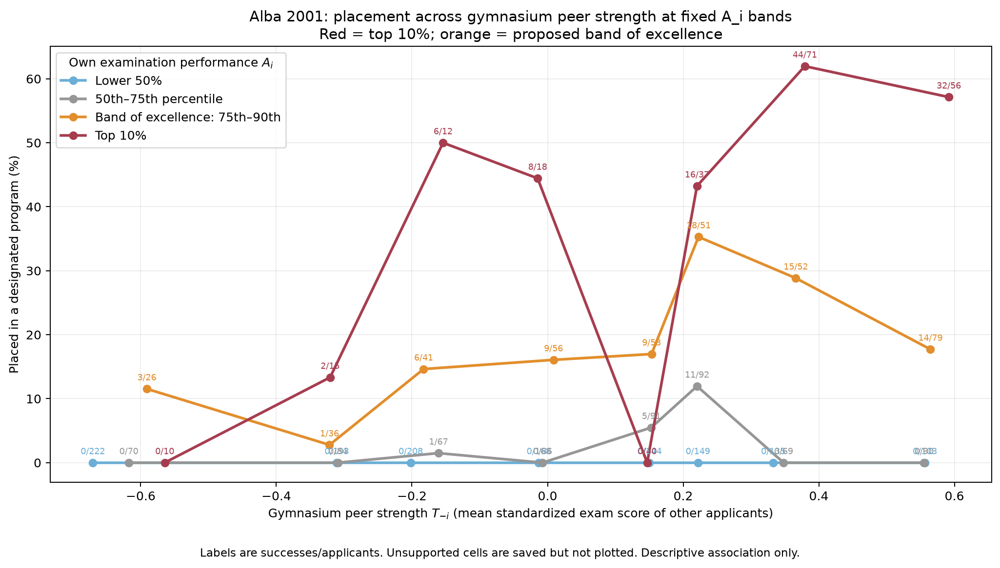

# VECTOR → Scholar VECTOR: Romania Alba findings and national expansion update

**Date:** September 30, 2026  
**Purpose:** Update Scholar VECTOR on the evidence developed after the September 29 joint specification and on the bounded national acquisition now underway.  
**Status:** Alba results are completed descriptive analyses. National acquisition is in progress. No national HERO, fitted mechanism, or causal estimate has been run.

## The major change since our last exchange

The archived 2001 Ministry system has moved from a locally plausible data architecture to a demonstrated empirical research path.

For Alba, we reconstructed participating applicants by originating gymnasium, retained the national-examination component and grades 5–8 component separately, attached actual main-round destination school/program placements, and recovered the contemporaneous program table with places, admissions, vacancies, and realized cutoffs. We then conducted the bounded descriptive analyses that Charles and new VECTOR had specified.

The most informative Alba plot holds an applicant's examination-performance band fixed and places gymnasium peer performance on the horizontal axis. It therefore asks the question that the unadjusted HERO could not answer clearly:

> Among applicants in the same broad examination-performance band, how did placement in a designated selective program vary across weaker and stronger observed gymnasium peer environments?

The result was sufficiently suggestive—and the local support sufficiently limited—that Charles and his advisor authorized recovery of the national 2001 main-allocation records before further interpretation.

## What the Alba source construction established

The analysis population contains **3,041 recovered participating-applicant records associated with 161 nonempty Alba origin-gymnasium codes**. These are observed participants in the recovered admissions system, not verified complete eighth-grade graduating classes.

The placement construction distinguishes:

- national-examination performance from grades 5–8 and from the composite admission score;
- originating gymnasium from destination high school and destination program;
- an actual placement from merely exceeding a program cutoff;
- fully occupied programs from programs with vacancies;
- confirmed local placement, confirmed outside-Alba placement, confirmed unassigned status, and unresolved program identity.

The archived rules and recovered rows continue to support a **75% national examination / 25% school grades** admission composite for 2001. The published paper's equal-weight description remains an unresolved documentary discrepancy.

The source and design record is:

- [`EDUCATION_20260930_Romania_program_ranking_and_HERO_decisions.md`](../decisions/EDUCATION_20260930_Romania_program_ranking_and_HERO_decisions.md)
- [`EDUCATION_20260930_Romania_program_cutoff_source_check.md`](../source_audit/EDUCATION_20260930_Romania_program_cutoff_source_check.md)

## Result 1: origin gymnasiums are differentiated, but their score ranges overlap

Using national-examination performance, the observed gymnasium grouping produced

\[
H_{\mathrm{sort}}=0.14918.
\]

Under 1,000 size-preserving random assignments, the mean was 0.05268 and the middle 95% ranged from 0.04209 to 0.06395. Only one of 1,001 random-reference values was at least as large as the observed value.

This establishes meaningful **partial differentiation** among recovered Alba gymnasium applicant groups. It does not establish separate academic strata: examination-score intervals still overlap extensively. The randomization is a conditional group-size reference, not national-population uncertainty and not a causal assignment experiment.

Direct source:

- [`EDUCATION_20260929_romania_gymnasium_differentiation_v1_summary.json`](../../outputs/romania_alba_2001_differentiation_v1/EDUCATION_20260929_romania_gymnasium_differentiation_v1_summary.json)

## Result 2: the first unadjusted HERO was informative but not congestion evidence

The first narrow success definition was actual placement into the highest realized cutoff tier among fully occupied programs, ranked separately within the six original subject categories. It yielded **200 successful placements among 2,844 eligible applicants, or 7.03%**.

The curve broadly rose with observed gymnasium peer performance, but its dramatic upper feature was not independent evidence across many gymnasiums. One origin gymnasium supplied 123 of 129 applicants and all 38 successes in the equal-width peak. The extreme-right zeros included two relatively low examination scorers in small strong-peer groups and one strong applicant placed in a real but non-designated program.

That inspection changed our interpretation. The first HERO established that selective placement varied with observed peer environment, but its right edge did not demonstrate a band-of-excellence congestion penalty.

Direct source:

- [`run_20260930T193231_654678Z_top1_tiers_full_6groups/report.md`](../../outputs/romania_alba_2001_hero_v1/run_20260930T193231_654678Z_top1_tiers_full_6groups/report.md)

## Result 3: the similar-score comparison remained positive

We next compared applicants within raw examination-score bands of width 0.25, divided observed gymnasium peer environments into weaker, middle, and stronger groups, required support from at least ten applicants and three gymnasiums in every retained cell, and reweighted all peer groups to the same own-score-band distribution.

Across 17 common-support examination-score bands:

- weaker-peer adjusted selective-placement rate: **3.17%**;
- stronger-peer adjusted selective-placement rate: **9.67%**;
- stronger minus weaker: **+6.50 percentage points**.

This is a descriptive conditional association. Examination scores were measured after time in the gymnasium; students were not randomly assigned; gymnasiums are not independent applicant-level replications; and geography, preferences, school grades, and other unobserved differences remain possible explanations. The result does not identify a peer effect or a congestion effect.

Direct source:

- [`run_20260930T193232_648410Z/report.md`](../../outputs/romania_alba_2001_similar_score_peer_comparison/run_20260930T193232_648410Z/report.md)

## Result 4: fixed performance bands revealed the pattern motivating national expansion

The final Alba view put leave-one-out gymnasium peer examination performance, \(T_{-i}\), on the horizontal axis and separated applicants into fixed own-examination-performance bands, \(A_i\): lower 50%, 50th–75th percentile, 75th–90th percentile, and top 10%.

For the proposed **band of excellence**, the 75th–90th percentile of own examination performance, selective-placement rates across the eight peer-performance bins were:

\[
11.5\%,\ 2.8\%,\ 14.6\%,\ 16.1\%,\ 17.0\%,\ 35.3\%,\ 28.8\%,\ 17.7\%.
\]

Thus this band rose through moderately strong peer environments and then declined across the two strongest peer bins. The top 10% remained much more successful in the two strongest peer bins: 44/71 and 32/56.

This is the closest Alba analogue to the proposed band-of-excellence pattern. It is **not yet a national result or a demonstrated congestion mechanism**. The last three band-of-excellence points represent only five, six, and six gymnasiums, respectively. That limited environment count is the principal reason to expand the source population rather than fit or explain the Alba curve more aggressively.

Direct sources:

- [`fixed_Ai_across_Tj_cells.csv`](../../outputs/romania_alba_2001_fixed_Ai_across_Tj/run_20260930T193232_982466Z/fixed_Ai_across_Tj_cells.csv)
- [`fixed_Ai_across_Tj_settings.json`](../../outputs/romania_alba_2001_fixed_Ai_across_Tj/run_20260930T193232_982466Z/fixed_Ai_across_Tj_settings.json)

## National 2001 acquisition now underway

Charles and his advisor authorized acquisition of the recoverable 2001 national main-allocation core. The workflow follows all **41 county units** on the official Ministry map and checkpoints six report families:

1. origin-school directory;
2. candidate roster with examination and grades 5–8 components;
3. admitted placements;
4. unassigned applicants;
5. destination-program directory; and
6. program occupancy and observed cutoffs.

Identifying source pages remain outside Dropbox and Git under `~/Desktop/VECTOR_temp/romania_2001_national_main_allocation_v1/`. The repository will receive only name-free research artifacts. Each successful page is saved and cryptographically checked before the workflow advances.

At the checkpoint inspected while this memo was written:

- **11 county units had been touched**;
- **five were complete in the six primary report families**: Alba, Arad, Bacău, Botoșani, and Buzău;
- **204 source pages** had been checkpointed;
- those pages contained **83,702 rows across overlapping report views**, not 83,702 unique students;
- candidate and outcome counts reconciled exactly in completed examples, including Arad: 3,192 candidates = 3,018 admitted + 174 unassigned, and Bacău: 6,384 = 6,133 + 251.

These counts are an in-progress acquisition snapshot and will change.

## What the first national pass taught us technically

Some county-wide reports have missing archived pages. These appeared as HTTP 404 responses, while successful requests continued. There was no HTTP 429 or `Retry-After` evidence of a formal rate limit.

The initial adaptive code mistakenly treated a missing capture as server pressure and lengthened the interval. That behavior has been corrected:

- HTTP 404/410 now records an archive-coverage gap without slowing the run;
- actual network failures, HTTP 429, and server errors still produce cautious backoff;
- transient failures are retried;
- confirmed fixed gaps are not pointlessly retried through repeated cooldown passes.

Wayback already redirects a nominal 2002 replay request to the nearest surviving copy, sometimes a 2005 capture. A bounded capture-index check did not identify an alternate copy for an inspected missing page and the index itself returned a later 503. We therefore will not query the capture index repeatedly during national acquisition.

Instead, after the primary national inventory finishes, missing county-wide segments will be recovered where possible from the Ministry's redundant per-origin-school reports. Alba already demonstrated that those school-specific candidate and placement views can be matched exactly while preserving the frozen participant population.

Implementation sources:

- [`EDUCATION_20260930_Romania_2001_national_acquisition.ipynb`](../../notebooks/EDUCATION_20260930_Romania_2001_national_acquisition.ipynb)
- [`EDUCATION_20260930_romania_2001_national_acquisition.py`](../../code/EDUCATION_20260930_romania_2001_national_acquisition.py)
- [`romania_archive_retrieval.py`](../../code/romania_archive_retrieval.py)

## Current interpretation and stop rules

The national expansion is justified by a specific support problem, not by dissatisfaction with the Alba curve. Alba contains a suggestive decline within the predeclared 75th–90th-percentile performance band at the strongest observed peer levels, but too few distinct gymnasium environments support those cells.

We will not calculate a national HERO merely because many pages have been downloaded. Before substantive national analysis, the source must pass these gates:

1. reconcile candidate counts against admitted plus unassigned outcomes by county;
2. recover or explicitly bound missing county-wide pages;
3. verify consistent variable definitions and program codes across counties;
4. quantify unresolved placements, duplicate identities, cross-county destinations, singleton peer groups, and gymnasium support;
5. freeze the national analysis population and success definition before viewing a national outcome curve.

The planned national replication should initially preserve the Alba definitions so that increased geographic support is not confused with a redesigned outcome. Alternative program tiers, category combinations, or occupancy rules remain recorded sensitivities, not an automatic specification search.

## Questions for Scholar VECTOR

1. Does the fixed-\(A_i\), varying-\(T_{-i}\) Alba result alter your assessment of Romania's scientific value, given the explicit gymnasium-count limitations?
2. What prior literature should govern our language for an examination measured after prolonged gymnasium exposure: performance, accumulated achievement, preparation, or another term?
3. Do you see a stronger documentary route for resolving the paper's 50/50 description against the official and row-verified 75/25 rule?
4. Are there specific threats to interpretation that should be frozen into the national specification before we inspect national curves?
5. Does the proposed source-completeness gate adequately prevent us from converting archive convenience into a scientific sample definition?

No new experiment is requested from Scholar VECTOR in this memo. We request scholarly interpretation, source guidance, and criticism of the proposed national gate while acquisition and source reconciliation continue.
