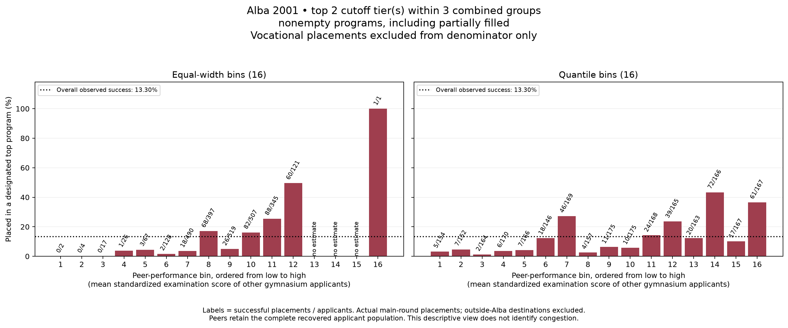

# Alba 2001: descriptive placement HERO — top 2 cutoff tier(s); nonempty programs, including partially filled; 3 combined groups

## What we did and why

We already knew each recovered applicant's national-examination score and originating gymnasium. We next attached the companion report of actual placement, using an exact unique name within the source-coded gymnasium and checking the admission composite. This tells us where the applicant was placed; a score above a cutoff alone never counts as success.

We defined success as actual placement into the top 2 distinct cutoff tier(s) among nonempty programs, including partially filled, ranked within 3 combined groups, including every tie. With two tiers this retains the original highest tier and adds the next distinct cutoff. Empty programs and programs lacking a reported minimum are never ranked. Cutoffs are reported admission-composite minima in this allocation, not examination-only scores or measures of teaching quality.

The combined groups are mathematics/sciences, social sciences/philology, and technology/vocational. Programs are reranked inside each combined group; this can reduce the successful destination set.

The full-capacity requirement is OFF. A partially filled program's minimum admitted score may reflect its small intake rather than binding competition for places. Selection into the designated set in this run must not be described as proven capacity scarcity.

Comparison reference: /Users/charleslevine/Library/CloudStorage/Dropbox/1-Documents/00- Dissertation/0-Next_Chapter/Code_and_Data/New SQL and PY Code/Cursor Workspace PDE/3-Master_Plan/VECTOR_work/new_VECTOR_work/education_analysis/outputs/romania_alba_2001_hero_v1/run_20260930T181101_938202Z. The saved applicant population, placements, peer averages and outcome eligibility were verified unchanged, and the exact reference bin boundaries were reused. The earlier result remains intact.

We held the complete recovered applicant population fixed for score standardization and mean performance of other gymnasium applicants. Only the outcome denominator changes when we exclude outside-Alba destinations, unknown outcomes, applicants with no observed peer, or (optionally) vocational placements. The baseline retains confirmed unassigned applicants as unsuccessful.

## Source accounting

- Recovered applicant records: **3,041**.
- Placement-status counts: {"confirmed_Alba_program": 2849, "ambiguous_program": 109, "confirmed_outside_Alba": 77, "confirmed_unassigned": 6}.
- Baseline mutually exclusive flow: {"included": 2844, "unknown_placement_or_program": 109, "outside_Alba_destination": 76, "no_observed_peer": 12}.

- Verified longer placement reports (extra rows retained only in source cache): {"276": {"frozen_candidate_rows": 103, "placement_report_rows": 104, "unique_name_and_composite_matches": 103, "missing_candidates": 0, "ambiguous_candidates": 0, "composite_disagreements": 0, "extra_report_rows_outside_frozen_population": 1, "candidate_rows_sha256": "a7bd98ee2404671491413cd971f99e2f2c9503ac8decd57bc5ea24cb8f9e0acc"}}.

## Descriptive results

### baseline include vocational

- **349 successful placements among 2,844 applicants (12.27%).**
- Actual bin counts: {'equal_width': 16, 'quantile': 16}.
- Vocational exclusion removed 0 applicants, including 0 designated successes.

### comparison exclude vocational

- **349 successful placements among 2,624 applicants (13.30%).**
- Actual bin counts: {'equal_width': 16, 'quantile': 16}.
- Vocational exclusion removed 220 applicants, including 0 designated successes.

## What these plots do and do not establish

The bars describe how realized placement rates vary with observed gymnasium peer examination performance. Labels show successes divided by applicants in each bin; an empty bin has no estimate. Quantile boundaries that coincide are collapsed, so tied peer values are never separated by row order. Both kinds of bin boundaries come from the baseline and remain fixed for any denominator comparison.

These are participating-applicant peer groups, not verified complete graduating classes. Examination performance was measured after time in the gymnasium; it is not a pre-gymnasium ability measure. The admission composite also contains this examination score. The cutoffs and outcomes come from the same allocation. This descriptive HERO does not separate prior sorting, peer development, preferences, and competitive congestion or identify a causal effect.

The observed success fraction is not capacity divided by a known true competitor pool: applications and preferences remain unobserved. Broadening the designated set changes our definition of success, not the historical allocation or institutional capacity. No automatic search over tiers, model replay, fitted curve, significance test, or new geographic coverage was run. Only the explicitly recorded category and occupancy settings were used.

Review the plots and their per-bin counts before deciding whether any next analysis is warranted. An absent downturn is a result, not a reason to search automatically for a more favorable definition.

## Reproducibility

The companion run record hashes the candidate manifest, every placement checkpoint, frozen scores, program table, implementation, decision record, and generated outputs. Raw personal records remain in the separate Desktop cache; the saved row audit contains generated row numbers rather than names.
