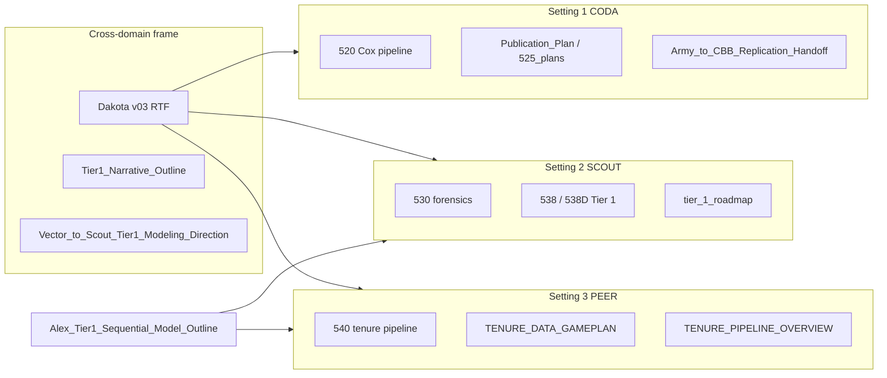
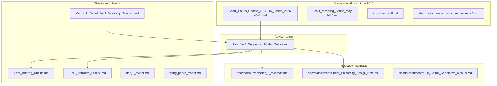

# Tier 1 model building — plan document map

## Short answer

**Yes — the workspace is visible as a three-setting cross-domain program**, but **no single file** is the complete, up-to-date master plan for all domains.

| Layer | Best document |
|-------|----------------|
| **Whole project (committee / Dakota)** | [advancement_under_constrained_distinction_dakota_feedback_v03.rtf](1-Various_PDE_and_Chat_stuff/5-Manuscript/advancement_under_constrained_distinction_dakota_feedback_v03.rtf) — VECTOR + Charles, June 2026 |
| **Model-building spine (Alex / Tier 1)** | [Alex_Tier1_Sequential_Model_Outline.md](1-Various_PDE_and_Chat_stuff/5-Manuscript/Alex_Tier1_Sequential_Model_Outline.md) |
| **Army (CODA)** | [talent/documents/Publication_Plan.md](talent/documents/Publication_Plan.md) + [520 pipeline](talent/) + [Coda_Summary_Post_Replication.md](talent/documents/Coda_Summary_For_Scout_and_Vector_Post_Replication.md) |
| **Basketball (SCOUT)** | [sports/documents/tier_1_roadmap.md](sports/documents/tier_1_roadmap.md) + 530/538D notebooks |
| **Academia (PEER)** | [tenure/documents/TENURE_DATA_GAMEPLAN.md](tenure/documents/TENURE_DATA_GAMEPLAN.md) + [540_tenure_pipeline.ipynb](540_tenure_pipeline.ipynb) |

The **Dakota doc** is the closest thing to an **overall plan narrative** you already wrote — it spans all three domains, the Wang-style modeling steps (§5–7), and asks for feedback on academic careers specifically. It does **not** replace per-domain gameplans or the Alex modeling spine.

---

## Ivy_Net — three domains, one frame

### Cross-domain analogy (from [TENURE_PIPELINE_OVERVIEW.md](tenure/documents/TENURE_PIPELINE_OVERVIEW.md) §1)

| Dimension | Army (CODA) | Basketball (SCOUT) | Academia (PEER) |
|-----------|-------------|-------------------|-----------------|
| Performance | OER / top-block | PPM / perf z | Publications / citations (OpenAlex, DBLP) |
| Pool | Senior-rater cohort | Teammates (team-season) | Department cohort |
| Peer quality | LOO pool mean | `poolq_loo` / congestion_quality | LOO dept pub rate (planned) |
| Outcome | Promoted to Major | NBA draft | Tenure (Asst → Assoc) |
| Attrition | Separation (competing risks) | N/A (draft yes/no) | Pre-tenure exit (planned Cox/FG) |
| Pipeline | 502→512→520 | 530→535/538/538D | 540 (`tenure_pipeline/`) |
| Agent name | **Coda** | **Scout** | **PEER** |

### Dakota v03 — what it adds to the plan map

Key sections aligned with your **three-level** Wang program:

1. **§1 Empirical** — inverted-U in Army, basketball, **preliminary** academia
2. **§2–3 Interpretation** — developmental benefits vs competitive constraints; shift to **“advancement under constrained distinction”** (broader than “global draft slots”)
3. **§4 Academic** — Wayback rosters + OpenAlex panel; **advancement vs attrition** parallel to Army competing risks
4. **§5 Minimal generative** — talent-only fails; congestion produces peak-and-decline (matches June Scout status)
5. **§6 Decomposition** — congestion as minimal term, not final story
6. **§7 Predictions** — threshold effects, peak shifts, assortativity (Level 3)
7. **§8–9** — network extensions (exposure vs comparison networks, prestige, talent gravity) — exploratory, for Dakota-type readers

**Gap vs code:** Dakota says academia “preliminary analyses suggest” inverted-U; [TENURE_DATA_GAMEPLAN.md](tenure/documents/TENURE_DATA_GAMEPLAN.md) still lists inverted-U checkpoint as **fast-path TODO** (stages 6–9 planned). Align status language before next committee send.

---

## Domain-specific plan documents

### Army — `talent/` (CODA)

| Document | Role |
|----------|------|
| [Publication_Plan.md](talent/documents/Publication_Plan.md) | Mechanism, venues, external-data search; Army inverted-U as anchor finding |
| [advisor_brief_twofold_status.md](talent/documents/advisor_brief_twofold_status.md) | Coding (525/520) vs publication tracks for Alex |
| [525_plans.md](talent/documents/525_plans.md) | UIC consistency, senior-rater pools, longevity |
| [Army_to_College_Basketball_Replication_Handoff.md](talent/documents/Army_to_College_Basketball_Replication_Handoff.md) | Replication design: PoolQ, inverted-U test in public data |
| [Coda_Summary_For_Scout_and_Vector_Post_Replication.md](talent/documents/Coda_Summary_For_Scout_and_Vector_Post_Replication.md) | Post-basketball-replication sync; Q1–Q8 CIF bars |
| [520_PIPELINE_COX_OVERVIEW.md](talent/documents/520_PIPELINE_COX_OVERVIEW.md) | Cox / competing-risks machinery |

**Status:** Empirical backbone **stable** (inverted-U established); extension work (525, divisions, UIC) planned not centerpiece for cross-domain brief.

### Academia — `tenure/` (PEER)

| Document | Role |
|----------|------|
| [TENURE_DATA_GAMEPLAN.md](tenure/documents/TENURE_DATA_GAMEPLAN.md) | **Strategic contract** — outcomes, stages, inverted-U thesis goal, advisor alignment (Apr 2026: quality over breadth) |
| [TENURE_PIPELINE_OVERVIEW.md](tenure/documents/TENURE_PIPELINE_OVERVIEW.md) | **Implementation map** — 540 cells, JSONL artifacts, cross-domain table |
| [PANEL_CSV_GLOSSARY.md](tenure/documents/PANEL_CSV_GLOSSARY.md) | Column definitions |
| [TENURE_STREAMLINING_AND_RESEARCH_PRIORITIES.md](tenure/documents/TENURE_STREAMLINING_AND_RESEARCH_PRIORITIES.md) | Priority triage |

**Status:** Infrastructure heavy (Wayback scrape → parse → panel → OpenAlex match). **Analysis stages 6–9** (pools, LOO peer quality, inverted-U bins, Cox) **planned** — Dakota §4 is ahead of pipeline completion in gameplan wording.

### Basketball — `sports/` (SCOUT)

Covered in sections below; most active generative work June 2026.

---

## Document stack (what each file is for)

| Document | Role | Best for |
|----------|------|----------|
| [Alex_Tier1_Sequential_Model_Outline.md](1-Various_PDE_and_Chat_stuff/5-Manuscript/Alex_Tier1_Sequential_Model_Outline.md) | **Master spine** — minimal model → data → fit → L*; §6A = PD11 generative threads | “What is the ordered research program?” |
| [Tier1_Briefing_Outline.md](1-Various_PDE_and_Chat_stuff/5-Manuscript/Tier1_Briefing_Outline.md) | Equations, variable domains, data column map, fitting plan | Technical briefing / manuscript §2–§6 |
| [Tier1_Narrative_Outline.md](1-Various_PDE_and_Chat_stuff/5-Manuscript/Tier1_Narrative_Outline.md) | Competing local forces, L-first story, voice | Prose and motivation |
| [Vector_to_Scout_Tier1_Modeling_Direction.md](1-Various_PDE_and_Chat_stuff/5-Manuscript/Vector_to_Scout_Tier1_Modeling_Direction.md) | VECTOR sync: phased Tier strategy, coding objectives | Agent/manuscript alignment |
| [tier_1_model.md](1-Various_PDE_and_Chat_stuff/5-Manuscript/tier_1_model.md) | Core Tier 1 logic for basketball | Model-layer reference |
| [wang_paper_model.md](1-Various_PDE_and_Chat_stuff/5-Manuscript/wang_paper_model.md) | Yin–Wang failure/success **template** (stylized fact → mechanism) | Cross-domain logic |
| [tier_1_roadmap.md](sports/documents/tier_1_roadmap.md) | **535 pipeline** execution contract (`df` columns, CELL 0) | Mechanical EDA checklist |
| [Tier1_Presorting_Design_Note.md](sports/documents/Tier1_Presorting_Design_Note.md) | Two layers: empirical vs generative; 530 forensics targets | Pool assignment design |
| [538_Cell10_Generative_Manual.md](sports/documents/538_Cell10_Generative_Manual.md) | CELL 10 playground knobs | Generative implementation |
| [Scout_Status_Update_for_VECTOR_Laszlo_Briefing_2026-06-02.md](1-Various_PDE_and_Chat_stuff/5-Manuscript/Scout_Status_Update_for_VECTOR_Laszlo_Briefing_2026-06-02.md) | **Current** status: 3 levels, oral quotes, L_Q vs team_mean | Laszló brief adjustment |
| [alex_gates_briefing_structure_outline_v4.md](1-Various_PDE_and_Chat_stuff/5-Manuscript/alex_gates_briefing_structure_outline_v4.md) | 5-minute oral structure | Live brief script |
| [important_stuff.md](1-Various_PDE_and_Chat_stuff/5-Manuscript/important_stuff.md) | Your scratch anchor lines | Quick reminders |
| [advancement_under_constrained_distinction_dakota_feedback_v03.rtf](1-Various_PDE_and_Chat_stuff/5-Manuscript/advancement_under_constrained_distinction_dakota_feedback_v03.rtf) | **Cross-domain committee brief** (Army + sports + academia + generative + network asks) | Dakota / tenure-savvy readers |

---

## How the **model-building program** is organized (conceptually)

The stack already encodes a **three-track** program; it is just spread across files:

### Track 1 — Empirical (Wang ladder on realized pools)
- **Goal:** Stylized fact + transparent fit (bins → LPM → logit, L*)
- **Spine:** Alex outline §4–§6
- **Notebooks:** [538_alex_tier1_model_and_fit.ipynb](sports/538_alex_tier1_model_and_fit.ipynb), [538D_development.ipynb](sports/538D_development.ipynb) CELL 4–6
- **Forensics:** [530_sports_pipeline.ipynb](sports/530_sports_pipeline.ipynb)

### Track 2 — Generative (minimal mechanism, modular)
- **Goal:** Smallest score beyond talent-only; test non-obvious predictions
- **Spine:** Alex outline §6A + [Tier1_Presorting_Design_Note.md](sports/documents/Tier1_Presorting_Design_Note.md)
- **Code:** [tier1_pool_assignment.py](sports/tier1_pool_assignment.py), [tier1_sim_config.py](sports/tier1_sim_config.py), 538D CELL 10–12
- **June status:** Congestion score live; inverted-U on **team_mean** axis; **L_Q** axis still open — documented in June Scout update, **not** in Alex spine yet

### Track 3 — Narrative / cross-domain
- **Goal:** Army + sports (+ academia) under “advancement under constrained distinction”
- **Docs:** Narrative outline, Vector direction, Wang notes, briefing v4

---

## Gaps (why it feels like there is no “one plan”)

1. **Spine vs reality:** [Alex_Tier1_Sequential_Model_Outline.md](1-Various_PDE_and_Chat_stuff/5-Manuscript/Alex_Tier1_Sequential_Model_Outline.md) §6A / §7 still describe **538 generative as “planned”**; much of it is **implemented** in 538D + `tier1_pool_assignment.py`.
2. **Execution roadmap is 535-centric:** [tier_1_roadmap.md](sports/documents/tier_1_roadmap.md) “Done/TODO” predates 538D CELL 10 congestion work and `CELL10_PLOT_B_TEAM_MEAN`.
3. **Status docs multiply:** May Scout brief, June Scout update, PEER update (2026-06-03), multiple `barabasi_briefing_*` and `alex_gates_briefing_*` versions — good for snapshots, easy to lose the canonical plan.
4. **No single “three levels” doc** in the spine (stylized fact → minimal score → predictions) — that framing lives only in the June VECTOR update and [important_stuff.md](1-Various_PDE_and_Chat_stuff/5-Manuscript/important_stuff.md).

---

## What to use **today**

| If you need… | Open this first |
|--------------|-----------------|
| **Entire dissertation frame** (all three settings) | [advancement_under_constrained_distinction_dakota_feedback_v03.rtf](1-Various_PDE_and_Chat_stuff/5-Manuscript/advancement_under_constrained_distinction_dakota_feedback_v03.rtf) |
| Overall program order (Alex / dissertation) | [Alex_Tier1_Sequential_Model_Outline.md](1-Various_PDE_and_Chat_stuff/5-Manuscript/Alex_Tier1_Sequential_Model_Outline.md) |
| Army replication + CODA status | [Coda_Summary_For_Scout_and_Vector_Post_Replication.md](talent/documents/Coda_Summary_For_Scout_and_Vector_Post_Replication.md) |
| Tenure pipeline + stages | [TENURE_PIPELINE_OVERVIEW.md](tenure/documents/TENURE_PIPELINE_OVERVIEW.md) |
| Equations + data map | [Tier1_Briefing_Outline.md](1-Various_PDE_and_Chat_stuff/5-Manuscript/Tier1_Briefing_Outline.md) |
| Pipeline / column contract | [tier_1_roadmap.md](sports/documents/tier_1_roadmap.md) |
| Generative pool design | [Tier1_Presorting_Design_Note.md](sports/documents/Tier1_Presorting_Design_Note.md) |
| Where we are **right now** (June) | [Scout_Status_Update_for_VECTOR_Laszlo_Briefing_2026-06-02.md](1-Various_PDE_and_Chat_stuff/5-Manuscript/Scout_Status_Update_for_VECTOR_Laszlo_Briefing_2026-06-02.md) |
| 5-minute oral flow | [alex_gates_briefing_structure_outline_v4.md](1-Various_PDE_and_Chat_stuff/5-Manuscript/alex_gates_briefing_structure_outline_v4.md) |

---

## Optional follow-up (if you want one canonical plan)

Create a short **index doc** (e.g. `Tier1_Model_Building_Master_Plan.md` in `5-Manuscript/`) that:

1. States the **three levels** (stylized fact / minimal score / predictions) and Wang sequence in one page
2. Links to the spine + execution docs (no duplication of equations)
3. Adds a **June 2026 progress table** (empirical ✓, congestion score ✓, generative check partial, L_Q match open, 4D parked)
4. Points notebooks: 530 forensics → 538D empirical → 538D CELL 10 generative
5. Marks [Alex_Tier1_Sequential_Model_Outline.md](1-Various_PDE_and_Chat_stuff/5-Manuscript/Alex_Tier1_Sequential_Model_Outline.md) as canonical spine and lists which sections need a light refresh (§6A, §7, §10 cell map for 538D)

This would not replace the stack — it would be the **table of contents** you are currently missing.
