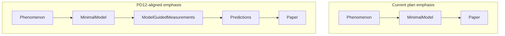

# PD12 Reassessment Plan (Charles + VECTOR → COMPASS)

## Trigger

Charles filed [`20260615_1155_Charles_to_COMPASS.md`](3-Master_Plan/20260615_1155_Charles_to_COMPASS.md) (cc: CODA, SCOUT, PEER, VECTOR). After re-reading PD12, he and VECTOR suspect **framing drift**: recent plans compress the chain to `Phenomenon → Minimal Model → Paper`, while Alex’s guidance better reads as `Phenomenon → Minimal Model → New Measurements → Predictions → Paper`.

**Constraint (binding):** No scope expansion, no new workstreams, no relitigation of Path II or correspondence locks.

---

## COMPASS verdict (preview — to be formalized in deliverable)

### Q1 — Does the current plan reflect Alex’s scientific progression?

**Mostly yes on substance; partially no on narrative emphasis.**

| Alex progression (PD12) | Current plan status | Gap type |
|-------------------------|---------------------|----------|
| Minimal model organizes inquiry | Path II + SCOUT closure C1–C7 | **Aligned** — ability-only null + congestion POC |
| Model proposes **new measurements** (Priority 3) | `crowding_smooth`, viable-peer counts, quality vs congestion split **already implemented** in SCOUT pipeline ([`20260520_Transcript_12_guidance.md`](sports/documents/20260520_Transcript_12_guidance.md) § Priority 3) | **Under-named** — treated as pipeline detail, not an explicit planning stage |
| Model generates **predictions** | #1 near-threshold (4D exports); #2 K peak-shift (Army-led) | **Aligned** — but predictions appear as “manuscript §4” rather than model outputs |
| Parameter identifiability (Priority 1) | Deferred for v1 | **Intentional deferral** — consistent with Charles constraint |
| Falsification / 4th domain (Priority 4) | Deferred | **Intentional deferral** |
| Extreme events / kill switches (Priority 2) | Partial (talent-only fails) | **Acceptable for v1** — formal 539 sweeps not draft-critical |

**Divergence is sequencing/visibility, not science:** D10 is framed as “packaging closure” when Alex would see it as **freezing the model→measurement→prediction evidence chain** (axis table, score equation, congestion feature, heterogeneity export).



**Adjustment:** Re-label existing artifacts; do **not** add new empirical builds before manuscript draft.

---

### Q2 — Is “minimal model closure” consistent with Alex?

**Current SCOUT closure is closer to Charles’s third option than the first — but the definition should be stated explicitly.**

Current checklist ([`20260615_1012_SCOUT_to_COMPASS_minimal_model_closure.md`](3-Master_Plan/20260615_1012_SCOUT_to_COMPASS_minimal_model_closure.md)):

- C1–C2: mechanism (null fails + congestion bends curves) — **not** “reproduces LOO inverted-U”
- C3–C4: axis table + score equation — **names measurable quantities**
- C6: ≥2 predictions traceable to mechanism
- C7: D10 bundle freezes all of the above

**Recommended closure standard (v1, PD12-faithful):**

```text
Minimal model closure =
  (a) Mechanism demonstrated (ability-only fails; congestion-in-score POC)
+ (b) Model names ≥1 model-guided empirical quantity (quality vs congestion; axis table on disk)
+ (c) ≥2 predictions traceable to mechanism (not curve replication)
+ (d) Honest axis/limitation prose (Rung 2 ≠ Rung 1 LOO axis)
+ (e) Frozen export bundle (D10)
```

Explicitly **reject** closure = “model reproduces phenomenon” — that would over-claim LOO generative match (VECTOR claim table marks this **Unsupported**).

**One-line revision** to SCOUT §7 Alex script: add “model-guided measurements frozen” between mechanism and predictions.

---

### Q3 — Explicit “Model-Guided Empirical Features” stage?

**Yes — as an explicit **labeling and packaging** stage, not a new workstream.**

| Feature | Status today | Owner |
|---------|--------------|-------|
| Team quality `poolq_loo` | Implemented | SCOUT |
| Viable-peer congestion `crowding_smooth` / `C_{i,t}` | Implemented | SCOUT |
| Quality vs congestion conceptual split | PD12 + claim table | VECTOR prose |
| Near-threshold heterogeneity readout | 4D exports exist | SCOUT |
| Army near-threshold / K hooks | CODA empirical | CODA |

**Where it sits (relative to other stages):**

```text
Today → D10 (freeze model + measurements + prediction artifacts)
     → PEER inference export (C1–C2)
     → VECTOR draft (ink measurements in §3 before §4 predictions)
```

Measurements were built **alongside** the empirical ladder (correct for Alex); the fix is to **surface** them in planning docs and manuscript order — not to rebuild 538.

---

### Q4 — Shortest path to publishable manuscript (PD12-faithful)

**Largely unchanged from [`20260615_1045_COMPASS_to_Charles_forward_plan_and_questions.md`](3-Master_Plan/20260615_1045_COMPASS_to_Charles_forward_plan_and_questions.md) Phase A–B; reorder the *story*, not the *tasks*:**

| Step | Action | PD12 alignment |
|------|--------|----------------|
| 1 | Charles Tier 1 locks (Q-D10, C1–C2, V1–V3) | Unchanged |
| 2 | **SCOUT D10** — bundle must include axis table, score one-pager, congestion feature docs, 4D heterogeneity, generative contrast | Freezes **model + measurements + prediction-facing artifacts** |
| 3 | **PEER** `faculty_panel_inference_v1.csv` | Tenure empirical leg (phenomenon panel) |
| 4 | **VECTOR** draft Wang structure with PD12 paragraph (quality vs congestion) in §2–§3 | Makes progression visible to Alex |
| 5 | **CODA** Army figure list + Alex meeting (C-ALEX-2 estimand) | Army prediction #2 prose |
| — | **Defer** P1 identifiability, P4 NHL/falsification, 539 kill-switch sweeps | Already parked; stays parked |

**Shortest faithful chain:**

`Triad phenomenon (Army/MBB/tenure preliminary) → Basketball generative mechanism POC → Model-guided measurements (quality + congestion) → Two predictions (#1 near-threshold, #2 K) → Manuscript`

---

### Q5 — Documents to revise?

| Document | Revise? | Proposed change |
|----------|---------|-----------------|
| [`20260615_1045_COMPASS_to_Charles_forward_plan_and_questions.md`](3-Master_Plan/20260615_1045_COMPASS_to_Charles_forward_plan_and_questions.md) | **Yes** | §3 locked consensus: insert **Model-Guided Measurements** rung; §5 Phase B: VECTOR inks measurements before predictions; §3 closure sentence matches Q2 standard |
| [`forward_plan_background.md`](3-Master_Plan/forward_plan_background.md) | **Yes** | Plain-English diagram: add measurements stage between model and predictions |
| [`PROJECT_STATUS_AND_NEAR_TERM_PLAN.md`](3-Master_Plan/PROJECT_STATUS_AND_NEAR_TERM_PLAN.md) | **Yes** | Executive summary + “Alex priorities” table: Priority 3 = **in-scope v1**, not “implicit only”; date stamp 2026-06-15 |
| [`20260615_1012_SCOUT_to_COMPASS_minimal_model_closure.md`](3-Master_Plan/20260615_1012_SCOUT_to_COMPASS_minimal_model_closure.md) | **Minor** | §1 header + §7 one-liner: explicit closure definition (Q2) |
| [`COMPASS_Initial_Guidance_v6.md`](3-Master_Plan/COMPASS_Initial_Guidance_v6.md) | **Minor** | Mission paragraph: “model-guided measurements” as required convergence step |
| **Manuscript Roadmap** | **No separate file** | Dakota v03 spine + VECTOR outline serve this role; add PD12 cross-ref in VECTOR §2 draft only |
| Tier 1 / Tier 2 locks | **No new locks** | Optional footnote: D10 satisfies model-guided-features stage |

**Do not revise:** claim language table (already correct), STANDING BY files, correspondence syntheses — unless Charles requests a Round 6 ping.

---

## Deliverables (execution phase)

### 1. Primary reassessment memo

Create **`3-Master_Plan/20260615_HHMM_COMPASS_PD12_reassessment.md`** containing:

- Formal answers to Q1–Q5 (above, expanded with citations)
- “No scope change” confirmation
- Updated scientific progression diagram
- Revised closure definition (one paragraph)
- Routing table: what each agent should **read** vs **change**

### 2. Agent read receipts

Each agent acknowledges [`20260615_1155_Charles_to_COMPASS.md`](3-Master_Plan/20260615_1155_Charles_to_COMPASS.md) + reassessment memo in their next action (no new correspondence round unless conflict):

| Agent | Action after read |
|-------|-------------------|
| **SCOUT** | D10 manifest explicitly lists model-guided measurement artifacts |
| **VECTOR** | §2–§3 draft order: measurements before predictions; PD12 quality/congestion paragraph |
| **CODA** | No code change; confirm Army rows in axis table cover near-threshold + K |
| **PEER** | No change to C1–C2 path |
| **COMPASS** | Apply doc revisions in §Q5 |

### 3. Living doc patches

Apply targeted edits to forward plan, `forward_plan_background.md`, and `PROJECT_STATUS_AND_NEAR_TERM_PLAN.md` per Q5 table.

---

## What does NOT change

- Path II architecture (basketball generative POC; Army + tenure empirical)
- Tier 1 execution sequence (Charles locks → D10 → PEER CSV → VECTOR draft)
- Deferred PD12 priorities 1, 2 (full), and 4
- Claim language table statuses
- Correspondence experiment = complete

---

## Success criteria

Charles and VECTOR can confirm: **“We are not optimizing for paper completion at the expense of Alex’s model→measurements→predictions progression — we are making that progression explicit in the plan and manuscript order, using work already done.”**
