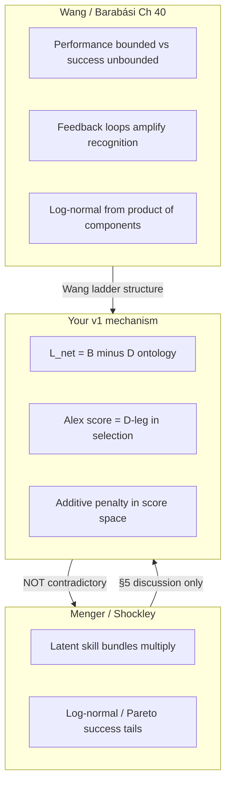
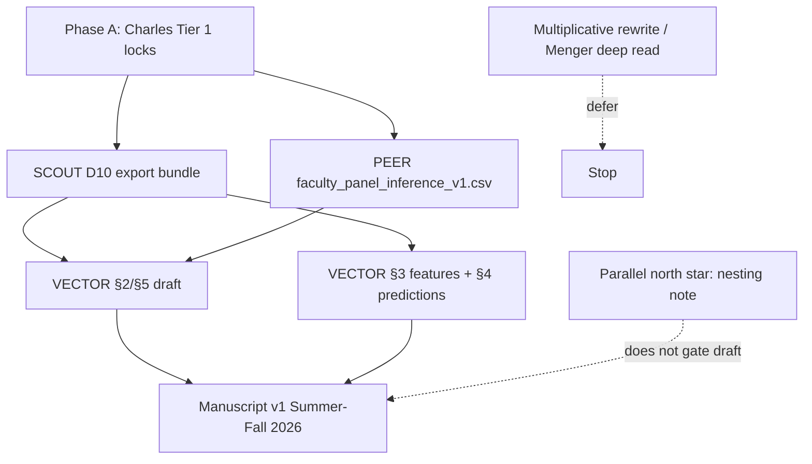

# Primary Focus: Model Work vs Reading Rabbit Holes

## What Alex actually said (latest transcript: PD12, May 20)

The most recent documented Alex conversation is [`sports/documents/20260520_Transcript_12_guidance.md`](sports/documents/20260520_Transcript_12_guidance.md) (no PD13+ in repo). It does **not** ask you to rewrite the generative model as multiplicative. It asks for four **sequenced** workstreams:

| PD12 priority | Alex's ask | v1 status |
|---------------|-----------|-----------|
| **P1** Parametric identifiability (5–6 params, 3 domains) | Fit generative model uniquely | **Deferred** — not draft-critical |
| **P2** Extreme-event / kill-switch sweeps in sim | Turn congestion off; confirm U disappears | **Partial** — talent-only fail in CELL 10 |
| **P3** Model-guided empirical features | Theory proposes **new measurements** | **Primary alignment** — `poolq_loo` vs `crowding_smooth`, 4D heterogeneity |
| **P4** Falsification / 4th domain | Show where inverted-U fails | **Deferred** |

The binding PD12 sentence for your empirical program:

> Distinguish **team quality** (mean peer performance) from **viable-peer congestion** (density above threshold). The downturn should steepen where congestion is high, especially for **near-threshold** individuals.

That is **measurement and prediction work** on an **additive selection score** \(S = a - \lambda C\), not a mandate to switch to Menger's multiplicative production function.

Earlier Alex guidance (PD10, May 7 — [`2026_0507_Alex_Gates_Post_Meeting_Simulation_Memo.md`](1-Various_PDE_and_Chat_stuff/5-Manuscript/2026_0507_Alex_Gates_Post_Meeting_Simulation_Memo.md)) reinforces the same hierarchy:

- Quadratic = **diagnostic**, not mechanism
- Mechanism = assortative pools + local comparison + congestion in selection
- Do **not** bake the inverted-U in as a first principle

---

## Additive vs multiplicative: why this is a false fork *right now*

You feel sideways because three literatures use "multiplicative" at **different levels**:

| Layer | Multiplicative literature | Your locked v1 model |
|-------|---------------------------|---------------------|
| **Outcome distribution** | Log-normal CEO pay; power-law citations | Not your primary claim — you study **advancement rate** inverted-U, not superstar tail scaling |
| **Latent ability** | Menger/Shockley: skills multiply | Compatible — heterogeneous \(a_i\) can come from any generative process |
| **Selection / evaluation** | Wang: component reuse dynamics (different model) | **Alex score**: \(S_i = a_i - \lambda C_{i,t}\) — additive in **comparison score** |
| **Net local environment** | Menger: multifactor bundles | **\(L_{\text{net}}(Q) = B(Q) - D(Q)\)** — additive decomposition of benefit vs constraint |

**Key resolution:** Multiplicative and additive are not rival ontologies at the same object.

- Menger's multiplicative talent explains **why small differences can become large inequalities** (distribution shape, Matthew-effect adjacent).
- Your **\(B - D\)** decomposition explains **why advancement can rise then fall in elite peer pools** (local competition under finite distinction).
- Alex's score is the **operationalized constraint leg \(D\)** inside one ontology — not a second model ([`INSIGHT_NUGGETS.md`](3-Master_Plan/INSIGHT_NUGGETS.md) nugget 2026-06-11; [`20260611_1640_SCOUT_to_COMPASS_model_coherence.md`](3-Master_Plan/20260611_1640_SCOUT_to_COMPASS_model_coherence.md)).

**Full generative \(B(Q) - D(Q)\) decomposition** is explicitly **NOT v1** per locked forward plan. Menger's multiplicative framing belongs in **§5 discussion** as motivation for future decomposition — already ruled in [`20260617_COMPASS_Menger_conceptual_calibration.md`](3-Master_Plan/20260617_COMPASS_Menger_conceptual_calibration.md).

Rewriting 539/538D as multiplicative **now** would be scope expansion Alex deferred (P1), and would delay the Summer–Fall 2026 manuscript without resolving the coherence problem you correctly flagged in June 11 COMPASS thread.

---

## Your niche (between Menger, Barabási/Wang, and Alex)

This is already your contribution line — you do not need a new model form to articulate it:

| Tradition | What it supplies | What your project adds |
|-----------|------------------|-------------------------|
| **Menger** | Selective ecology; assortative matching; tournaments; talent as complexity reduction; multiplicative bundles as sociology | **Cross-domain empirical test** (Army / MBB / tenure) Menger motivates but does not run; explicit **development vs competitive constraint** split |
| **Barabási / Wang** | Stylized fact → minimal mechanism → new measurements → predictions; performance vs success distinction | **Inverted-U in advancement** (not superstar tail paper); congestion as model-guided measurement (PD12 P3) |
| **Alex (PD10–12)** | Minimal generative discipline; quality vs congestion split; near-threshold predictions | Operational score + repo artifacts (`539`, `538D` CELL 10, `crowding_smooth`) |

One-sentence positioning (approved in Menger calibration memo):

> Menger explains the **selective ecology** (who gets sorted into elite pools); Alex's congestion features explain **what happens inside** those pools to near-threshold performers; Wang structure organizes how we **package** phenomenon → mechanism → measurements → predictions.

Wang et al. 2025 Ch 40 (your Zotero PDF) is a **handbook overview** of the field Alex and Laszlo built — bounded performance vs unbounded success, log-normal from multiplicative components, feedback loops. It validates your **paper architecture**, not a pivot to multiplicative generative form. Your outcome (draft rate / promotion hazard) is closer to **bounded advancement probability** than to CEO net-worth scaling.

---

## Primary focus right now (ordered)

The project consensus is explicit: center of gravity is **package artifacts, lock inference policy, draft the paper** — not relitigate model form or absorb more framing literature.

### Do first (this week)

1. **Answer Tier 1 batch** in [`20260615_1045_COMPASS_to_Charles_forward_plan_and_questions.md`](3-Master_Plan/20260615_1045_COMPASS_to_Charles_forward_plan_and_questions.md) §6–§7 — this unblocks SCOUT D10, PEER inference, VECTOR draft start. Everyone is STANDING BY on your locks.

2. **Green-light SCOUT D10** — frozen manuscript bundle must include Rung 2.5 artifacts:
   - Quality vs congestion axis table (`poolq_loo` vs `crowding_smooth`)
   - 4D near-threshold heterogeneity exports
   - Generative contrast (talent-only fails)
   - Score one-pager naming Alex score as **\(D\)-leg**

3. **PEER inference export** after C1–C2 locks — tenure N for Setting 3 prose.

### Model work that counts (in scope)

- **Write the nesting note** (2–3 pages): one diagram showing \(L_{\text{net}} = B - D\), Alex score = \(D\), empirical features = expanded observables of same object. This resolves your June 11 "two models" anxiety without changing equations.
- **Package PD12 P3** — you already built `crowding_smooth`; stop re-deriving it from Menger.
- **Lock prediction #1** (near-threshold heterogeneity) as primary discriminating test; #2 (K peak-shift) as prose hook.

### Model work to defer (explicit stop rule)

| Temptation | Why defer |
|------------|-----------|
| Multiplicative rewrite of 539/538D | Alex P1 deferred; Menger = §5 only; no PD12 ask |
| Full generative \(B(Q)-D(Q)\) in prose as if estimated | Locked NOT v1 |
| LOO pool-quality bin-for-bin generative match | Path II honest limitation |
| Rosen superstars / Wang unbounded-success deep dive | Lit for §2/§5 snippets only |
| More Menger companion chapters | Framing calibration complete ([`20260617_COMPASS_Menger_conceptual_calibration.md`](3-Master_Plan/20260617_COMPASS_Menger_conceptual_calibration.md)) |

### Reading rule (prevents sideways drift)

When Menger/Wang/Rosen triggers a model-form question, ask:

> Does this change what I export in D10 or what VECTOR writes in §3–§4 this month?

If no → capture as **one nugget** in [`INSIGHT_NUGGETS.md`](3-Master_Plan/INSIGHT_NUGGETS.md) or §5 discussion bullet; return to Tier 1 locks.

---

## What to bring to Alex (when you meet)

Use [`20260611_Alex_Gates_Talking_Points.md`](3-Master_Plan/20260611_Alex_Gates_Talking_Points.md) — **not** a model-form relitigation unless Alex raises it.

**If** multiplicative comes up, one honest framing:

> v1 keeps additive selection score and \(B-D\) ontology; Menger/Wang multiplicative framing motivates future decomposition and §5 inequality discussion — not a v1 rewrite.

Ask Alex to confirm manuscript-first Path II still stands — not whether to abandon additive score.

---

## Bottom line

**Your primary focus:** Execute Phase A of the locked forward plan (Tier 1 locks → D10 → PEER export → VECTOR draft). The "model work" Alex wants **now** is Rung 2.5 — export and label quality vs congestion and near-threshold heterogeneity — nested inside \(L = B - D\), not a new multiplicative generative core.

The reading you did clarifies **where you sit intellectually** (Menger ecology + Wang ladder + Alex congestion measurement). It should **sharpen §2/§5 prose**, not **sideways-rewrite §3 mechanism** before artifacts are packaged.
