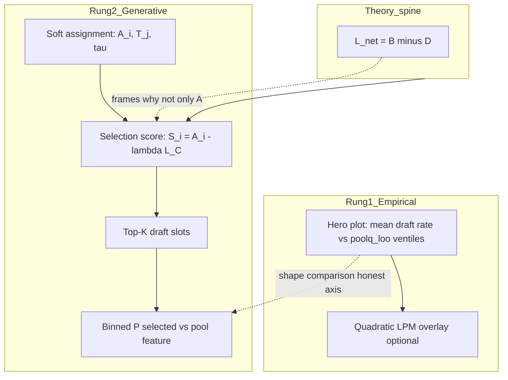

# Hero inverted-U: model types, testing, and smart restart

## Short answer: yes, your approach makes sense

You are doing the right thing by stepping back. The project already distinguishes **phenomenon → theory → generative POC** ([`05_Model_Nesting_Note_v1.md`](5-Manuscript/05_Model_Nesting_Note_v1.md), [`30_Alex_Gates_inform_status_outline.md`](3-Master_Plan/30_Alex_Gates_inform_status_outline.md)). Your confusion is mostly **which layer you are trying to “solve” at once**. Splitting those layers is the smart move.

---

## 1. What “mathematical model” means here (three different objects)

In everyday conversation we say “the model” as if there is one thing. In this project there are **three different objects**, and mixing them up is the main source of confusion. Each answers a different question. None of them, by itself, is the whole dissertation story.

---

### The three layers in plain language

| Layer | Plain-language name | What you are actually doing | What a successful result looks like |
|-------|---------------------|----------------------------|-------------------------------------|
| **A. Phenomenological / reduced form** | **“Describe the curve in the data”** | Fit a simple functional form to real player-season rows — e.g. does draft probability bend downward at the top when you plot it against leave-one-out pool quality? | You can show, on the **locked hero spec**, that draft rate rises and then dips (or is concave) when you smooth or bin the empirical panel. You get coefficients and a picture. |
| **B. Structural / mechanism (theory)** | **“Explain why help and hurt can coexist”** | Write down a story in symbols: net learning has a benefit part and a congestion part; selection may penalize crowding among viable peers, not just reward raw ability. | The story is internally consistent, maps to named objects in the code (`A_i`, congestion `L_C`, weight `λ`), and suggests **falsifiable ingredient tests** (e.g. “if congestion does not enter selection, the sim story fails”). |
| **C. Generative / simulation (DGP)** | **“Build a fake league and see if the rule produces a bent curve”** | Simulate rosters: draw ability, assign players to teams, rank by a selection score, draft the top *K*, then bin and plot **who got selected** vs a pool statistic. | Under a **minimal rule set** (score includes congestion, scarce slots), the **shape** of the simulated selection curve differs from talent-only selection — e.g. elite bins compress relative to ability-only. |

**Do not use one word (“the model”) for all three.** Layer A is a **statistical summary** of MBB data. Layer B is **economic/statistical narrative** about mechanisms. Layer C is a **computerized thought experiment** that operationalizes part of Layer B.

---

### Layer A — phenomenological (the hero and the quadratic LPM)

**Question it answers:** *Does an inverted-U-shaped (or concave) relationship between pool quality and draft probability show up in the real NCAA→NBA panel on a fixed, pre-specified definition of “quality”?*

**What it is not:** A claim that NBA teams literally maximize a particular formula, or that we have identified *why* the curve bends.

**Concrete objects in the repo:**

- **Hero plot** — binned mean draft rate (`Y_draft`) vs **`poolq_loo`**: each player’s leave-one-out mean teammate performance (teammates’ box-score quality with that player removed so they are not counted twice).
- **Quadratic LPM (linear probability model)** — regression on the same filtered rows:  
  `Y_draft ~ β₀ + β₁·poolq_loo + β₂·poolq_loo²`  
  wired in [`panel_build.py`](sports/sports_pipeline/panel_build.py) (`draft_poolq_quadratic_coeffs`, ventile overlay in 530).

**What “test” means here:** Check sign and magnitude of **`β₂`** (negative ⇒ concave / inverted-U tendency); compare the smooth curve to **ventile bin means** visually; optional out-of-sample checks. You are **fitting the phenomenon**, not simulating a league.

**What Layer A proves:** The stylized fact is **real on the locked estimand** (16 quantile bins, winsorized `poolq_loo`, `min_minutes=20`, etc.).  
**What it does not prove:** Mechanism, causal effects, or that any NBA front office uses this score.

---

### Layer B — structural / mechanism (theory spine)

**Question it answers:** *Why is it plausible that being on a “good” team pool could both help and hurt draft odds?* — and **why selection is not the same as describing the environment.*

**What it is:** Prose and notation — not one estimated equation in v1. **Two parts, do not merge:**

**Part 1 — Environment (`L_net = B(·) − D(·)`):** Peers confer benefit (B) and congestion (D) on net development / value in the environment. This **describes the pool**, not who gets drafted.

**Part 2 — Selection (Alex score):** **`S_i = A_i − λ·L_C`** is the **advancement rule** — who gets the scarce slot. Congestion enters **selection itself**, jointly with ability **`A_i`**. This is **not** the full reduced-form environment and **not** the hero regression.

**Charles binding (Jul 2026):** [`3-Master_Plan/BINDING_Selection_is_its_own_step.md`](../../3-Master_Plan/BINDING_Selection_is_its_own_step.md)

**What “test” means here:** Narrative consistency + sim **selection knockouts** — e.g. **`λ = 0`** (ability-only selection) and ask whether the generative story still holds.

**What Layer B proves:** A coherent **mechanism vocabulary** and falsifiable **directional** claims (congestion in selection can matter).  
**What it does not prove:** Separate identification of **`B(Q)`** and **`D(Q)`** as functions of one axis in v1, or that the real NBA implements **`S_i`** literally.

---

### Layer C — generative simulation (the DGP)

**Question it answers:** *If we write down an explicit **data-generating process** — artificial players, teams, and a draft rule — does a **minimal** congestion term in the selection score change the **shape** of who gets picked when we bin by pool quality?*

**DGP** = **data-generating process**: the full recipe that **creates** synthetic rosters and draft outcomes, as opposed to fitting a curve to real outcomes after the fact.

**Concrete stack in the repo (538D CELL 10):**

1. Draw or assign **ability** for synthetic players.
2. **Soft assignment** to team types **`T_j`** (temperature **`τ`**) — who lands on which team context.
3. Compute a **selection score** (e.g. **`S_i = A_i − λ·L_C`**).
4. **Top-K** draft — only **`K`** slots, so selection is scarce.
5. Plot **binned P(selected)** vs a pool feature (hero uses **`poolq_loo`**; sim may document if another axis is used for comparison — see Path II in the nesting note).

**What “test” means here:** Re-run the DGP with knobs toggled; compare **curves**, not regression **`R²`** on real data. The headline knockout: **`λ > 0`** (congestion in score) vs **`λ = 0`** (talent-only) — does the elite tail behave differently?

**What Layer C proves:** A **minimal artificial league** where talent-only selection is **not enough** and a congestion term in the score **can** bend the selection curve — proof-of-concept for Alex’s mechanism.  
**What it does not prove:** Bin-for-bin replication of every hero ventile rate, or that the real draft **is** this sim.

---

### How the three layers relate (read this before the diagram)

**Reading the diagram:**

- **Top path (Rung 1):** Start from **real MBB data** → hero bins + optional quadratic overlay. This is Layer **A**. No simulation required.
- **Middle path (Rung 2):** Start from **rules** → synthetic league → binned selection plot. This is Layer **C**. The sim **tests the rule**, not the regression.
- **Theory box:** Layer **B** sits **between** interpretation and design — it explains why selection might use **`A − λL_C`**, not only **`A`**, but it does not by itself produce numbers until wired into Layer C (or decomposed empirically later at Rung 2.5).

**Alex side-by-side (what v1 actually delivers):** Layer **A** hero PNG + Layer **C** sim PNG, same **Y** (advancement / draft rate), **honest X** labels (empirical LOO quality vs sim bins on the best available matching axis), plus an explicit **limitation sentence** — not “derive the hero from a closed-form integral.”

---

### One paragraph to keep in memory

**Layer A** can reproduce an inverted-U **without telling you why** — it is curve-fitting and binning on the real panel ( **outcomes only** ). **Layer B** splits **environment** (B − D) from **selection** (Alex score as its own step). **Layer C** runs the **selection step** in code and shows talent-only **selection** is insufficient. You need **A** for the empirical fact, **B** for the dissertation logic (environment ≠ selection), and **C** for the claim that **congestion in the selection rule** can bend curves — three jobs, three objects.

---

## 2. Does simulation test a formula?

**Yes — when the formula is a generative rule**, not when it is only a regression fit.

- **Simulation tests:** “If selection uses `S_i = A_i − λ·L_C` and rosters form this way, does **P(selected)** bend non-monotonically when we bin by a pool statistic?”
- **Regression tests:** “Does `P(draft | poolq_loo)` look quadratic in the **real panel**?” (already wired in 530)

Both are legitimate; they answer **different questions**. Simulation is **not** required to *draw* an inverted-U (a quadratic fit can do that). Simulation **is** required for the Wang-style claim: **talent-only selection is not enough; a congestion term in the score changes the curve** (already shown with λ=0 vs λ>0 in 538D).

---

## 3. Your two simplification strategies — which to use when

### (a) Top-down: full mechanism → drop until it breaks

**Best for:** Layer B/C — Alex score, assignment, roster formation.

**Procedure:**
1. Start with the **full generative stack** you already built (ability draw, soft match to `T_j`, congestion in score, top-K).
2. Fix **one empirical anchor** (hero spec below).
3. Remove or zero one ingredient at a time and record **what breaks**:
   - `λ = 0` → talent-only (should flatten / fail to show congestion story)
   - no soft assignment (hard assortative chop) → changes pool overlap / tail bins
   - no `L_C` term, only `A_i` → selection on ability alone

This is **mechanism identification in the sim**, not coefficient estimation on real draft data.

### (b) Bottom-up: minimal curve → decompose

**Best for:** Layer A — describing the hero.

**Procedure:**
1. Start with **simplest curve**: `E[Y | Q] = β₀ + β₁Q + β₂Q²` with `β₂ < 0` (530 LPM).
2. Decompose **Q** (`poolq_loo`) into interpretable pieces only when moving to Rung 2.5:
   - `poolq_loo` ≈ quality column (B-ish mix)
   - `crowding_smooth` ≈ congestion column (D-ish) — CELL 5d in [`530_sports_pipeline.ipynb`](sports/530_sports_pipeline.ipynb)

**Recommendation:** Use **both**, in order: **bottom-up for the hero (A)**, **top-down for the sim (C)**. They are not competing; they are different rungs.

---

## 4. Assortative grouping, τ, etc. — simulation details or essentials?

**Mostly simulation / DGP details** — not the core mathematical claim.

| Knob | Role | Needed for v1 Alex side-by-side? |
|------|------|----------------------------------|
| **`λ` / congestion in score** | Core mechanism ingredient | **Yes** |
| **Top-K selection** | Scarcity of draft slots | **Yes** (conceptually) |
| **Soft assignment (τ, `T_j`)** | How players land on teams | **Helpful** for realistic pool overlap; not the headline theorem |
| **Assortative sort-and-chop benchmark** | 537 overlay | **Diagnostic only** (Plot A overlap) |
| **Empirical team distribution on/off** | Faithful 538 sweeps | **Stretch / appendix** — not gate for “minimal POC” |

Path II (locked in nesting note): generative figure may use **pool mean** on X while empirical hero uses **`poolq_loo`**. Say that aloud; do not over-fit assortativity until the **minimal** story works.

**Stretch goal (parallel, not v1 gate):** match hero on **`poolq_loo`** with same binning ([`alex_side_by_side_v0/`](sports/datasets/mbb/exports_inverted_u_v0/alex_side_by_side_v0/) spec: 16 quantile, winsor 0.01–0.99, `min_minutes=20`).

---

## 5. Do you need simulation? Why?

| Goal | Need sim? |
|------|-----------|
| Show inverted-U exists in MBB data | **No** — hero is done |
| Fit a smooth curve through bins | **No** — quadratic LPM |
| Explain *why* help and hurt can coexist | **Partly prose** (`L_net = B − D`) |
| Show **congestion in selection** is a plausible **minimal ingredient** | **Yes** — 538D |
| Prove **identification of B(Q) and D(Q)** separately on one axis | **No** — explicitly deferred in v1 |

**Why sim exists in your project:** Alex’s score is a **rule for an artificial league**, not a claim that real NBA teams optimize `S_i`. Simulation is how you **operationalize and stress-test** that rule. It is the supplement; the hero is the spine.

---

## 6. What is probably a “keeper” vs what can wait

**Keep (solid foundation):**
- Locked hero triplet + [`530`](sports/530_sports_pipeline.ipynb) panel/LOO pipeline
- Nesting note + Alex brief axis honesty
- 538D CELL 10 generative lab (`S = A − λL_C`, talent-only control)
- Sensitivity lessons in [`Pertinent_Thoughts_Scout.md`](sports/documents/Pertinent_Thoughts_Scout.md) (`min_minutes`, quantile vs equal-width)

**Defer / shrink (avoid re-blocking):**
- Bin-for-bin LOO replication as **v1 requirement**
- Large faithful-538 sweeps on Rivanna until minimal sim curve is locked
- HS binning, multiplicative rewrite, full `B(Q)−D(Q)` estimation
- Extra knobs (assortativity grids, empirical team cloning) until minimal λ + K story is documented in one page

---

## 7. Recommended sequence (slow, smart)

1. **Write one page “three models” memo** (you + agent): hero = Rung 1; LPM = descriptive; 538D = Rung 2; explicit non-claims.
2. **Freeze hero estimand** (already): 16 quantile, ppm z-scored, winsor (0.01, 0.99), `min_minutes=20`, 2011–2021, `poolq_loo`, draftee filter off.
3. **Layer A check (1 hour):** Run quadratic LPM on same filtered rows; confirm negative quadratic term aligns with top ventile dip.
4. **Layer C minimal (538D):** One knob sheet: `λ>0`, `λ=0`, same bin count as hero; plot on **best available X** (try `poolq_loo` first; document if only pool-mean bends).
5. **Top-down knockouts:** Zero λ, simplify assignment; record which kills non-monotone shape.
6. **Alex slide:** side-by-side PNGs + one limitation sentence from nesting note §4.
7. **Only then** revisit assortativity / faithful sweeps if LOO match still matters scientifically.

---

## 8. One-sentence answers to your numbered questions

1. **Recreate inverted-U:** Yes — via **quadratic reduced form** (easy) and/or **generative selection with congestion** (mechanism); full `B−D` decomposition is theory, not yet a single estimated formula.
2. **What is a model / how tested:** Three layers (table above); simulation tests **generative rules**, regression tests **empirical curve**, theory frames **interpretation**.
3. **Top-down vs bottom-up:** Use **both** — bottom-up for hero fit, top-down for sim mechanism stripping.
4. **Assortativity etc.:** Mostly **simulation plumbing**; not the v1 theorem. Sim is needed for **minimal mechanism POC**, not for proving the hero exists.
5. **Reset smart?** **Yes.** Keep infrastructure; re-order claims around rungs; stop requiring one formula to do all jobs.
6. **Approach correct?** **Yes**, with one guardrail: **do not make bin-for-bin LOO sim match the gate for “we have a model.”** That is north-star R&D, not the definition of success for the next Alex conversation.
