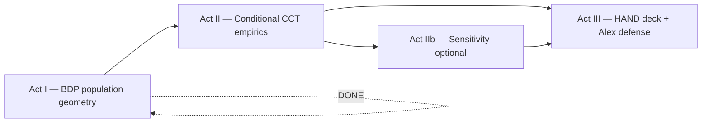

# CCT Campaign Plan — Fix Â_i, Find the Squid vs Jackal

**Prepared by COMPASS** (for Charles, SCOUT, Alex)  
**Date:** 2026-08-21  
**Status:** Act II open — Alex briefed and excited; execution starts when Charles green-lights Priority 1  
**SCOUT:** Read this file first when Charles sends it. Sign off or file questions in [`20260821_SCOUT_CCT_campaign_review.md`](20260821_SCOUT_CCT_campaign_review.md) (create on review).

**Canonical companions (do not re-derive from memory):**

| Doc | Role |
|-----|------|
| [`20260820_COMPASS_Charles_CCT_porch_reading.md`](20260820_COMPASS_Charles_CCT_porch_reading.md) | Narrative + science (SCOUT approved 2026-08-21) |
| [`20260821_SCOUT_porch_reading_review.md`](20260821_SCOUT_porch_reading_review.md) | Spot-checks, three clarifications |
| [`../HEROs_and_PASSes/PD20_22_campaign_big_picture.md`](../HEROs_and_PASSes/PD20_22_campaign_big_picture.md) | Dissertation arc (Army → MBB ladder) |
| [`../../BINDING_Selection_is_its_own_step.md`](../../BINDING_Selection_is_its_own_step.md) | Score ≠ select ≠ environment |

---

## 0 — One sentence (what Alex just got excited about)

**Hold individual talent Â_i fixed.** Then ask: at the **same fish size**, does draft probability **fall** when the player moves from a **Squid pond** (stands out on a pretty-good team) to a **Jackal pond** (same talent, crowded among contenders)?

That is the **Central Contention and Theme (CCT)**. Alex’s reaction — *fix A_i* — is exactly the **microscope** this campaign builds. Marginal hero curves **average over ability**; they cannot answer this question. **Conditional plots can.**

---

## 1 — Campaign arc (three acts)



| Act | Question | Status | Owner |
|-----|----------|--------|-------|
| **I — BDP** | What do the pools look like? (Â, T̂_j, roster size, +DFT) | **Closed** (2026-08-20) | Charles + scripts |
| **II — Conditional** | At **fixed Â**, does draft rate fall as pond thickens? | **Next** | **SCOUT** (build) · Charles (pick specs) |
| **III — HAND + Alex** | Can you **show and defend** CCT in one deck? | After Act II figures | Charles (slides) · COMPASS (wording) |

**Win condition for the campaign:** At least one **defensible figure** where Squid proxy > Jackal proxy at **matched Â** on **mg10 min20 11_21**, with cell counts in JSON, plus a one-slide Alex line you can read aloud without hedging into “maybe the marginal hero dips.”

**Not the win condition:** Bin 16 dips on a single ventile curve. July pre-QC artifact; Track C closed that path.

---

## 2 — Scientific guardrails (binding)

1. **Environment (L_net = B − D) ≠ advancement.** CCT is a **draft / selection** story, not “bad teammates hurt my box score.”
2. **Score (S_i = A_i − λ L_C) ≠ select (top-K, Gibbs).** Hero is an **outcome**; do not merge layers in talk or captions.
3. **Congestion axis:** **poolq_loo** first (“teammates around me,” excluding self). **T̂_j** second only — team mean **includes** the player.
4. **Locked panel for claims:** **mg10 min20 11_21** (same estimand as POST-QC hero). FP / min0 = QC story only.
5. **Perf metric:** **PPM canonical**; BPM / OBPM = robustness appendix (Track C: no elite dip rescue).
6. **+DFT overlay:** magnifier on draft-ecosystem subsample — not “drafted players only” on player histograms.

**Army cross-read (do not garble):** Army **screams** (robust macro tail drop). Captain promotion ~**35–40%** — assembly-line baseline, not tiny K/N. NCAA draft ~**2–2.5%**. Army loud ≠ Army slots scarcer than NBA picks.

---

## 3 — Plot menu (priority order)

Build **in order** unless Charles reorders. Each plot ships **PNG + JSON sidecar** (cell counts mandatory).

### Priority 1 — Matched Â × pond (THE Alex plot) ★

**Spec**

- Panel: mg10 min20 11_21  
- Fix narrow **Â_i band** (default: z ∈ [1.5, 2.0]; sensitivity: top decile)  
- X-axis: **poolq_loo** ventiles (preferred) or T̂_j ventiles  
- Y-axis: draft rate (with binomial CI if n allows)  
- Squid proxy: mid pond / mid T̂_j · Jackal proxy: top pond / top T̂_j — **same  band**

**CCT signature:** Jackal bar **below** Squid bar at same individual talent.

**Outputs**

- `basic_data_plots/CCT_draft_rate_ai_band_poolq_loo.png`  
- `basic_data_plots/CCT_draft_rate_ai_band_poolq_loo.json`

### Priority 2 — Â × poolq_loo heatmap

Draft rate in every cell (Â ventile × poolq_loo ventile). Hero curve = column average — shows **smearing**. Look for upper-right (high A, high pond) **cooler** than upper-middle.

**Wider bins at top** if sparse (~1,100 total drafts). Flag cells with n < 30 in JSON.

### Priority 3 — Within-team rank × T̂_j quartile

Draft rate vs **roster percentile** (where Â_i sits on team), **faceted by T̂_j quartile**. CCT: at high T̂_j, draft mass concentrates at top of team; at mid T̂_j, same z + higher rank → higher rate.

### Priority 4 — Interval overlap + draft (HAND17 extension)

Color drafted vs not on interval slide logic; top T̂_j quartile; drafted players on **leading edge** of team interval?

### Priority 5 — Model-aligned diagnostics

- L_j^C vs T̂_j by ventile  
- MLE residuals: observed − predicted draft rate by poolq_loo at **fixed A**

### Act IIb — Sensitivity (after Priority 1 lands)

| Variant | Purpose |
|---------|---------|
| +DFT subsample only | BDP compression hints signal may sharpen |
| mg10 min10 | Minutes-floor sensitivity |
| BPM / OBPM | Track C magnifier — appendix only |
| Alternate  bands | Robustness if default band is thin |

---

## 4 — Engineering plan

### New script (SCOUT)

**Name (locked):** `sports/scripts/pass_a_congestion_conditional.py`

**Reuse:** `pass_a_empirical_bundle.py` panel path, `pd20_22_campaign_window`, `hero_gallery_paths`, BDP layout helpers from `bdp_ai_tj_distributions.py` where sensible.

**CLI sketch**

```bash
python sports/scripts/pass_a_congestion_conditional.py \
  --season-min 2011 --season-max 2021 \
  --min-minutes 20 --min-games 11 \
  --ai-lo 1.5 --ai-hi 2.0 \
  --plot matched_pond \
  --out-dir 3-Master_Plan/re_entry/HEROs_and_PASSes/basic_data_plots
```

**Incremental writes:** JSONL or per-plot JSON with **n, drafts, rate, CI** per cell — append-friendly if we add bands later ([`.cursor/rules/incremental-writes.mdc`](../../.cursor/rules/incremental-writes.mdc)).

**Do not clobber:** Locked Pass A hero PNGs in `pass_a/`.

### HAND deck (Charles)

New deck or new section in next HAND — working title **`CHAR_CCT_HAND`** or section in PD23 deck. **Change Picture** from `basic_data_plots/` and `slides/Basics_data_plots_HAND/` exports. Agents **never** overwrite `.pptx`.

---

## 5 — Checklist (Charles checkboxes only)

**How to use:** Charles changes `[ ]` → `[x]` and fills **Proof**. SCOUT/COMPASS update **Status** rows in §6.

### Phase 0 — Green light

| Done | Item | Proof |
|------|------|-------|
| [ ] | Charles read porch doc + this campaign plan | Date |
| [ ] | SCOUT reviewed this campaign plan | Link to review md |
| [ ] | **Priority 1 spec locked:** Â band, axis (poolq_loo vs T̂_j), season window | One line in Proof |
| [ ] | Charles says **go** on script build | Message / date |

### Phase 1 — Priority 1 figure (Act II core)

| Done | Item | Proof |
|------|------|-------|
| [ ] | `pass_a_congestion_conditional.py` exists, smoke test runs | Command + exit 0 |
| [ ] | Matched Â × poolq_loo PNG + JSON on disk | Path |
| [ ] | JSON cell counts reviewed — no empty claims from n < 10 cells | SCOUT note |
| [ ] | Charles eyeballs figure — “this is the Squid/Jackal test” | Y/N + tweak list |
| [ ] | COMPASS slide caption draft (score ≠ select language) | §7 or slide stub |

### Phase 2 — Act II expansion

| Done | Item | Proof |
|------|------|-------|
| [ ] | Priority 2 heatmap | Path |
| [ ] | Priority 3 roster percentile faceted | Path |
| [ ] | +DFT subsample rerun of Priority 1 | Path |
| [ ] | BPM/OBPM robustness panel (optional) | Path |

### Phase 3 — Act III (Alex-ready)

| Done | Item | Proof |
|------|------|-------|
| [ ] | HAND deck section assembled | `.pptx` path |
| [ ] | Alex paragraph rehearsed (§8 below) | PD # or date |
| [ ] | BINDING rule visible on one slide or speaker note | Slide # |
| [ ] | Campaign doc **Status** updated to Closed or Act III complete | This file |

---

## 6 — Ownership & delegation

| Task | Owner | Delegate? |
|------|-------|-----------|
| Campaign sequencing, checklist, Alex wording | **COMPASS** | — |
| Script build, plots, JSON spot-checks | **SCOUT** | — |
| Green-light specs, HAND assembly, checkboxes | **Charles** | — |
| Slide visual design, Change Picture | **Charles** | — |
| Theory / manuscript integration later | **VECTOR** | When Act III done |

**SCOUT first deliverable when green-lit:** Priority 1 PNG + JSON + 5-line README stub in `basic_data_plots/CCT_README.md` (what panel, what band, what to look for).

**COMPASS standing job:** Keep this file’s **Status** and Phase tables current after each SCOUT drop; file `SCOUT_report_to_COMPASS.md` summary when a phase closes.

---

## 7 — Slide / caption language (COMPASS draft — edit in HAND)

**Title (Priority 1 slide):** *Same talent, different pond — draft rate at fixed Â_i*

**Subtitle:** mg10 min20 · 2011–2021 · poolq_loo ventiles · band z ∈ [1.5, 2.0]

**Caption (binding-safe):**  
*Not “good players get drafted.” At matched individual talent, players in **thicker teammate ponds** (higher leave-one-out pool quality) show **lower** draft rates — consistent with congestion in **ranking**, not proof of environment effects on development.*

**Speaker note for Alex:**  
*This is the fix-A_i plot you asked for. The marginal hero averages over ability; here ability is fixed. Squid vs Jackal is mid-pond vs top-pond at the same Â.*

---

## 8 — One paragraph for Alex (read aloud)

> We closed Act I — what the league and draft-ecosystem teams look like. The old hero curve rises through the middle but doesn’t show a clean elite dip on cleaned data; that July tail was mostly cameo noise. Alex, your fix-A_i idea is the next step: **hold individual talent fixed** and compare draft rates in crowded versus uncrowded teammate ponds. Interval overlap shows why that matters — elite teams stack several players at the same talent level. Our fitted model already weights congestion in the score. Now we build the empirical picture that matches the Squid-versus-Jackal thought experiment — not another bin on the marginal chart.

---

## 9 — Do-not-do (save campaign time)

1. **More ESPN seasons alone** — unlikely to reveal CCT (you + Alex agree).  
2. **Another marginal poolq_loo ventile run** hoping bin 16 dips.  
3. **Promoting OBPM/BPM to canonical hero** — appendix magnifier only.  
4. **Confusing T̂_j with poolq_loo** in slides or prose.  
5. **Claiming Army tiny K/N** — wrong; Army screams via macro tail drop.  
6. **MERGE score + select + environment** in one sentence — BINDING violation.

---

## 10 — Collaboration model (three of you + two agents)

**What’s been working**

- Porch reading as **single narrative**; technical memos as supplements.  
- SCOUT **review file** with spot-checks (not silent edits).  
- Charles **checkboxes only Charles touches**.

**Tighter loop for this campaign (recommended)**

| Artifact | Purpose | Who updates |
|----------|---------|-------------|
| **This file** | Operational source of truth — priorities, checklist, specs | COMPASS |
| **Porch reading** | Stable story for Ginger / re-entry | Frozen unless science changes |
| **`SCOUT_report_to_COMPASS.md`** | End-of-phase: what shipped, paths, blockers | SCOUT after each Priority |
| **`YYYYMMDD_SCOUT_CCT_campaign_review.md`** | One-time sign-off on this plan (like porch review) | SCOUT |
| **Question files** | Only when blocked: `YYYYMMDD_COMPASS_to_SCOUT_questions.md` | COMPASS |

**What to stop doing**

- Parallel memos that re-merge the same plot menu (porch + campaign + joint memo is enough).  
- SCOUT building without Charles **Phase 0 green-light** on  band and axis.  
- Long chat threads as spec — **spec lives in §3–4 of this file**.

**Charles’s workflow**

1. Send SCOUT this file.  
2. Lock Priority 1 spec (one message: band + axis).  
3. SCOUT builds → drops PNG/JSON → pings in report.  
4. You assemble HAND → brief Alex → mark checklist.

**Optional later:** Mirror a slim `.plan.md` to [`plans/`](../../plans/) if you want PDF via `convert_single_md_to_pdf.sh` — not required for day-one execution.

---

## 11 — Open decisions (Charles picks — defaults in parentheses)

| Decision | Default | Alternatives |
|----------|---------|--------------|
| Â band for Priority 1 | z ∈ [1.5, 2.0] | Top decile; [1.0, 1.5] for wider n |
| Primary pond axis | **poolq_loo** ventiles | T̂_j ventiles (secondary panel) |
| Ventile count | 16 (match hero) | 10 wider bins at top |
| First HAND target | New CCT section | Append to next PD HAND |

---

## 12 — Status log

| Date | Event |
|------|-------|
| 2026-08-20 | Act I BDP closed; porch reading published |
| 2026-08-21 | SCOUT porch review complete; Army/K/N clarifications merged |
| 2026-08-21 | Charles briefed Alex on **fix Â_i** — Alex excited |
| 2026-08-21 | **This campaign plan published** — awaiting SCOUT read + Charles green-light |

---

*Charles — you asked for a plan you could show SCOUT and get cracking. Act I is done. Alex wants the fix-A_i microscope. Green-light Priority 1 and SCOUT builds. COMPASS keeps the checklist honest.*

— **COMPASS** (SCOUT: your move after review)
