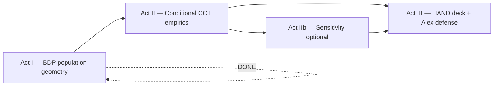

# CCT Campaign Plan — Fix Â_i, Find the Squid vs Jackal

**Prepared by COMPASS** (for Charles, SCOUT, Alex)  
**Date:** 2026-08-21  
**Status:** Act II **sensitivity sweep complete** (2026-08-21) — P1 full **NO**, P1 **+DFT PPM YES** (~2 pp); P3 shipped; **next: Priority 2 heatmap**, then **Priority 2b Alex board plot (K/N bins)** per PD25  
**SCOUT review:** Complete (2026-08-21) — [`20260821_SCOUT_CCT_campaign_review.md`](20260821_SCOUT_CCT_campaign_review.md)

**Canonical companions (do not re-derive from memory):**

| Doc | Role |
|-----|------|
| [`20260820_COMPASS_Charles_CCT_porch_reading.md`](20260820_COMPASS_Charles_CCT_porch_reading.md) | Narrative + science (SCOUT approved 2026-08-21) |
| [`20260821_SCOUT_porch_reading_review.md`](20260821_SCOUT_porch_reading_review.md) | Spot-checks, three clarifications |
| [`../HEROs_and_PASSes/PD20_22_campaign_big_picture.md`](../HEROs_and_PASSes/PD20_22_campaign_big_picture.md) | Dissertation arc (Army → MBB ladder) |
| [`../../BINDING_Selection_is_its_own_step.md`](../../BINDING_Selection_is_its_own_step.md) | Score ≠ select ≠ environment |

---

## 0 — One sentence (what Alex just got excited about)

**Hold individual talent Â_i fixed.** Then ask: at the **same fish size**, does draft probability **fall** when the player moves from a **Squid pond** (stands out on a pretty-good team) to a **Jackal pond** (same talent, crowded among contenders)?

That is the **Central Contention and Theme (CCT)**. Alex’s reaction — *fix A_i* — is exactly the **microscope** this campaign builds. Marginal hero curves **average over ability**; they cannot answer this question. **Conditional plots can.**

---

## 1 — Campaign arc (three acts)



| Act | Question | Status | Owner |
|-----|----------|--------|-------|
| **I — BDP** | What do the pools look like? (Â, T̂_j, roster size, +DFT) | **Closed** (2026-08-20) | Charles + scripts |
| **II — Conditional** | At **fixed Â**, does draft rate fall as pond thickens? | **Sweep done** — see §3 scorecard; whisper in **+DFT PPM only** | **SCOUT** · Charles (HAND) |
| **III — HAND + Alex** | Can you **show and defend** CCT in one deck? | After Act II figures | Charles (slides) · COMPASS (wording) |

**Win condition (revised 2026-08-21):** A **defensible HAND story** — not a single pooled bar — that Charles can read to Alex without BINDING violations. **Partial win:** PPM **+DFT** shows Squid > Jackal at matched  (~23% vs ~21%, overlapping CIs). **Full-panel P1 and OBPM do not.** Priority 3 adds within-team rank on contenders. **Priority 2 heatmap** may localize where the +DFT whisper lives.

**Not the win condition:** Bin 16 dips on a single ventile curve; claiming CCT confirmed from +DFT alone without caveats; promoting OBPM to canonical.

---

## 2 — Scientific guardrails (binding)

1. **Environment (L_net = B − D) ≠ advancement.** CCT is a **draft / selection** story, not “bad teammates hurt my box score.”
2. **Score (S_i = A_i − λ L_C) ≠ select (top-K, Gibbs).** Hero is an **outcome**; do not merge layers in talk or captions.
3. **Congestion axis:** **poolq_loo** first (“teammates around me,” excluding self). **T̂_j** second only — team mean **includes** the player.
4. **Locked panel for claims:** **mg10 min20 11_21** (same estimand as POST-QC hero). **QC always on:** `drop_dash_placeholder_names=True` (dash `"-"` rows). FP / min0 = QC story only.
5. **Perf metric:** **PPM canonical**; BPM / OBPM = robustness appendix (Track C: no elite dip rescue).
6. **+DFT overlay:** magnifier on draft-ecosystem subsample — not “drafted players only” on player histograms.

**Army cross-read (do not garble):** Army **screams** (robust macro tail drop). Captain promotion ~**35–40%** — assembly-line baseline, not tiny K/N. NCAA draft ~**2–2.5%**. Army loud ≠ Army slots scarcer than NBA picks.

---

## 3 — Plot menu (priority order)

Build **in order** unless Charles reorders. Each plot ships **PNG + JSON sidecar** (cell counts mandatory).

### Priority 1 — Matched Â × pond (THE Alex plot) ★

**Spec**

- Panel: mg10 min20 11_21  
- Fix narrow **Â_i band** (default: z ∈ [1.5, 2.0]; sensitivity: top decile)  
- X-axis: **poolq_loo** ventiles (preferred) or T̂_j ventiles  
- Y-axis: draft rate (with binomial CI if n allows)  
- **poolq winsor:** 0.01–0.99 (match locked POST-QC hero — BDP Â/T̂ plots omit winsor; this plot does not)  
- Squid proxy: mid pond / mid T̂_j · Jackal proxy: top pond / top T̂_j — **same  band**

**CCT signature:** Jackal bar **below** Squid bar at same individual talent.

**Outputs**

- `basic_data_plots/CCT_draft_rate_ai_band_poolq_loo.png`  
- `basic_data_plots/CCT_draft_rate_ai_band_poolq_loo.json`

#### Priority 1 scorecard (2026-08-21) — all variants shipped

Spec locked: mg10 min20 2011–2021 · PPM/OBPM z ∈ [1.5, 2.0] · poolq_loo ventiles (within band) · winsor 0.01–0.99 · Squid = bins 6–8 · Jackal = bins 14–16.

| Variant | Squid | Jackal | CCT (Squid > Jackal)? | Files |
|---------|-------|--------|------------------------|-------|
| **PPM · full panel** | 7.3% (n=382) | 10.8% (n=381) | **NO** | `CCT_draft_rate_ai_band_poolq_loo.*` |
| **PPM · +DFT** | **22.9%** (n=140) | **20.9%** (n=139) | **YES** (~2 pp; CIs overlap) | `…_poolq_loo_dft.*` |
| **OBPM · full** | 16.3% (n=306) | 37.6% (n=306) | **NO** (strong opposite) | `…_poolq_loo_obpm.*` |
| **OBPM · +DFT** | 29.0% (n=114) | 39.8% (n=113) | **NO** | `…_poolq_loo_obpm_dft.*` |
| **PPM · T̂_j axis** (8 bins) | — | — | Draft rate **rises** with T̂_j at fixed  | `CCT_draft_rate_fixedAi_Tj_*_Tj.*` |

Band (PPM full): 2,035 PS / 178 drafted (~8.8% in band; **166/178 drafts** on +DFT teams). All 16 ventiles n ≈ 127–128 (full) or ~46 (+DFT).

**[COMPASS] synthesis**

1. **Full league:** thicker poolq_loo → **higher** draft rate at fixed  — opposite naive CCT on this axis. Confound: elite programs raise both pond quality and draft visibility.
2. **+DFT PPM:** sign **flips** toward CCT — BDP “draft-ecosystem zoom” intuition validated, but effect is **small** and **noisy** (bin 14 spikes; bins 15–16 fall; pooled proxies hide ventile mess).
3. **OBPM:** wrong magnifier — Jackal dominates even more; **appendix only** (Track C).
4. **T̂_j secondary:** monotonic rise with team mean — “better team helps” at fixed z.
5. **Priority 3** (below): different question — **within-team rank** on Q4 contenders (top 9.5% vs mid 3.0%).

**Honest Alex line (post-sweep):** *“Full panel at fixed talent: crowded ponds draft more. Restrict to programs that actually produce picks, PPM sign flips — mid-pond edges top-pond by ~2 points but uncertainty overlaps. OBPM goes the other way. On contenders, you must be near the top of your roster.”*

**HAND lead pair:** side-by-side **PPM full vs PPM +DFT** + **Priority 3 Q4 panel**.

### Priority 2 — Â × poolq_loo heatmap — **NEXT**

Draft rate in every cell (Â ventile × poolq_loo ventile). Hero curve = column average — shows **smearing**. Look for upper-right (high A, high pond) **cooler** than upper-middle. Run on **full panel and +DFT** if feasible.

**Wider bins at top** if sparse (~1,100 total drafts). Flag cells with n < 30 in JSON.

### Priority 2b — Alex board plot: fixed Â × T̂_j (K/N bins) — **QUEUED after P2**

**Source:** PD25 (2026-08-21) — [`../../../transcripts/PD25_notes.md`](../../../transcripts/PD25_notes.md) · board [`../../../transcripts/PD25_board.jpeg`](../../../transcripts/PD25_board.jpeg)

**Question (Alex):** At fixed individual talent, does draft rate stay **flat** in team talent, then **turn down** once congestion kicks in near **K/N**? (Plateau → downturn on X = team mean talent.)

**Why now (not instead of P2):** P2 heatmap finishes Act II smearing diagnosis; P2b is the **direct empirical test** of Alex’s whiteboard. Does **not** replace poolq_loo P1 — **complements** it on the **T̂_j** axis.

**Spec (default — Charles can tweak one message)**

| Knob | Value |
|------|--------|
| Panel | mg10 **min20** 2011–2021 · POST-QC · **+DFT primary** (draftee-team ecosystem) |
| Â band | PPM z ∈ **[1.5, 2.0]** (match locked P1); sensitivity: [2.0, 3.0] if n allows |
| **X-axis** | **T̂_j** (team mean Â), **not** poolq_loo |
| **Y-axis** | Mean Y_draft |
| **X binning** | **K/N-informed** — not blind 16-quantile on full T̂_j range |
| Winsor | poolq 0.01–0.99 on perf path (same as P1) |

**Binning rule (Alex / PD25)**

1. **Back-of-envelope** minimum bin count on X so ≥ **2 bins lie past** the model congestion threshold on the **team-talent** scale (function of **K**, roster **N**, **θ**, **γ** — document assumptions in JSON).
2. Prefer **equal-width on high-T̂_j tail** or **custom cutpoints** anchored at empirical K/N quantile of **within-team** ability — **not** equal-count ventiles that smear sparse top tail.
3. **Prune sweeps:** Alex: unlikely to see downturn with **&lt; ~20** X bins — don’t waste grid below calculated floor.
4. **Power floor:** flag bins with **n &lt; 30** (same as P2); no claims from empty cells.

**Expected shapes**

| Population | Alex prediction | P1 already saw |
|------------|-----------------|----------------|
| +DFT, high  | Flat → **down** at high T̂_j | T̂_j panel: **up** (16 quantile) — **retest with P2b bins** |
| Full panel | Confounded (elite programs) | Rate rises with T̂_j |

**CCT signature (P2b):** Jackal-side bins **below** Squid-side bins **after** knee — same language as P1 but on **T̂_j** with explicit knee search.

**Outputs (SCOUT naming)**

- `basic_data_plots/CCT_draft_rate_fixedAi_Tj_knbins_dft.png`  
- `basic_data_plots/CCT_draft_rate_fixedAi_Tj_knbins_dft.json`  
- `basic_data_plots/CCT_draft_rate_fixedAi_Tj_knbins_dft_Tj_bins.csv` — `edge_lo`, `edge_hi`, `n`, `drafts`, `draft_rate`

**Script:** extend `pass_a_congestion_conditional.py` with `--plot fixed_ai_tj_knbins` (or dedicated helper). Reuse panel path from P1. **COMPASS** drafts K/N bin-count memo; **SCOUT** implements.

**Do not:** Claim model validation in caption — empirical knee **first**; MLE inflection fit is Priority 5 / MLE phase.

### Priority 3 — Within-team rank × T̂_j quartile — **SHIPPED**

Draft rate vs **roster percentile**, faceted by **T̂_j quartile**. Files: `CCT_draft_rate_roster_pct_by_tj_quartile.{png,json}`.

**Result (2026-08-21):** Q4 (highest T̂_j) — top roster rank **9.5%** vs mid rank **3.0%** (top > mid: **YES**). All quartiles show top rank > mid rank. Does **not** fix  — complements P1; supports “stand out on **your** team,” especially on contenders.

### Priority 4 — Interval overlap + draft (HAND17 extension)

Color drafted vs not on interval slide logic; top T̂_j quartile; drafted players on **leading edge** of team interval?

### Priority 5 — Model-aligned diagnostics

- L_j^C vs T̂_j by ventile  
- MLE residuals: observed − predicted draft rate by poolq_loo at **fixed A**

### Act IIb — Sensitivity — **MOSTLY DONE**

| Variant | Status | Result |
|---------|--------|--------|
| +DFT subsample (PPM P1) | ✓ | CCT **YES**, fragile (~2 pp) |
| OBPM full + +DFT | ✓ | CCT **NO** both; appendix only |
| T̂_j secondary panel | ✓ | Rate rises with team mean |
| mg10 min10 | — | Not run |
| Alternate  bands | — | Charles call after P2 heatmap |

---

## 4 — Engineering plan

### New script (SCOUT)

**Name (locked):** `sports/scripts/pass_a_congestion_conditional.py`

**Reuse:** `pass_a_empirical_bundle.py` panel path, `pd20_22_campaign_window`, `hero_gallery_paths`, BDP layout helpers from `bdp_ai_tj_distributions.py` where sensible.

**CLI sketch**

```bash
python sports/scripts/pass_a_congestion_conditional.py \
  --season-min 2011 --season-max 2021 \
  --min-minutes 20 \
  --min-team-season-games 10 \
  --winsor-lo 0.01 --winsor-hi 0.99 \
  --ai-lo 1.5 --ai-hi 2.0 \
  --plot matched_pond \
  --out-dir 3-Master_Plan/re_entry/HEROs_and_PASSes/basic_data_plots
```

**[SCOUT] mg10 = `min_team_season_games 10`** in code (drop team-seasons with ≤10 games; keep 11+). Do not pass `11` — that is not the repo knob name.

**Incremental writes:** JSONL or per-plot JSON with **n, drafts, rate, CI** per cell — append-friendly if we add bands later ([`../../../.cursor/rules/incremental-writes.mdc`](../../../.cursor/rules/incremental-writes.mdc)).

**Do not clobber:** Locked Pass A hero PNGs in `pass_a/`.

### HAND deck (Charles)

New deck or new section in next HAND — working title **`CHAR_CCT_HAND`** or section in PD23 deck. **Change Picture** from `basic_data_plots/` and `slides/Basics_data_plots_HAND/` exports. Agents **never** overwrite `.pptx`.

---

## 5 — Checklist (Charles checkboxes only)

**How to use:** Charles changes `[ ]` → `[x]` and fills **Proof**. SCOUT/COMPASS update **Status** rows in §6.

### Phase 0 — Green light

| Done | Item | Proof |
|------|------|-------|
| [ ] | Charles read porch doc + this campaign plan | Date |
| [x] | SCOUT reviewed this campaign plan | [`20260821_SCOUT_CCT_campaign_review.md`](20260821_SCOUT_CCT_campaign_review.md) |
| [x] | **Priority 1 spec locked:** Â band, axis (poolq_loo vs T̂_j), season window | **poolq_loo** · z ∈ [1.5, 2.0] · 2011–2021 · mg10 min20 · winsor 0.01–0.99 |
| [x] | Charles says **go** on script build | 2026-08-21 — Alex briefed; green-light Priority 1 |

### Phase 1 — Priority 1 figure (Act II core)

| Done | Item | Proof |
|------|------|-------|
| [x] | `pass_a_congestion_conditional.py` exists, smoke test runs | `python sports/scripts/pass_a_congestion_conditional.py --plot matched_pond …` exit 0 (2026-08-21) |
| [x] | Matched Â × poolq_loo PNG + JSON on disk | `basic_data_plots/CCT_draft_rate_ai_band_poolq_loo.{png,json}` |
| [x] | JSON cell counts reviewed — no empty claims from n < 10 cells | All 16 bins n≈127–128; band n=2,035 / 178 drafts; **CCT=NO** (Jackal 10.8% > Squid 7.3%) |
| [ ] | Charles eyeballs figures — Squid/Jackal test + sweep story | See §3 scorecard |
| [x] | COMPASS slide caption draft (score ≠ select language) | §7 (two-panel + P3) |

### Phase 2 — Act II expansion

| Done | Item | Proof |
|------|------|-------|
| [ ] | Priority 2 heatmap (full + +DFT if feasible) | **NEXT — green-light SCOUT** |
| [ ] | **Priority 2b** Alex board plot (fixed Â × T̂_j, K/N bins, +DFT) | After P2 — [`PD25_notes.md`](../../../transcripts/PD25_notes.md) |
| [x] | Priority 3 roster percentile faceted | `CCT_draft_rate_roster_pct_by_tj_quartile.{png,json}` |
| [x] | +DFT subsample rerun of Priority 1 | `CCT_draft_rate_ai_band_poolq_loo_dft.*` |
| [x] | OBPM robustness (full + +DFT) | `…_obpm.*`, `…_obpm_dft.*` — appendix only |

### Phase 3 — Act III (Alex-ready)

| Done | Item | Proof |
|------|------|-------|
| [ ] | HAND deck section assembled | `.pptx` path |
| [ ] | Alex paragraph rehearsed (§8 below) | PD # or date |
| [ ] | BINDING rule visible on one slide or speaker note | Slide # |
| [ ] | Campaign doc **Status** updated to Closed or Act III complete | This file |

---

## 6 — Ownership & delegation

| Task | Owner | Delegate? |
|------|-------|-----------|
| Campaign sequencing, checklist, Alex wording | **COMPASS** | — |
| Script build, plots, JSON spot-checks | **SCOUT** | — |
| Green-light specs, HAND assembly, checkboxes | **Charles** | — |
| Slide visual design, Change Picture | **Charles** | — |
| Theory / manuscript integration later | **VECTOR** | When Act III done |

**SCOUT first deliverable when green-lit:** Priority 1 PNG + JSON + 5-line README stub in `basic_data_plots/CCT_README.md` (what panel, what band, what to look for).

**COMPASS standing job:** Keep this file’s **Status** and Phase tables current after each SCOUT drop; file `SCOUT_report_to_COMPASS.md` summary when a phase closes.

---

## 7 — Slide / caption language (COMPASS draft — edit in HAND)

### Slide A — P1 full vs +DFT (side-by-side)

**Title:** *Same talent, different pond — league vs draft-ecosystem*

**Caption (binding-safe):**  
*At fixed PPM z ∈ [1.5, 2.0]: **full panel** — thicker teammate ponds → **higher** draft rates (Jackal > Squid). **+DFT subsample** (programs with ≥1 pick in window) — sign **flips**: mid-pond slightly > top-pond (~23% vs ~21%), overlapping uncertainty. Not proof of environment effects; consistent with congestion **ranking** story **within** draft ecosystems only.*

### Slide B — Priority 3 Q4

**Title:** *On contenders, draft mass sits at the top of the roster*

**Caption:**  
*Draft rate vs within-team roster percentile, faceted by team talent quartile. Q4 (highest T̂_j): top rank ~9.5% vs mid ~3.0%. Does not fix  — shows “big fish on **this** team” matters, especially on elite rosters.*

**Speaker note for Alex:**  
*Fix-A_i was the right move. Full league confounds program quality with pond thickness. The whisper may live in draft-ecosystem programs on PPM, plus within-team rank on contenders — not the old marginal hero curve.*

---

## 8 — One paragraph for Alex (read aloud — post-sweep)

> We closed Act I and built the fix-A_i microscope you asked for. On the **full** NCAA panel at matched talent, players in **thicker** teammate ponds get drafted **more**, not less — elite-program confound. When we restrict to **programs that actually produce draft picks**, the sign **flips** on PPM: mid-pond slightly beats top-pond, but only by about two points with overlapping uncertainty. OBPM goes strongly the other way — appendix only. Separately, on **contender rosters**, draft mass concentrates at the **top of the team** — you have to stand out locally even when the team is elite. That’s our honest NCAA picture so far: not the marginal hero dip, but a draft-ecosystem whisper plus within-team rank on contenders.

---

## 9 — Do-not-do (save campaign time)

1. **More ESPN seasons alone** — unlikely to reveal CCT (you + Alex agree).  
2. **Another marginal poolq_loo ventile run** hoping bin 16 dips.  
3. **Promoting OBPM/BPM to canonical hero** — appendix magnifier only.  
4. **Confusing T̂_j with poolq_loo** in slides or prose.  
5. **Claiming Army tiny K/N** — wrong; Army screams via macro tail drop.  
6. **Claiming CCT confirmed from +DFT PPM alone** — ~2 pp, overlapping CIs, noisy ventiles.
7. **MERGE score + select + environment** in one sentence — BINDING violation.

---

## 10 — Collaboration model (three of you + two agents)

**What’s been working**

- Porch reading as **single narrative**; technical memos as supplements.  
- SCOUT **review file** with spot-checks (not silent edits).  
- Charles **checkboxes only Charles touches**.

**Tighter loop for this campaign (recommended)**

| Artifact | Purpose | Who updates |
|----------|---------|-------------|
| **This file** | Operational source of truth — priorities, checklist, specs | COMPASS |
| **Porch reading** | Stable story for Ginger / re-entry | Frozen unless science changes |
| **`SCOUT_report_to_COMPASS.md`** | End-of-phase: what shipped, paths, blockers | SCOUT after each Priority |
| **`YYYYMMDD_SCOUT_CCT_campaign_review.md`** | One-time sign-off on this plan (like porch review) | SCOUT |
| **Question files** | Only when blocked: `YYYYMMDD_COMPASS_to_SCOUT_questions.md` | COMPASS |

**What to stop doing**

- Parallel memos that re-merge the same plot menu (porch + campaign + joint memo is enough).  
- SCOUT building without Charles **Phase 0 green-light** on  band and axis.  
- Long chat threads as spec — **spec lives in §3–4 of this file**.

**Charles’s workflow**

1. Send SCOUT this file.  
2. Lock Priority 1 spec (one message: band + axis).  
3. SCOUT builds → drops PNG/JSON → pings in report.  
4. You assemble HAND → brief Alex → mark checklist.

**Optional later:** Mirror a slim `.plan.md` to [`plans/`](../../plans/) if you want PDF via `convert_single_md_to_pdf.sh` — not required for day-one execution.

---

## 11 — Open decisions (Charles picks — defaults in parentheses)

| Decision | Locked (2026-08-21) | Alternatives (later) |
|----------|---------------------|----------------------|
| Â band for Priority 1 | **z ∈ [1.5, 2.0]** ✓ | Top decile; [1.0, 1.5] if bins thin |
| Primary pond axis | **poolq_loo** ventiles ✓ | T̂_j ventiles (secondary panel) |
| **Alex board X-axis (P2b)** | **T̂_j with K/N bins** (queued) | Blind 16-ventile T̂_j (already run — wrong shape) |
| Ventile count | 16 (match hero) | 10 wider bins at top |
| First HAND target | New CCT section | Append to next PD HAND |

---

## 12 — Status log

| Date | Event |
|------|-------|
| 2026-08-20 | Act I BDP closed; porch reading published |
| 2026-08-21 | SCOUT porch review complete; Army/K/N clarifications merged |
| 2026-08-21 | Charles briefed Alex on **fix Â_i** — Alex excited |
| 2026-08-21 | **This campaign plan published** — awaiting Charles green-light |
| 2026-08-21 | **SCOUT campaign review complete** — four engineering patches in §4 |
| 2026-08-21 | **Charles green-lit Priority 1** — poolq_loo, default  band; SCOUT building `pass_a_congestion_conditional.py` |
| 2026-08-21 | **Act IIb sweep** — +DFT PPM CCT **YES** (~2 pp); OBPM **NO**; T̂_j rises; P3 Q4 top 9.5% vs mid 3.0%; see §3 scorecard |
| 2026-08-21 | **COMPASS updated** campaign plan + §13: **Priority 2 heatmap next** |
| 2026-08-21 | **PD25** Alex board — flat-then-down at fixed Â × T̂_j; **Priority 2b** queued · [`PD25_notes.md`](../../../transcripts/PD25_notes.md) |

---

## 13 — COMPASS sequencing (current)

| Order | Plot | Status |
|-------|------|--------|
| **1** | P1 matched Â × poolq_loo (full + +DFT + OBPM + T̂_j) | ✓ Done — see §3 scorecard |
| **2** | P3 roster percentile × T̂_j quartile | ✓ Done |
| **3 (NEXT)** | **P2 heatmap** — Â × poolq_loo (full + +DFT) | **Green-light SCOUT** |
| **4** | **P2b Alex board** — fixed Â × **T̂_j** (+DFT, **K/N bins**) | **Queued after P2** — PD25 |
| **5** | Wider  band / mg10 min10 | After P2b |
| **6** | P4 interval overlap + draft | Optional HAND enrich |
| **—** | PD24 BPM hero rerun | Extra — after P2b, appendix |

**Do not:** Claim CCT confirmed from +DFT alone; promote OBPM to canonical; revert to marginal hero bin-16 dip hunting.

**Repo hygiene:** COMPASS checks `CCT_README.md`, `CCT_Campaign_Plan.md`, and `basic_data_plots/CCT_*` at start of each Charles chat. SCOUT updates `CCT_README.md` on every drop.

---

*Act II sweep done. HAND lead: PPM full vs +DFT + P3 Q4. Next: **P2 heatmap** → **P2b Alex board (K/N bins)**. Notes: [`PD25_notes.md`](../../../transcripts/PD25_notes.md).*

— **COMPASS** · **SCOUT sweep 2026-08-21** · **P2 → P2b queued**
