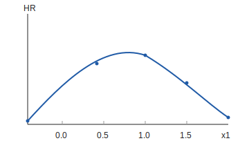

## Competing Risks (CR) and Hazard Ratios (HR) for Dummies

This note explains how we build and interpret the two main plot types in the pipeline:
- Competing risks CIF plots (Cell 11).
- Hazard‑ratio and partial‑effects plots (Cell 12.6).

It is written for quick re‑orientation, not for formal statistics. The goal is to match the logic of the code you are running in `520_pipeline_cox_working.ipynb`.

---

## 1) The three core ideas

### 1.1 Time is split into intervals
We take snapshots of each officer over time. Each snapshot becomes a time interval. The model uses these intervals to learn how things change over time.

### 1.2 Events happen at the end
Promotion or attrition is recorded at a single “event time.” In the data, that is the end of the last interval.

### 1.3 We handle two event types
Promotion and attrition compete with each other. If someone attrites, they can no longer be promoted, and vice‑versa. That is why we use competing‑risks methods.

### Formal note (core definitions)
Let $T$ be time‑to‑event and $J$ be event type ($J=1$ promotion, $J=2$ attrition, $J=0$ censored).

- **Survival function**:
$$
S(t) = P(T > t)
$$

- **Cause‑specific hazard** for event $k$:
$$
h_k(t) = \lim_{\Delta t\to 0} \frac{P(t \le T < t+\Delta t,\ J=k \mid T \ge t)}{\Delta t}
$$

These are *instantaneous* rates (hazards), not cumulative probabilities.

---

## 2) What data rows look like

Each snapshot row becomes one survival record interval:

- `start_time`: days from DOR CPT to the snapshot date.
- `stop_time`: days from DOR CPT to the next snapshot date.
- For the final snapshot:
  - `stop_time` is the event date (promotion/attrition) or the study end date.
  - `event` is 1 for promotion, 2 for attrition, 0 for censored.

Each row also contains:
- Static covariates: sex, YG, etc.
- Time‑varying covariates: snapshot variables (married, job_code, OER metrics, pool metrics, etc.).

This is built in Cell 10.

### Formal note (interval construction)
Each officer $i$ produces intervals $(t_{i,j-1}, t_{i,j}]$ with covariates $X_{i,j}$ observed at the **start** of the interval (snapshot date). The event indicator is attached to the **final** interval only:

- $event = 1$ if promoted, $event = 2$ if attrited, $event = 0$ if censored.

This is standard counting‑process / time‑varying Cox format.

---

## 3) What the CR/CIF plot is actually doing

### 3.1 CR plots use one row per officer
In Cell 11, the CR plot collapses each officer to their **last interval**:
- This row contains the officer’s final snapshot values.
- The event is the promotion/attrition/censor outcome for that officer.

So the CR plot is a “last‑snapshot” plot:
- It does **not** use the full time‑varying history.
- It uses the **final values** of covariates only.

### 3.2 The CIF curve is “cumulative probability over time”
The CIF curve for each bin is a line that rises as events happen over time.

For a given bin:
- At each time `t`, it counts how many officers in that bin had the event by `t`.
- It divides by the total number of officers in that bin.
- It accumulates this over time to create a curve.

So the curve at day `t` says:
> “By day `t`, what fraction of officers in this bin have been promoted (or attrited)?”

### Formal note (CIF vs hazard)
For event type $k$, the **cumulative incidence function** is:
$$
F_k(t) = P(T \le t,\ J=k)
$$

This is *cumulative probability*, not instantaneous risk.

The **cause‑specific hazard** is:
$$
h_k(t) = \lim_{\Delta t\to 0} \frac{P(t \le T < t+\Delta t,\ J=k \mid T \ge t)}{\Delta t}
$$

The relationship is:
$$
F_k(t) = \int_0^t S(u^-)\, h_k(u)\, du
$$

So CIF is an *accumulation* of hazards over time, adjusted for the survival function $S(t)$.

### 3.3 Why the curve is flat vs separated
If a bin has higher event rates, its curve rises faster and ends higher.
If bins look the same, the curves lie on top of each other.

This is what happened with backward painting:
- The backward covariate was future‑looking relative to the last snapshot.
- That made bins look statistically similar, so CIF curves flattened.

---

## 4) What the Cox model and HR plots are actually doing

### 4.1 Cox uses **all** intervals
Unlike CR plots, the Cox model uses every interval for each officer.

That means time‑varying covariates **do matter** throughout the career.

The Cox model is estimating:
> “Given the covariates at time `t`, what is the instantaneous risk of promotion or attrition at time `t`?”

### Formal note (Cox model)
The Cox proportional hazards model (cause‑specific) is:
$$
h_k(t \mid X) = h_{0k}(t)\,\exp(\beta_k^\top X(t))
$$

where:
- $h_{0k}(t)$ is the baseline hazard for event $k$
- $X(t)$ are covariates (time‑varying or static)
- $\beta_k$ are coefficients

The **hazard ratio** for a one‑unit increase in a covariate $x$ is:
$$
HR = \exp(\beta_x)
$$

### 4.2 Hazard ratio = “how much risk changes”
A hazard ratio (HR) tells you:
- HR > 1: higher risk
- HR < 1: lower risk

So an HR plot is just a way of showing how risk changes as a variable changes.

### 4.3 Partial‑effects plots
These plots:
- Hold all other variables constant.
- Show the model’s implied effect of one variable on the hazard.
 
If you add a quadratic term, the partial‑effects plot is the **combined effect**:
$$
\beta_1 x + \beta_2 x^2
$$

### Formal note (partial effects)
Partial‑effects (PE) plots usually show the *relative hazard*:
$$
HR(x) = \exp(\beta_1 x + \beta_2 x^2 + \cdots)
$$

Often we anchor at a reference value $x_0$ and plot:
$$
\frac{HR(x)}{HR(x_0)} = \exp\big(\beta_1 (x - x_0) + \beta_2 (x^2 - x_0^2)\big)
$$

This is still an **instantaneous risk ratio**, not a cumulative probability.

---

## 5) Where competing risks matter in Cox modeling

In the Cox setup for promotion, attrition is treated as a competing event:
- Officers who attrite are “no longer at risk” for promotion.
- This changes the effective risk set over time.

The CR plots make this visible. The Cox model uses the same event coding and time structure.

### Formal note (competing risks in Cox)
In the cause‑specific Cox setup:
- You fit a separate Cox model for each event type $k$.
- Other event types are treated as censored at their event time.

This is consistent with our current implementation for promotion vs attrition.

---

## 5.1) Worked examples with quadratics and competing risks

### Example A: Cox model with three covariates (x1, x2, x3) and quadratics on x1, x2

We include the linear terms for all three covariates, plus squared terms for `x1` and `x2`. The cause‑specific Cox model is:

$$
h_k(t \mid X) = h_{0k}(t)\,\exp\big(\beta_1 x_1 + \beta_2 x_2 + \beta_3 x_3 + \beta_4 x_1^2 + \beta_5 x_2^2\big)
$$

Interpretation:
- `β1` and `β4` jointly determine the shape of `x1`’s effect.
- `β2` and `β5` jointly determine the shape of `x2`’s effect.
- `β3` is the linear effect of `x3`.

If you want a partial‑effects curve for `x1`, you plot the combined effect:

$$
HR(x_1) = \exp\big(\beta_1 x_1 + \beta_4 x_1^2\big)
$$

while holding `x2` and `x3` fixed at reference values.

#### Numeric example (computed curve for x1)
Assume we fit a model and get:
- $\beta_1 = 1.2$
- $\beta_4 = -1.0$

Then the partial‑effects curve for `x1` is:
$$
HR(x_1) = \exp(1.2x_1 - 1.0x_1^2)
$$

Evaluate at a few points (holding other covariates fixed):

- At $x_1 = 0.0$:  
  $HR = \exp(0) = 1.00$

- At $x_1 = 0.5$:  
  $HR = \exp(1.2(0.5) - 1.0(0.25)) = \exp(0.35) \approx 1.42$

- At $x_1 = 1.0$:  
  $HR = \exp(1.2 - 1.0) = \exp(0.2) \approx 1.22$

- At $x_1 = 1.5$:  
  $HR = \exp(1.8 - 2.25) = \exp(-0.45) \approx 0.64$

Interpretation: the curve rises at first, peaks, then declines — a classic inverted‑U effect from the negative quadratic term.

Mini plot:

---

### Example B: Competing risks model using x1 vs x3 (same covariates)

For competing risks, we typically fit **two cause‑specific Cox models**:

**Promotion (k=1):**
$$
h_1(t \mid X) = h_{01}(t)\,\exp\big(\beta_1 x_1 + \beta_3 x_3 + \beta_4 x_1^2\big)
$$

**Attrition (k=2):**
$$
h_2(t \mid X) = h_{02}(t)\,\exp\big(\gamma_1 x_1 + \gamma_3 x_3 + \gamma_4 x_1^2\big)
$$

Notes:
- You can use the **same covariates** for both risks, but allow **different coefficients** (`β` vs `γ`).
- The CIF for promotion uses the promotion hazard and the overall survival:
$$
F_1(t) = \int_0^t S(u^-)\, h_1(u)\, du
$$
- The CIF for attrition is defined analogously using `h_2(u)`.

In our pipeline, the CR plots in Cell 11 are **not** fitted Cox curves; they are empirical CIF curves by bin. The Cox models (Cell 12) are where the `x1/x3` formulas above are actually estimated.

---

## 6) How forward vs backward painting interacts with CR vs HR

### 6.1 Forward painting (safe for CR)
Forward painting attaches the most recent completed eval to the snapshot.

For CR plots (which use last snapshots), forward values are aligned in time and give intuitive separation.

### 6.2 Backward painting (conceptually right, but risky for CR)
Backward paint attaches **future eval outcomes** to the entire rating window.

This is conceptually valid for performance, but in CR plots:
- The last snapshot is often before the eval‑thru date.
- You end up using a covariate that reflects information **after** the event.

This makes the CR curves flatten even if the covariate itself looks fine.

### 6.3 Backward painting still useful for Cox
Because Cox uses all time intervals, backward paint can still be meaningful:
- It describes performance during the rating window.
- It may still carry signal for hazard modeling.

But for CR plots (last‑snapshot only), it can look broken if time‑alignment is off.

---

## 7) Why your “flat backward CIF” was real

We measured this directly:
- `eval_thru_dt_bwd` was after the last snapshot in **58.7%** of officers.
- That means more than half of the final‑snapshot covariates were future‑looking.

Result:
- Backward bins had similar promotion rates.
- CIF curves collapsed into a narrow band.

This is not a plotting bug. It is a time‑alignment issue.

---

## 8) Practical solutions you can choose

### Option A: Use forward painting for CR plots
Simple, intuitive, time‑aligned.

### Option B: Use backward painting only with time‑alignment guard
Filter to rows where:
`eval_thru_dt_bwd <= snpsht_dt` (or <= event date)
This keeps backward values from looking into the future.

### Option C: Use backward painting only in Cox/HR analysis
Keep CR plots forward, but use backward for hazard modeling and interaction analysis.

---

## 9) One‑paragraph “mental model” recap

Competing‑risks plots use **one row per officer** at the **last snapshot**, and show how promotion/attrition accumulates over time for bins of a covariate. If the covariate is measured using **future evals** (backward paint), it becomes misaligned with the event window and the CIF curves flatten. The Cox model uses **all intervals**, so time‑varying covariates (including backward ones) can still matter there. That’s why backward looks “broken” in CR but can still be useful for hazard modeling.

---

## 10) Where this is implemented in the pipeline

- **Cell 10**: Builds survival intervals (`start_time`, `stop_time`, `event`).
- **Cell 11**: Collapses to last snapshot for CR plots.
- **Cell 12.6**: Builds HR and partial‑effects plots using full model.

Key functions in `520_pipeline_cox_working.ipynb`:
- `prepare_plot_data`: collapses to last snapshot (CR plots).
- `plot_competing_risks`: computes CIF curves.
- `plot_partial_effects`: uses fitted Cox model for HR curves.

---

## 11) Checklist if you get confused later

1) Am I looking at CR plots or HR plots?
2) CR plots = last snapshot only, HR plots = all intervals.
3) Are my covariates time‑aligned to the last snapshot?
4) If backward paint is used, is it future‑looking for many officers?
5) If yes, use forward or add time‑alignment guard.

---

If you want a more technical version (with formulas and references), I can add it, but this is the “plain‑English” version aligned to the current pipeline.
