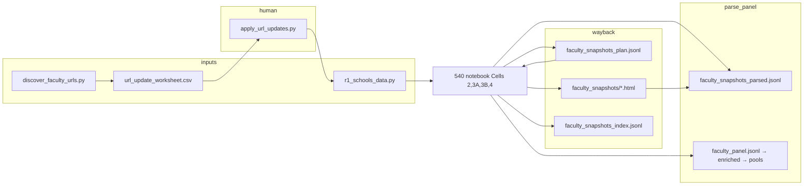

# Tenure pipeline — architecture audit & daily enrichment plan

**Date:** 2026-10-02  
**Audience:** Charles — re-entry, daily Wayback enrichment for ~2 weeks  
**Companion docs:** [`TENURE_SCRAPE_AND_ADJUDICATE_FOR_DUMMIES.md`](TENURE_SCRAPE_AND_ADJUDICATE_FOR_DUMMIES.md) (step-by-step), [`TENURE_PIPELINE_OVERVIEW.md`](TENURE_PIPELINE_OVERVIEW.md) (long reference)

---

## Executive summary

The **science stack is real** (168 schools in panel, Cells 0–9 built, solid `.py` modules for parse, link, panel, OpenAlex). The **operational stack is still a notebook monolith** for Wayback: CDX (3A), parse (4), and one-off rescues (3C–3E) live mainly in `540_tenure_pipeline.ipynb` (~5.6k lines), while URL tooling (`apply_url_updates.py`, `discover_faculty_urls.py`) and download (`stage3b_download.py`) sit beside it with **duplicated CDX logic** and **two path conventions** (`tenure/tenure_pipeline/…` vs legacy `tenure_pipeline/…`).

That produces a “old grid + new growth” feeling: each fix worked once, but there is **no single daily driver** for “I added three URLs—run CDX, download, parse, tell me if quality improved.”

**Human URL intake stays the worksheet CSV** — that is intentional. **Streamlining targets execution** (fewer wrong cells, slug-scoped runs, Terminal/CLI when Jupyter/Dropbox fights you), not replacing your judgment on which URL to try.

**Notebook boolean flags (`RUN_CELL*`) remain the right model** when you run from `540`. A future `run_wayback_wave.py` CLI would be an **alternate front door** to the same stages, not a replacement for Cell 0 flags.

---

## What you have today (soup to nuts)



| Layer | Canonical artifacts | Where logic lives |
|--------|---------------------|-------------------|
| **Schools & URLs** | `r1_schools_data.py`, `r1_cs_departments.csv`, `url_update_worksheet.csv` | `apply_url_updates.py` |
| **URL discovery (batch)** | `faculty_url_suggestions.csv` | `discover_faculty_urls.py` (~945 lines, own CDX client) |
| **CDX plan** | `faculty_snapshots_plan.jsonl` (~35k lines) | **Notebook Cell 3A** (not yet extracted to `.py`) |
| **HTML download** | `faculty_snapshots/`, `faculty_snapshots_index.jsonl` | **`stage3b_download.py`** + thin Cell 3B; `run_stage3b_cli.py` |
| **Parse** | `faculty_snapshots_parsed.jsonl`, strategy audit | **`html_parser.py`** + **Cell 4** (much logic still in notebook) |
| **Panel & pubs** | panel JSONL, OpenAlex cache | `faculty_linker.py`, `panel_builder.py`, `openalex_resolver.py` |
| **Conductor** | `RUN_CELL*` in Cell 0 | `540_tenure_pipeline.ipynb` |

**Modular pieces to keep:** `html_parser.py`, `apply_url_updates.py`, `discover_faculty_urls.py` (conceptually), `faculty_linker.py`, `panel_builder.py`, `pool_metrics.py`, `rebuild_plan.py`, `viz_pipeline.py`, **`stage3b_download.py`**.

**Direction of travel:** extract **3A** and **4** into `.py` modules like 3B; notebook stays conductor + viz + long jobs.

---

## Why it feels like a maze (root causes)

1. **Two conductors** — Scrape is “Cell 0 flags + run 540” *or* ad hoc scripts (`apply_url_updates`, `run_stage3b_cli`, `discover_faculty_urls`). No one command yet means “enrich these schools today.”

2. **CDX implemented twice** — Cell 3A and `discover_faculty_urls.py` both hit the CDX API with separate helpers. Fixes in one do not automatically apply to the other.

3. **Notebook as source of truth for ops** — 3A/4 logic is awkward to run from Terminal without loading the notebook (as `run_stage3b_cli` still does for Cell 0).

4. **Path prefix drift** — Plan/index use `tenure/tenure_pipeline/faculty_snapshots/…` while older rows use `tenure_pipeline/faculty_snapshots/…`. Helpers compensate; every new tool must remember both.

5. **Duplicate tree** — `tenure/alex_tenure_handoff/` mirrors much of `tenure/`. Risk of editing the wrong copy.

6. **Retry semantics (partially fixed Oct 2026)** — Failed downloads (0 B, 403) used to retry forever. **`stage3b_download.py`** now **permanent-skips** when the last index row says archive-dead and the file is still missing. Verify failures still retry until staging succeeds.

7. **Documentation drift** — Some docs default to Rivanna for scrape; Mac + Dropbox works for 3A–4 with `run_stage3b_cli` for 3B when needed.

8. **No slug-scoped runs** — Global queue (e.g. 22 pending across many schools). Daily work wants **`--uni-slug`** filtering (future CLI / notebook args).

9. **Weak closed loop** — After a URL change, you manually re-read worksheet/audit. Missing: one report “this URL: snaps X→Y, mean recs A→B.”

10. **Side quests in same notebook** — DBLP, OpenAlex 6B, 7–9 share Cell 0 with scrape. Easy to leave heavy flags on by mistake.

---

## Obsolete or quarantine (stop patching)

| Item | Recommendation |
|------|----------------|
| `tenure/alex_tenure_handoff/` | Archive or delete after diff vs live `tenure/` |
| `r1_schools_data.py.bak` | Remove from repo |
| Cells **3C–3E** | Freeze unless a new school matches those rescue patterns |
| `test_candidates.py` | Replace with a small “probe URL” CLI; paths are stale |
| **Cells 5–9 daily** | Not part of daily scrape; panel/OpenAlex refresh on its own schedule |
| `rebuild_plan.py --force` | Rare; prefer school-scoped reset when available |

---

## Target modular layout (recommended end state)

```text
tenure/tenure_pipeline/
  wayback/
    cdx_client.py          # shared: 3A, discover, probe CLI
    stage3a_cdx.py         # plan builder (extract from notebook)
    stage3b_download.py    # exists
    stage4_parse.py        # extract from notebook
    paths.py               # normalize URL, resolve paths, search roots
  apply_url_updates.py
  discover_faculty_urls.py
  html_parser.py
  …

tenure/
  run_wayback_wave.py      # optional daily CLI (future)
  run_stage3b_cli.py       # download-only today
  540_tenure_pipeline.ipynb  # RUN_CELL* flags, viz, OpenAlex, panel 5–9
```

**Notebook after refactor:** still **boolean flags per stage**; cells call imported modules instead of embedding hundreds of lines.

---

## Daily enrichment — two valid front doors

### A. Notebook-first (your preference)

1. Paste candidate URLs into **`url_update_worksheet.csv`** column **`new_url`** (or use suggestions from `discover_faculty_urls.py` after review).
2. Terminal once: `./apply_url_updates.sh` (merges into `r1_schools_data.py`, refreshes worksheet stats).
3. **Cell 0:** set booleans — for a scrape wave typically:
   - `RUN_CELL2 = True`
   - `RUN_CELL3_CDX = True` (only if new/changed URLs need CDX)
   - `RUN_CELL3_DOWNLOAD = True`
   - `RUN_CELL4 = True`
   - **Everything else `False`** (especially 1, 6A/6B, 7–9).
4. Run **Cell 0**, then the cells whose flags are `True` (2 → 3A → 3B → 4).

You keep **full control** via flags; nothing runs unless you set it.

### B. CLI supplement (when helpful)

- **`run_stage3b_cli.py`** — same as Cell 0 + 3B without Jupyter (Dropbox write issues).
- **Future `run_wayback_wave.py`** — would run the same stages as A with `--slugs` / `--steps`; **would not remove** Cell 0 flags.

**Discovery is optional batch work:** `discover_faculty_urls.py` proposes URLs; **you still paste the ones you trust** into the worksheet. No fully autonomous “add URL without human.”

---

## Recommendations (prioritized)

### P0 — Daily URL work (1–3 dev days)

1. **`run_wayback_wave.py`** — `--slugs`, `--steps apply|cdx|download|parse` (optional; notebook flags remain).
2. **Extract `stage3a_cdx.py` and `stage4_parse.py`** (mirror `stage3b_download.py`).
3. **Shared `cdx_client.py`** — one CDX implementation for 3A + discover.
4. **`paths.py`** — single home for URL normalize + snapshot path resolve (today split notebook / `apply_url_updates.py`).
5. **Slug-scoped** CDX / download / parse.
6. **Update `TENURE_SCRAPE_AND_ADJUDICATE_FOR_DUMMIES.md`** — Mac-first daily wave; Rivanna for long all-school CDX + OpenAlex bulk.
7. **Quarantine `alex_tenure_handoff/`**.

### P1 — Quality of life

8. **`probe_faculty_url.py`** — one URL: CDX count + one snapshot parse count.
9. **Post-wave report** — snaps, HTML, mean recs per URL after parse.
10. **`rebuild_plan.py --slug X`** — school-scoped plan reset.
11. Group hero/decision scripts under `tenure/scripts/` with a short index.

### P2 — Longer-term

12. Thin 540: stages 1–4 import modules; notebook = flags + viz + HPC notes.
13. HTML storage policy doc (Dropbox + staging; optional `WRITE_ROOT_MODE=temp`).
14. Document: scrape wave ends at Cell 4; panel refresh (5+) on a separate schedule.

---

## What is not broken (do not rebuild)

- Worksheet + **`apply_url_updates.py`**
- **`html_parser.py`** strategy stack
- Append-only **plan JSONL** (bookmarks, sentinels, multi-capture)
- OpenAlex **incremental cache** (separate from daily Wayback)
- Stage 9 / hero scripts (research layer)

---

## Suggested two-week cadence

| When | Focus |
|------|--------|
| **Weekdays** | 3–8 schools from bottom of worksheet → apply → Cell 0 flags → 2/3A/3B/4 → refresh worksheet |
| **Evenings (optional)** | `discover_faculty_urls.py` on worst mean-rec schools; paste winners next day |
| **Weekend** | `html_parser.py` if a **pattern** repeats; Cell 5+ only if panel refresh needed |

**Environment:** prefer **`tenure_net`** for pipeline work (not `sports_net`).

---

## Simple FAQ (Charles)

**Do I hand-add URLs to the CSV?**  
Yes. The worksheet is your **queue and audit trail**. You (or discovery output you approve) put URLs in **`new_url`**, run **`apply_url_updates.py`**, then scrape.

**Is CLI “more efficient”?**  
CLI is **more reliable for some steps** (especially 3B on Dropbox) and **could** bundle steps later. It does **not** replace the worksheet or **`RUN_CELL*`** flags if you prefer the notebook. Same pipeline, different front door.

**Should I abandon boolean flags?**  
No. Keep **`RUN_CELL*`** in Cell 0. Refactoring means cells **call `.py` modules**; flags still gate what runs when you “Run All” or run selected cells.

---

## Phase 1 implemented (2026-10-02)

| Item | Location |
|------|----------|
| Path + URL helpers | `tenure_pipeline/wayback/paths.py` |
| CDX client (3A) | `tenure_pipeline/wayback/cdx_client.py` |
| Stage 3A module | `tenure_pipeline/stage3a_cdx.py` |
| Stage 3B module | `tenure_pipeline/stage3b_download.py` (earlier) |
| Stage 4 module | `tenure_pipeline/stage4_parse.py` |
| Daily CLI | `tenure/run_wayback_wave.py` |
| Slug filter | Cell 0 `WAYBACK_SLUGS`; 3A / 3B / 4 |
| Thin notebook cells | 540 cells 3A, 3B, 4 |
| Stale handoff | `tenure/alex_tenure_handoff/STALE_DO_NOT_EDIT.md` |

## Phase 2 implemented (2026-10-02)

| Item | Location |
|------|----------|
| Shared CDX (discovery) | `discover_faculty_urls.py` → `wayback/cdx_client.py` (`query_cdx_collapsed`, `count_cdx_captures`) |
| Single-URL probe | `tenure_pipeline/probe_faculty_url.py` |
| Post-wave report | `tenure_pipeline/wayback_wave_report.py`; auto after `parse` in `run_wayback_wave.py` (use `--no-post-report` to skip) |
| School-scoped plan reset | `rebuild_plan.py --slug SLUG` / `--slugs a,b` (backup then filter JSONL) |
| Script index | `tenure/scripts/README.md` |
| Live batch URL test | `test_candidates.py` paths fixed; prefer `probe_faculty_url.py` for Wayback |

---

## Document history

| Date | Change |
|------|--------|
| 2026-10-02 | Phase 2: probe, report, rebuild --slug, discover CDX dedupe |
| 2026-10-02 | Phase 1 code landed; daily wave in SCRAPE dummies |
| 2026-10-02 | Initial audit (Agent); mirrored from architecture review in chat |
